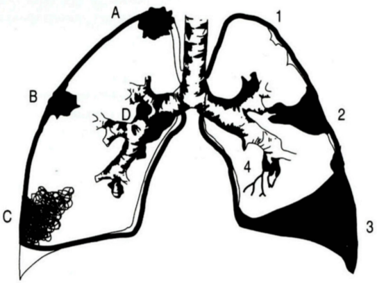
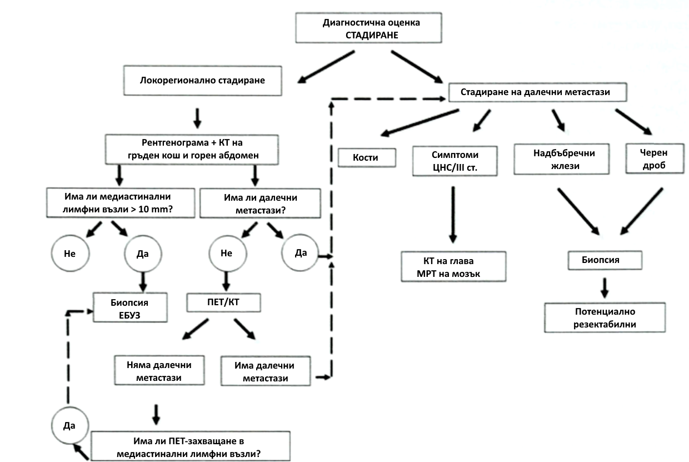

# БЕЛОДРОБЕН КАРЦИНОМ
#### Епидемиология
По данни на **СЗО**, карциномът на трахеята, бронхите и белите дробове е **водеща причина за смърт** в Европейския регион (3.9% от общата смъртност).
В **България**:
- Ракът на белите дробове е **най-честото злокачествено заболяване при мъжете (19.3%)** и пето по честота при жените (5.3%).
- Годишно се диагностицират **над 4000 нови случая**.
- Смъртността е **по-голяма от тази, причинена от рак на млечната жлеза, дебелото черво и простатата, взети заедно**.
---
## Рискови фактори
- **Тютюнопушене:** Рискът се увеличава с броя на цигарите и **пакето/годините**. Отказът на всяка възраст може значително да намали риска.
- **Пасивно тютюнопушене.**
- **Излагане на газ радон:** Продуцира се от естествения разпад на уран в почвата, скалите и водата, който в крайна сметка става част от въздуха, който дишаме. Навлиза в сградите чрез малки пукнатини в основите им.
- **Излагане на азбест и други канцерогени:** Като арсен, хром, никел, кадмий и петролни продукти, особено при пушачи.
- **Фамилна анамнеза** за рак на белия дроб.
- **Хронични белодробни заболявания** – белези от туберкулоза, хроничен бронхит, ХОББ.
---
## Патогенеза
Развитието е вероятно в резултат на въздействие върху бронхиалния епител на различни карциногенни вещества, активиращи реакции, които предизвикват степенни, до мутагенни процеси и неконтролируемо размножаване на атипични клетки.
- **Генни мутации**:
  - Мутация в **K-ras прото-онкогени** е отговорна за 10-30% от белодробните аденокарциноми.
  - Мутация в **EML4-ALK тирозинкиназа** се среща в 4% от недребноклетъчните белодробни карциноми.
  - **EGFR (Рецептор на епидермалния растежен фактор):** Играе роля в регулирането на клетъчното размножаване, апоптозата, ангиогенезата и туморната инвазия. Генетичните мутации, водещи до дисрегулация му, обикновено се наблюдават при **недребоклетъчен белодробен карцином**, което обяснява използването на **EGFR-инхибитори** при лечението на заболяването.
- **Наследствен генетичен фактор:** Приблизително **8%** от случаите, с относителен риск **2.4 пъти по-голям** за индивиди с роднини с болестта.  Полиморфизмите на хромозома 6 и 15 са свързани с повишен риск.
---
#### Класификация по Локализация
- **Централен:** Локализиран в главни, лобарни и сегментни бронхи (ендоскопски достъпен).
  - Перибронхиоларен
  - Ендобронхиоларен.
- **Периферен:** Разположен дистално от сегментните бронхи. Трудно се доказва с ендоскопска техника, а локализацията до гръдната стена го прави по-достъпен за **ТТАБ (трансторакална аспирационна биопсия)**.
  - Особена форма е **този на Панкоаст-Тобиас** (Фиг. 1).
    
> **Фигура 1.** Схематично представяне на топографията (десен бял дроб) и усложненията (ляв бял дроб) при белодробен карцином. А-върхов (Панкоаст-Тобиас); В-периферен карцином; С-пневмонична форма; D-централен карцином; 1-емфизем; 2-ателектаза; 3-плеврален излив; 4-бронхиектазии.
#### Клинична класификация (Важна за избор на поведение и лечение)
**Недребноклетъчен карцином (НДК)**
- **75-80%** от белодробния карцином.
- **Плоскоклетъчен карцином:**
  - **Най-честият** хистологичен тип. Свързан с **тютюнопушенето**.
  - Локализира се **централно**, до големите въздухоносни пътища.
  - Обикновено се представя с плътно хомогенно засенчване на пулмографията, но може да разпадне и да изглежда рентгенологично като абсцес.
  - Често се представя с **хиперкалциемия**.
- **Аденокарцином:**
  - **Не е задължително свързан** с тютюнопушенето.
  - Развива се от алвеоларните и бронхиоларните жлезни клетки.
  - Локализира се типично като **периферно разположена маса**.
  - Може да бъде **първичен** белодробен или **вторичен** от други места, особено когато е налице инфилтрация на плеврата и последващ **плеврален излив**.
- **Алвеоларен клетъчен карцином:** Рядък. Може да причини **обилно отделяне на спутум (бронхорея)** и **инфилтративни** **засенчвания** на пулмографията.
- **Други:** Едроклетъчен карцином, Аденосквамозен карцином и Саркоматоиден карцином.
---
#### Дребноклетъчен карцином (ДКК)
- **20-25%** от белодробния карцином.
- Само в **1%** се среща при непушачи.
- Обикновено е **метастазирал** по време на диагнозата (хематогенни разсейки).
- Често метастазира в: **черен дроб, кости, костен мозък, главен мозък, надбъбречни жлези и др.**
- **Хирургията обикновено не е подходяща.**
- **Химио- и радиочувствителен.**
- Изключително **агресивен**: Нелекуваният ДКК има средна преживяемост от **6 седмици**.
---
#### Допълнителни Прогностични Фактори и Типизиране
- **Хистопатологична степен (grading):** От 1 до 4 (G) – определя диференциацията (високо, умерено, нискодиференциран и недиференциран карцином), има прогностична стойност.
- **Състоянието на резекционни линии и хистологично изследване на лимфни възли, добити чрез системна медиастинална лимфна дисекция:** Определя се след хирургична резекция. Незадължителни описания: лимфна (L), венозна (V) и периневрална инвазия (Pn).
- **Имунохистохимично изследване:** Препоръчва се за разграничаване на първичен белодробен аденокарцином от метастатичен аденокарцином, на хистологични подтипове на нискодиференцирани белодробни карциноми, на белодробен аденокарцином от плоскоклетъчен карцином и мезотелиом и за определяне на невроендокринен статус на туморите
#### Молекулярно-патологично типизиране
**Целта** на тестването за **EGFR-мутации** и **ALK-пренареждане** е да се идентифицират пациенти, които могат да получат **таргетна терапия** като лечение от първа линия.
- **Механизъм:** Таргетните лекарства (напр. тирозин-киназни инхибитори – TKI) са високоспецифични: те **блокират** протеините, произведени от тези мутирали гени, които са жизненоважни за растежа на раковите клетки.
- **Предимство:** Таргетната терапия е **по-ефективна и по-добре поносима** от стандартната химиотерапия при наличие на тези мутации.
- **Приложение:** Тестването е **критично** за избор на лечение при **напреднало заболяване (IIIB-IV)**, тъй като ранните стадии (I и II) се лекуват предимно хирургично.
- **Таргетен тип карцином:** Тестването се препоръчва основно при **Недребноклетъчен Белодробен Карцином (НДК)**, тъй като тези мутации са рядкост при дребноклетъчния карцином.
- Препоръчват се при следните биопсично доказани варианти в стадий IIIB-IV:
  - аденокарцином
  - недребноклетъчен белодробен карцином, фаворизиран като аденокарцином
  - недребноклетъчен белодробен карцином - неопределен тип (NOS)
  - смесен тип с аденокомпонента.
---
#### TNM Стадиране
Стадирането корелира с прогнозата и определя избора на лечение.
**T (Първичен тумор)**
- **Tx:** Първичният тумор не може да се оцени или тумор, доказан с наличие на туморни клетки в храчка или бронхиален съм при негативни образни изследвания и бронхоскопия.
- **T0:** Липсва първичен тумор.
- **Tis:** Карцином *in situ*.
- **T1:** **≤ 3 cm**, заобиколен от бял дроб или висцерална плевра, не по-проксимално от дялов бронх:
  - **T1a(mi):** Минимално инвазивен аденокарцином.
  - **T1a** = тумор ≤ 1 cm.
  - **T1b** = тумор > 1 но ≤ 2 cm.
  - **T1c** = тумор > 2 но ≤ 3 cm.
- **T2:** > 3 но ≤ 5 cm или тумор с някоя от следните характеристики: нахлува във висцерална плевра, засяга главен бронх, независимо от разстоянието от карината, но без ангажиране на карината; ателектаза/обструктивен пневмонит, простиращ се до хилуса и включващ част от или целия бял дроб:
  - **T2a** = тумор > 3 но ≤ 4 cm.
  - **T2b** = тумор > 4 но ≤ 5 cm.
- **T3:** Тумор > 5 cm, но ≤ 7 см или свързан с отделни туморни възли в същия дял на първичния тумор или директно инвазиращ една от следните структури: гръдна стена (включително париетална плевра и тумори на горна бразда), френичен нерв, париетален перикард.
- **T4:** Тумор > 7 cm или свързан с отделен туморен възел(и) в различен лоб от този на първичния тумор или инвазиращ една от следните структури: сърце, големи съдове, трахея, възвратен ларингеален нерв, хранопровод, тяло на прешлен или бифуркация на трахея (карина).
**N (Регионални лимфни възли)**
- **Nx:** Регионални лимфни възли не могат да се оценят.
- **N0:** Без метастаза в регионален възел.
- **N1:** Метастаза в ипсилатерални перибронхиални и/или хилусни лимфни възли и интрапулмонарни възли, включително засягане чрез пряк растеж.
- **N2:** Метастаза в ипсилатерален медиастинален и/или лимфен(и) възел(и) под бифуркацията на трахея.
- **N3:** Метастаза в контралатерални медиастинални, контралатерални хилусни, ипсилатерални или контралатерални скаленни или супраклавикуларни лимфни възли.
**M (Далечна метастаза)**
- **M0:** Без далечна метастаза.
- **M1:** Наличие на далечна метастаза.
  - **M1a:** Отделен туморен възел(и) в контралатерален дял; тумор с плеврален или перикарден възел(и) или малигнен плеврален или перикарден излив.
  - **M1b:** Единична екстраторакална метастаза.
  - **M1c:** Множествени екстраторакални метастази в един или повече органи.
**Таблица 1. Групиране на стадии и подгрупи в съответствие с TNM**
| **СТАДИЙ** | **T** | **N** | **M** | 
| --- | --- | --- | --- | 
| Окултен рак | Tx | N0 | M0 | 
| 0 | Tis | N0 | M0 | 
| IA1 | T1 (mi) T1 a | N0 N0 | M0 M0 | 
| IA2 | T1b | N0 | M0 | 
| IA3 | T1c | N0 | M0 | 
| IB | T2a | N0 | M0 | 
| IIA | T2b | N0 | M0 | 
| IIB | T1a-c  T2a  T2b  T3 | N1  N1 N1 N0 | M0  M0 M0 M0 | 
| IIIA | T1a-c T2a-b T3 T4 T4 | N2 N2 M1 N0 N1 | M0  M0 M0 M0 M0 | 
| IIIB | T1a-c T2a-b T3 T4 | N3 N3 N2 N2 | M0  M0 M0 M0 | 
| IIIC | T3 T4 | N3 N3 | M0 M0 | 
| IVA | Всяко T Всяко T | Всяко N Всяко N | M1a M1b | 
| IVB | Всяко T | Всяко N | M1c | 
---
#### Клинична картина
***Без симптоми*:** в до 25% от случаите 
**Локални туморни ефекти:**
- **Постоянна кашлица** или промяна в характера на кашлицата.
- **Хемоптиза** - типично с вид на "**малиново желе.**"
- **Болки в гръдния кош** - при ангажиране на плеврата или гръдната стена.
- Нерезорбираща се пневмония или лобарна ателектаза.
- Необяснима диспнея (в резултат на бронхиално стеснение или обструкция).
- **Дисфония/афония** - при туморна инвазия и засягане на левия n.reccurens.
- **Дисфагия** - при компресия на хранопровода.
- **Плеврален излив** - при директна инвазия на тумора или плеврални метастази.
- Високо стоящ диафрагмален купол - при парализа на n.phrenicus.
- **Синдром на Claude Bernard-Homer** (__*птоза, миоза, енофталм*__) в резултат на ангажиране на шийната част на n.sympaticus от върхов или Pancoast-Tobias тумор.
- **Pancoast туморът** може директно да обхване разклоненията на n.sympaticus в шийната област, брахиалния плексус и ребрата, причинявайки слабост на малките мускули на ръката и болки в рамото.
- Ако е обтуриран голям бронх, е възможно да се развие пневмония или абсцес.
**Метастатични туморни ефекти:**
- **Шийна/супраклавикуларна лимфаденопатия** (налице при около 30% от болните - достъпно място за диагностична биопсия).
- **Хепатомегалия** - чернодробни метастази.
- Болки/патологични фрактури на костите - костни метастази.
- **Неврологична симптоматика** – мозъчни метастази (главоболие, гадене, огнищен дефицит)..
- **Хиперкалциемични ефекти** (в резултат на костни метастази или директна туморна продукция на паратироиден хормон).
- Дисфагия вследствие на компресия от големи медиастинални лимфни възли.
**Паранеопластични синдроми **(от продукцията на хормонподобни субстанции)**:**
- **Най-честият при ДКК:** **Синдром на Иценко-Кушинг** (при повишена ектопична секреция на АСТН).
- **Най-честият при НДК:** Свързан с продукция на субстанция, подобна на паратироидния хормон, повишаваща нивата на калция в периферната кръв.
- **Неспецифични симптоми:**
  - Кахексия
  - Слабост
  - Умора
  - Депресия
**Белодробният карцином трябва да се подозира** при всеки пациент над 40 г. с **персистираща кашлица, хемоптиза, или нерезорбираща се пневмония**, особено при **пушачи**.
---
#### Диагноза
**Кога е необходимо да се проведат изследвания:**
- Нововъзникнала персистираща кашлица или влошаване на съществуваща кашлица.
- Кръвохрак.
- Персистиращи „бронхити" или чести респираторни инфекции.
- Гръдна болка.
- Необяснима загуба на тегло и/или умора.
- Диспнея или хриптене.
- Анамнеза за излагане на тютюнопушене и други рискови фактори.
**Лабораторни и Функционални изследвания:**
- **Кръвни тестове:** Вкл. натрий, калций, чернодробни показатели, изследване на кръвосъсирването при планирана биопсия.
- **Спирометрия** при предстоящо хирургично лечение.
- **Цитологично изследване** на храчка.
- Изследване на плеврален пунктат (биохимично, цитологично).
- **Трансторакална тънкоиглена аспирационна биопсия (ТТАБ)** под КТ контрол при периферно разположени тумори (цитилогично, хистологично изследване).
- **Биопсия на периферен лимфен възел** (хистологично изследване).
- **Туморни маркери:** Карциноембрионален антиген (СЕА), антидиуретичен хормон (АДХ) и др.
**Образни изследвания:**
- **Рентгенография на бели дробове (фас и профил):** За оценка на местоположението, ангажимента на плеврата, деструкция на ребра, интраторакални метастази, медиастинална лимфаденопатия.
  - Незабавна при пациенти с кръвохрак.
  - Препоръчителна при следните клинични симптоми, персистиращи повече от три седмици: кашлица или промяна в характера на хроничната кашлица, неясна гръдна болка, загуба на тегло, костни болки, задух.
- **Компютъртомографско изследване (КТ) на гръден кош и горен абдомен:** За оценка на големината, разположението на тумора и неговите метастази. **КТ е задължителна стъпка** за диагноза и TNM стадиране.
- **Магнитно-резонансната томография (МРТ):** Метод на избор за доказване/отхвърляне на метастатични лезии в **кости, мозък и надбъбреци**. Използва се и за оценка на Т- и N-стадий при тумор тип Pancoast.
- **Позитрон емисионна томография (ПЕТ/КТ):**
  - Мултимодална техника (KT+PET).
  - Сканирането с глюкозен аналог (FDG) се основава на засилен **глюкозен метаболизъм** в туморните клетки и представлява анатомично-метаболитен изобразяващ метод.
  - Докато КТ ни представя анатомичните структури, ПЕТ измерва метаболитната активности и функцията на тъканите.
  - Уместна при **всички пациенти с НДК** за търсене на далечни метастази преди избор на лечение.
**Ендоскопски методи:**
- **Фибробронхоскопия:** Ендоскопски оглед, **БАЛ** (бронхоалвеоларен лаваж), четкова биопсия, катетър биопсия, щипкова биопсия, трансбронхиална пункционна биопсия (при перибронхиален растеж/увеличени лимфни възли), трансбронхиална белодробна биопсия (при дисеминирани лезии).
- **Автофлуоресцентна бронхоскопия:** при осветяване със синя светлина нормалната лигавица изглежда зелена, патологичните зони – морави. Препоръчва се при тежка дисплазия, карцином *in situ* или суспектни туморни клетки в храчка при нормална образна диагностика.
- **Ендоскопски ендобронхиален ултразвук (ЕБУЗ) с трансбронхиална аспирационна биопсия** и **езофагеален ултразвук (ЕУЗ) с трансезофагеална аспирационна биопсия:** Прилагат се за диагностично уточняване на увеличени медиастинални лимфни възли и за медиастинално стадиране при НДК. Могат да заместят медиастиноскопията.
**Хирургични методи:**
- Видеоасистирана торакоскопия (**VATS**)
- Медиастиноскопия
- Експлоративна торакотомия

> **Съкращения:** КТ - компютър-томография. ЕБУЗ - ендобронхиален ултразвук. ПЕТ/КТ - позитрон-емисионна томография компютър-томография. МРТ - магнитно-резонансна томография. ЦНС - централна нервна система.
> **Фигура 2.** Алгоритъм за диагноза и стадиране на БК (модификация по С.Frank).
---
#### Диференциална Диагноза
- Туберкулоза
- Саркоидоза
- Силикоза
- Пневмонии
- Белодробен абсцес
- Гъбични инфекции
- Белодробни кисти
- Бронхиектазии
- Метастази с извънбелодробен произход
---
#### Терапия на Белодробния Карцином
Бива:
- Радикална (свързана с отстраняване или унищожаване на тумора)
- Палиативна (намаляваща болката и страданието на пациента).
Видът на лечението се определя от:
- **Тип** (дребноклетъчен, недребноклетъчен) на карцинома.
- **Размера и позицията** на рака.
- **Стадия** на развитие.
- **Оценката на здравния статус** на пациента. Най често той се оценява посредством скалата на **ECOG**:
  - 0 - норма, способен на нормални дейности.
  - 1 - с наличие на симптоми, но амбулаторен, на домашен режим с поносими туморни прояви.
  - 2 - с инвалидизиращи туморни прояви, но под 50% от времето на легло.
  - 3 - тежко инвалидизиран с над 50% от времето на легло.
  - 4 - тежко болен, 100% от времето е на легло.
  - 5 - смърт.
**Хирургично лечение**
- **НДК Стадий I и II:** Осъществява се лобектомия или пулмонектомия, придружени от системна лимфна дисекция (конвенционална или VATS). При ограничени респираторни резерви в стадий I е допустима **сублобарна резекция**.
- **ДКК:** **Не се препоръчва рутинно** хирургично лечение.
- При всеки пациент с малигнен плеврален излив се прилага диагностична торакоцентеза и се обсъжда избор на плеврален дренаж с талкова плевродеза.
**Лъчелечение**
- Самостоятелно радикално лъчелечение.
- **Предоперативно (неоадювантно)** и **следоперативно (адювантно)** лъчелечение.
- **Профилактично краниално лъчелечение** при **ДКК**.
- **Палиативно** лечение при метастази в мозъка, костите, при компресия на гръбначен мозък и при синдрома на горна празна вена.
- **Стереотактична радиотерапия:** Роботизиран четириизмерен метод за високодозово лъчелечение, алтернатива на конвенционалната хирургия, особено при възрастни (над 65-70 години). Ефективен е в ранен стадий с диаметър на тумора до 20 mm и негативен нодален статус (N0). Радиохирургията дава възможност за палиативно лъчелечение на метастази, които са в непосредствена близост до жизненоважни органи на пациента.
**Химиотерапия**
В зависимост от етапа на недребноклетъчен рак на белия дроб и други фактори, химиотерапията може да се използва в различни ситуации:
- Като **основно лечение** (понякога заедно с лъчетерапия) за по-напреднали ракови заболявания или при болни с противопоказания за оперативно лечение.
- Заедно с **лъчетерапия (съпътстваща терапия)** за някои видове рак, които не могат да бъдат отстранени чрез хирургична намеса, тъй като са прорастнали във важни близки структури.
- **Преди операция (понякога заедно с лъчева терапия)** с цел редукция обема на тумора: **неоадювантна терапия**.
- **След операция (понякога заедно с лъчева терапия)** с цел да се убият всички ракови клетки, които може да са останали в организма: **адювантна терапия**.
**Таргетна лекарствена терапия**  
Таргетната терапия се фокусира върху специфични аномалии, налични в раковите клетки. Блокирайки тези аномалии, таргетните медикаменти могат да доведат до смърт на раковите клетки. Някои таргетни терапии действат само при хора, чиито ракови клетки имат определени генетични мутации (**EGFR-мутации, ALK-пренареждане**).
**Имунотерапия**
Имунотерапията използва имунната система за борба с рака. Имунната система е неефективна, защото раковите клетки произвеждат протеини, които заслепяват клетките на имунната система. Имунотерапията действа, като се намесва в този процес. За пълно активиране на Т клетката се използват т.нар. **"check-point" инхибитори** (Anti-PD-1, Anti-PD-L1 и Anti-CTLA-4).
---
#### Лечение на Недребноклетъчния Карцином (НДК)
- **Стадий I и II:**
  - **Хирургичното лечение е на първа линия.** Химиотерапията и постоперативното лъчелечение нямат място при заболяване в **IA стадий**. Адювантна химиотерапия може да бъде полезна при селектирани случаи от стадий **IB** и, по-специално, ако туморът е > 4 cm.
  - **Стадий II:** Хирургично лечение, последвано от **адювантна химиотерапия**. Предпочита се лобектомия. Сублобарни резекции са показани само при тумори < 3 cm, при пациенти с тежки нарушения на белодробната функция, напреднала възраст и изразена коморбидност.
  - **Лъчетерапията** се прилага при пациенти с противопоказания за хирургично лечение.
- **Стадий III А и III В:** **Комбинирана химиотерапия и лъчетерапия.** Стандартната системна химиотерапия при болни с напреднал недребноклетъчен белодробен карцином включва двойна комбинация на платинов препарат (*cisplatin* или *carboplatin*) с трета генерация цитостатик (*docetaxel, gemcitabine, paclitaxel, pemetrexed* и *vinorelbine*).
- **Стадий IV:**
  - Химиотерапия.
  - Палиативна лъчетерапия.
- **Ако са налице мутации:**
  - При тумори с **EGFR-мутации** може да се прилага лечение с тирозин-киназни инхибитори: *gefitinib, erlotinib* и *afatinib*.
  - При тумори с **ALK пренареждане**: *crizotinib*.
- **Имунотерапия:**
  - Anti-PD-1: *Nivolumab* и *Pembrolizumab*.
  - Anti-PDL-1: *Durvalumab, Atezolizumab* и *Avelumab*.
  - Anti-CTLA-4: *Ipilimumab* и *Tremelimumab*.
---
#### Лечение на Дребноклетъчния Карцином (ДКК)
- **Поведение при локализирано заболяване:** **Комбинирана химиолъчетерапия.** Цитостатичният режим включва *Cisplatin* и *Etoposide*. Провеждат се 4 - 6 курса на лечение. След приключване на комбинираното химиолъчелечение, при добро общо състояние и локализирано заболяване, се препоръчва осъществяването на **профилактично краниално лъчелечение**, за да редуцира честотата на интракраниални мозъчни метастази.
- **Поведение при метастазирало заболяване:** Стандартният подход е **4 - 6 курса химиотерапия** (*cisplatin + etopoposide*). Лъчетерапията е палиативна. **Профилактично облъчване на главния мозък** се препоръчва при пациенти с добър здравен статус, които са получили ремисия след първоначалното лечение.