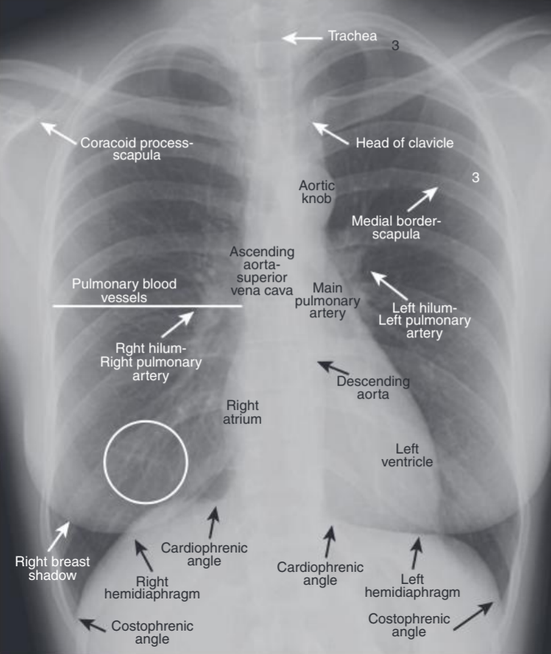

# 🩻 План за разчитане на рентгенография на гръдна клетка

Преди всичко:
- Определете **вида на рентгенографията** – гръдна клетка (РА проекция, право положение, легнал, АР и т.н.).
- Проверете дали **името на снимката и заявката съвпадат**.
- Обърнете внимание на **възрастта и пола на пациента**.

---

## I. Ориентация на снимката
- Проверете дали **ляво и дясно** са правилно отбелязани.

## II. Центриране на снимката
- Всички части на белите дробове трябва да се виждат - върхове, основи, косто-диафрагмални синуси (КДС)
- Да се виждат **и двата купола на диафрагмата**.
- **Стерналните ръбове на ключиците** трябва да са на еднакво разстояние от спинозните израстъци → симетрична графия.
- **Ръцете на пациента** трябва да са абдуцирани, за да не се наслагват скапулите върху белодробните полета.

## III. Техническо качество на снимката
(важи основно за снимки на плака, не за дигитални рентгенографии)
- **Нормална експонация:** през медиастиналната сянка се виждат първите 4 торакални прешлена.  
- **Субекспонирана графия (бял филм):** не се вижда нито един прешлен през медиастинума.  
- **Преекспонирана графия (черен филм):** виждат се всички прешлени.

## IV. Оценка на торакалните структури
### 1. Куполи на диафрагмите
- **Позиция:** нормално на нивото на 5–6 междуребрие (по предната част на ребрата).  
  - Лявата обикновено е с до 2.5 cm по-ниска от дясната.  
  - При ~10% от хората са на едно ниво.
- **Очертания:** резки, гладки, проследими от край до край.
- **Косто-диафрагмални синуси:** остри, добре видими.
- **Субдиафрагмално пространство:** без свободен въздух или патологични засенчвания (напр. калцификати).

### 2. Медиастинум
- **Позиция на медиастиналната сянка:** централно разположена – около 1/3 надясно и 2/3 наляво от срединната линия.
- **Ширина:** нормалната медиастинална сянка се описва като неразширена.
- **Очертания:** резки и гладки.
- **Форма:** с нормални дъги.
- **Сърдечна сянка:**  
  - Размер – до 50% от ширината на торакса (кардио-торакален индекс, КТИ ≤ 0.5).  
  - Описание на сърдечните дъги – нормални или с увеличен конвекситет, допълнителни дъги (напр. двойно-контуриране на дъгата на дясно предсърдие от уголемено ляво предсърдие).
- **Трахея:** централно разположена, неразширена; ъгълът на бифуркацията е остър ≤ 70°.

### 3. Хилуси
- **Хилусна точка:** мястото, където горно-дяловата белодробна вена пресича долно-дяловата артерия.
- **Позиция:** между 2-ро и 4-то ребро (по преден контур).  
  - Левият е малко по-висок (до 1 cm) от десния.
- **Структура:** само съдове.
- **Размер на долнодяловите белодробни артерии:** до 17 mm.

### 4. Белодробни полета
- Нормално се виждат само **сенки на съдове и ребра**.
- Понякога се виждат централните бронхиални клонове като „пръстенчета“ (при ортограден изглед).
- **Всяка** сянка, която не произлиза от тези структури, трябва да бъде описана.
- **Зони:**
  - Горно белодробно поле – над 2-ро ребро отпред  
  - Средно белодробно поле – между 2-ро и 4-то ребро отпред  
  - Долно белодробно поле – под 4-то ребро отпред
- **Белодробен съдов рисунък:**
  - Хиперемия – твърде много съдове  
  - Олигемия – намален брой съдове  
  - Венозна конгестия – при сърдечна недостатъчност  
  - Рязка промяна в калибъра – патологична

### 5. Костни структури
- Всички ребра са налице, без фрактури.
- Без патологични сенки или лезии по костите.

### 6. Меки тъкани
- Хомогенни, без патологични сенки.  
- Проверете за **мастектомия** или други промени.

---

## Причини за солитарен белодробен нодул
- #### Неоплазии
  - **Малигнени**
    - Бронхогенен карцином  
    - Солитарна белодробна метастаза  
    - Лимфом  
    - Карциноиден тумор (бронхиален или периферен)
  - **Доброкачествени**
    - Белодробен хамартом  
    - Хондром
- #### Възпалителни причини
  - Гранулом  
  - Белодробен абсцес  
  - Ревматоиден нодул (ревматоиден артрит, грануломатоза на Вегенер)  
  - Възпалителен псевдотумор (плазмоклетъчен гранулом)  
  - Кръгла пневмония  
  - Туберкулом (ТБК)  
  - Мицетом (аспергилом и др.)
- #### Вродени причини
  - Артерио-венозна малформация  
  - Белодробна киста  
  - Бронхиална атрезия с изпълнен бронх (секрет)
- #### Други причини
  - Инфаркт на белия дроб  
  - Интрапулмонален лимфен възел  
  - Бронхиален секрет  
  - Белодробен хематом  
  - Белодробна амилоидоза  
  - Нормален конфлуенс на белодробните вени
- #### Мимикьори (фалшиви нодули)
  - Сянка на мамилата  
  - Кожна лезия (бенка, брадавица)  
  - Костна фрактура или друга костна лезия  
  - Излив по малкия интерлобарен процеп

