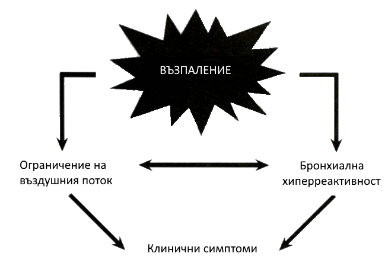

# Бронхиална Астма (САМО ДО ДИФЕРЕНЦИАЛНА ДИАГНОЗА, НЕДОВЪРШЕНА)

### Дефиниция
Астмата е **хетерогенно заболяване**, което обичайно се характеризира с **хронично възпаление на дихателните пътища**. Дефинира се с анамнеза за респираторни симптоми – **хриптене, задух, стягане в гърдите и кашлица**, които се променят във времето и по интензивност, заедно с **вариабилно ограничение на въздушния поток**, което по-късно може да стане персистиращо.

* Ограничението на въздушния поток може да се нормализира спонтанно или под влияние на лечението и понякога могат да липсват за седмици или месеци.
* Астмата се асоциира с **бронхиална хиперреактивност** към директни и индиректни стимули.
* Пациентите могат да получат **животозастрашаващи екзацербации**.

---

## Фенотипи на Бронхиална Астма

Астмата е хетерогенно заболяване с различни подлежащи болестни процеси. Фенотипите са разпознаваеми клъстери от демографски, клинични и/или патофизиологични характеристики. (Класификация според Wenzel)

#### I. Th2 Астма (Еозинофилно Възпаление)
1.  **Ранно начало, Алергична Астма**
    * **Характеристики**: Ранно начало, лека до тежка, алергични симптоми и други заболявания.
    * **Биомаркери**: Специфични IgE, Th2 цитокини (IL-4/IL-13), задебелена базална мембрана.
    * **Терапевтичен отговор**: Кортикостероид чувствителна, Th2 таргетирана терапия.
2.  **Късно начало, Еозинофилна Астма**
    * **Характеристики**: Късно начало, често тежка, по-малко алергична.
    * **Биомаркери**: Кортикостероид-резистентна еозинофилия, IL-5.
    * **Терапевтичен отговор**: Чувствителна към антитела срещу IL-5 и цистеинил левкотриенови модификатори, кортикостероид резистентна.
3.  **Астма, Индуцирана от Физическо Натоварване**
    * **Характеристики**: Лека, интермитентна при физическо натоварване.
    * **Биомаркери**: Активирани мастни клетки, Th-2 цитокини (IL-9), цистеинил левкотриени.
    * **Терапевтичен отговор**: Чувствителна към цистеинил левкотриенови модификатори, бета агонисти и антитела срещу IL-9.

---

#### II. Не-Th2 Астма (Нееозинофилно Възпаление)

1.  **Астма при Затлъстяване**
    * **Характеристики**: Късно начало, предимно при жени, много симптоми, по-малко изразена бронхиална хиперреактивност, ниско ФЕО1, увеличен блокиран газ (air trapping).
    * **Биомаркери**: Липса на Th2 биомаркери, оксидативен стрес, ADMA.
    * **Терапевтичен отговор**: Чувствителна към отслабване, антиоксиданти и възможен отговор към хормонална терапия.
2.  **Неутрофилна Астма**
    * **Характеристики**: Ниско ФЕО1, повече блокиран газ (air trapping).
    * **Биомаркери**: Неутрофилия в спутум, Th17 маркери, IL-8.
    * **Терапевтичен отговор**: Възможен отговор към макролидни антибиотици.
3.  **Астма при Пушачи**
    * **Характеристики**: Пасивно или активно тютюнопушене, намаляващо ФЕО1, резистентна към стероиди.
    * **Биомаркери**: Намалено FeNO.
    * **Терапевтичен отговор**: Възможен отговор при спиране на тютюнопушенето.

---

### Епидемиология
* **Честота**: Едно от най-честите хронични заболявания в световен мащаб.
* Засяга **10-15%** от децата и **5-10%** от възрастните.
* Засегнати са **339 милиона** души по света (над 400 000 в България).
* **Разпределение по пол**: По-често при момчетата в детството (2:1). След пубертета преобладават жените.
* **Нарастване на честотата** е свързано със замърсяването на въздуха, пасивното тютюнопушене, урбанизацията и „западния" стил на живот.

---

### Рискови Фактори
* **Генетични** (гени, предразполагащи към атопия и бронхиална хиперреактивност).
* **Алергени** (акари в домашния прах, животни и по-специално котка и куче, хлебарки, гъби, полени).
* **Инфекции** на респираторния тракт (предимно вирусни - РСВ, риновирус и други).
* **Тютюнопушене** (активно, пасивно).
* **Замърсители** на въздуха и промишлени дразнители.
* **Физическо натоварване**, хипервентилация.
* **Лекарства**: Аспирин или НПВС, бета-адренергични блокери (включително капки за очи).
* **Коморбидни състояния**: Гастро-езофагеална рефлуксна болест, хронични синузити или ринити.
* **Затлъстяване** (асоциация между астма и нарушен липиден и глюкозен метаболизъм).
* **Диета** (нисък прием на антиоксиданти и омега-3 мастни киселини).
* **Емоционални фактори** или **стрес**.
* **Перинатални фактори** (преждевременно раждане, напреднала възраст на майката, пренатална експозиция на тютюнев дим).

---

### Патогенеза

#### 1. Възпаление на Дихателните Пътища
Астмата е възпалително заболяване, което ангажира големите и малките дихателни пътища.
* **Възпалителни клетки**: Дендритни клетки, макрофаги, Т-лимфоцити (Th-0, Th-2, Th-1), мастни клетки, базофили, **еозинофили**, неутрофили.
    * Възпалението при астма се дължи на дисбаланс между Th1 и Th2 лимфоцити.
    * Th-2 клетките генерират цитокини (IL-4, IL-5, IL-6, IL-9, IL-13), които медиират алергичното възпаление.
    * Th-1 клетките продуцират IL-2 и IFN-a, важни за клетъчните защитни механизми.
    * Според „хигиенната хипотеза“, прекарани инфекции в детството, по-рядка употреба на антибиотици и живот в провинцията стимулират Th1 отговор и намаляват честотата на астма.
   Липсата на тези фактори води до персистиращ Th2 отговор и по-висока заболеваемост.
   * Новите данни за не-Th2 фенотипове на астма показват, че хигиенната хипотеза обяснява само част от случаите.
* **Възпалителни медиатори** (над 100): Хистамин, простагландини, левкотриени, ензими, хемокини, NO.
* Отокът на дихателните пътища и мукусната хиперсекреция допринасят за бронхиалната хиперреактивност и ограничението на въздушния поток.

#### 2. Ремоделиране
Хроничното възпаление води до структурни промени:
* **Хипертрофия и хиперплазия** на гладките мускули.
* **Увеличаване** на мукозните жлези.
* **Задебеляване** на базалната мембрана.
* Количествени и качествени промени на съдовете на дихателните пътища.

Ремоделирането може да доведе до **необратимо ограничение на въздушния поток**.  
Астмата е заболяване на големите дихателни пътища, но могат да бъдат ангажирани и малките дихателни пътища.

---

### Патофизиология

#### 1. Ограничение на Въздушния Поток
Води до развитие на симптомите и е свързано с възпалението и ремоделирането. Причинява се от:
* **Контракция на гладката мускулатура** в отговор на многобройни бронхоконстрикторни медиатори и невротрансмигери.
* **Оток на стената** на дихателните пътища, предизвикано от възпалителни медиатори.
* **Задебеляване на стената** вследствие на ремоделирането.
* **Мукусна хиперсекреция**.

Бронхиалната обструкция увеличава резистанса към потока, намалява експираторния поток и може да предизвика **хиперинфлация**, поради намалена способност за "изгонване" на въздуха.

#### 2. Бронхиална Хиперреактивност (БХР)
Води до стеснение на дихателните пътища в отговор на стимули, които са безвредни за здравия човек (напр. студен въздух). **Степента на БХР корелира с клиничната тежест на астмата**.  БХР е свързана както с възпалението, така и с ремоделирането.

---

### Клинична Картина
* Анамнеза за някое от следващите:
  * **Кашлица**, влошаваща се най-вече **през нощта**.
  * Повтарящо се **хриптене**, **затруднено дишане**, **стягане в гърдите**.
* Симптомите **варират по време и интензивност** и се проявяват/влошават със **сезонен характер**.
* **Тригери**:
  * Физическо натоварване
  * Вирусни инфекции
  * Инхалаторни алергени (в т.ч. животински, от акари в домашен прах, плесени, по лени и др.)
  * Дразнители (тютюнев дим)
  * Лекарства (аспирин, бета блокери)
  * Промени във времето (студен въздух) 
  * Силни емоции/стрес
  * Ендокринни фактори
* Симптомите се появяват/влошават **през нощта** и събуждат пациента. 
* Симптомите се повлияват при лечение на астмата.
* Пациентите имат анамнеза за **алергичен ринит, алергичен конюктивит, екзема, уртикария** или **фамилна анамнеза** за астма или друго атопично заболяваня.
* Симптоми, които по-вероятно не са свързани с астма
  * Изолирана кашлица без други респираторни симптоми.
  * Хронична продукция на спутум.
  * Гръдна болка.
  * Диспнея, индуцирана от физическо натоварване с шумна инспирация (стридор).

---

**Физикално Изследване**
* **Горен респираторен тракт**: Увеличена назална секреция, оток на мукозата, назален полип.
* **Гръден кош**:
    * Може да бъде **съвсем нормален** (не изключва астма).
    * **Хриптене** или **удължено издишване** при форсирано издишване.
    * При тежък живото-застрашаващ  пристъп може да няма хриптене - **„тих" бял дроб**.
    * Свръхраздуване на гръдния кош, използване на допълнителните мускули, деформация на гръдния кош (при хронична астма).
* **Кожа**: Атопични дерматити, екземи.
* **Очи**: Конюктивити.

---

### Екзацербация на Астмата
* **Продроми (Предвестници)**
  * Сърбеж в носа и носоглътката
  * Запушване на носа, Ринорея
  * Пристъпно кихане
  * Суха дразнеща кашлица
  * Вегетативни промени (потене, често уриниране)
  * Сърбеж
  * Чувство на вътрешно напрежение
* **Симптоми**
  * **Стягане в гърдите**
  * **Хриптене**
  * **Задух**
  * **Кашлица**
  * Оскъдна експекторация
  
  

#### КЛАСИФИКАЦИЯ НА ЕКЗАЦЕРБАЦИЯТА НА АСТМАТА ПО ТЕЖЕСТ

Класификацията по тежест е представена в Таблица 1. За класификация е необходимо наличието на повечето параметри, но не задължително всички.

#### Таблица 1. Тежест на Екзацербацията на Астмата
| Показател | Лека | Умерено-тежка | Тежка | Застрашаващ респираторен арест |
|:---|:---|:---|:---|:---|
| **Задух** | При ходене | При говорене | В покой | |
| **Позиция** | Може да легне | Предпочита да седи | Седнал, приведен напред | |
| **Разговор** | Изречения | Фрази | Думи | |
| **Съзнание** | Може да е възбуден | Обикновено е възбуден | Обикновено е възбуден | Сънлив или объркан |
| **Дихателна честота** | Увеличена | Увеличена | Често >30/min | |
| **Допълнителни мускули и тираж** | Липсва обичайно | Обичайно | Обичайно | Парадоксално движение на гърдите и корема |
| **Хриптене** | Умерено, често само в експириум | Силно | Обикновено силно | Липса на хриптене |
| **Пулс** | < 100 | 100 - 120 | > 120 | Брадикардия |
| **Парадоксален пулс** (Спадане на систолното кръвно налягане по време на инспирация) | Липсва (< 10 mm Hg) | Може да се наблюдава (10 - 25 mm Hg) | Често се наблюдава (> 25 mm Hg) | Липсата предполага умора на дихателните мускули |
| **ВЕД след прилагане на бронходилататор*** (% от предвиденото или най-доброто лично постижение) | > 80% | 60 - 80% | < 60% (< 100 l/min) или отговорът трае < 2 часа | |
| **PaO₂ (атм. въздух)** | Нормално (> 60 mm Hg) | > 60 mm Hg | < 60 mm Hg | |
| **PaCO₂** | < 45 mm Hg | < 45 mm Hg | > 45 mm Hg | |
| **SaO₂%** | > 95% | 91 - 95% | < 90% | Възможна е цианоза |

* **Парадоксален пулс** - При тежък астматичен пристъп по време на вдишване въздухът трудно излиза от белите дробове и налягането в гръдния кош става силно отрицателно. Това „всмуква“ повече кръв към дясното сърце, което се разширява и притиска лявата камера. Така лявата камера се пълни по-малко и изтласква по-малък обем кръв – в резултат кръвното налягане рязко спада при вдъхновение.
---

### ИЗСЛЕДВАНИЯ ЗА АСТМА

 **1. Изследвания, необходими за поставяне на диагнозата астма и преценка на контрола на заболяването**
* **Спирометрия**: Предпочитан метод за измерване на ограничението на въздушния поток и неговата обратимост.
    * **Диагностични критерии (Вариации)**:
        * Ниска стойност на ФЕО₁/ФВК (нормално >0.75-0.80 при възрастни).
        * Вариации на ФЕО₁ с **> 12% и > 200 mL** между визитите (при липса на респираторни инфекции).
    * **Обратимост (Бронходилататорен тест)**: Нарастване на ФЕО₁ с **> 12% и > 200 mL** 10-15 min след прием на 200 - 400 mcg Salbutamol. Увеличение > 15% и > 400 mL в по-голяма степен подкрепя диагнозата.
* **Измерване на Върховия Експираторен Дебит (ВЕД)**: Подпомага диагностицирането и проследяването.
    * **Вариабилност**: Вариабилност на ВЕД **> 10%** между сутрешните и вечерните стойности (при серийни измервания в продължение на 15 дни) предполага диагноза астма.
* **Подобрение след Противовъзпалително лечение**: Нарастване на ФЕО₁ с > 12% и > 200 mL (или на ВЕД е >20%) след 4-седмично лечение подкрепя диагнозата.
* **Бронхиална реактивност (Бронхопровокационен тест)**: Измерва се при пациенти с нормална белодробна функция, но с характерни симптоми.
    * **Положителен тест**: Спад на ФЕО₁ с **> 20%** със стандартизирани дози метахолин/хистамин, или **> 15%** със стандартизирана хипервентилация/манитол.
    * **Значение**: Негативният тест (при пациенти без инхалаторни стероиди) обикновено изключва диагнозата астма. Положителният тест може да се наблюдава и при други заболявания (алергични ринити, ХОББ).
* **Кожни тестове с алергени или специфични IgE в серума**: Наличието на атопия увеличава вероятността за алергична астма, но не е задължително.
    * **Общ серумен IgE**: Нива над 100 IU често се наблюдават при алергични реакции, но не са специфични само за астма. Повишени нива се изискват при тежка астма за лечение с omalizumab.
  * Връзката между експозицията на алергена и симптомите трябва да бъде потвърдена чрез анамнезата на пациента.
* **Определяне на Еозинофилия в периферна кръв и спутум**:
    * **Кръв**: Еозинофили над **4% или 300-400/μL** поддържат диагнозата, но липсата не я отхвърля. 
      * Може да се наблюдава и при алергична бронхопулмонална аспергилоза, Churg-Strauss синдром и еозинофилна пневмония.
    * **Спутум**: Процентът на еозинофилите може да се използва за определяне и контролиране на терапията. Повишени стойности се изискват при тежка астма за лечение с моноклонални антитела.
* **Ниво на Издишания Азотен Окис (FeNO)**: Увеличено при пациенти с еозинофилна астма, които не са получавали инхалаторни кортикостероиди.
  * Стойностите на FeNO са увеличени и при атопия, еозинофилните бронхити и алергични ринити
   * **Значение**: Не е утвърден за диагноза, но стойности **> 50 ppb** при непушачи с неспецифични симптоми се асоциират с добър краткосрочен отговор към инхалаторни кортикостероиди.
* **Артериални кръвни газове (АКГ)**: Осигуряват информация по време на пристъп.
    * **Ранни стадии**: Хипоксия, но не и хиперкапния (поради хипервентилация - респираторна алкалоза).
    * **Влошаване**: По-късно, поради увеличе ната работа на дишането, увеличената кислородна консумация и увеличения сърдечен дебит настъпва метаболитна ацидоза. Респираторната недостатъчност води до развитие на респираторна ацидоза. 
    * Кръвно-газовият анализ може да подпомогне решението за включване на пациента на механична вентилация
   * Препоръчва се да се изследва АКГ при пациенти, при които SaO₂ не се е възстановила до над 90% след кислородотерапия.

**2. Изследвания, необходими за диференциална диагноза**
* **Дифузионен капацитет (DLCO)**: Нормален при астма, може да е намален при ХОББ.
* **Пулмография и други образни изследвания**: За изключване на пневмоторакс, чуждо тяло, белодробен рак и др.
* **Електрокардиограма (ЕКГ)**: За изключване на сърдечно-съдови заболявания.
* **Ларингоскопия**: За изключване на обструкция на горни дихателни пътища и патология на гласните връзки.
* **Фибробронхоскопия**: Рядко е необходима (за изключване на ендобронхиален тумор).
* **Белодробна биопсия**: Много рядко е необходима за изключване на други причини (напр. бронхиолит).

---

### Диагноза
Астмата често се диагностицира въз основа на **анамнезата и симптомите**. **Измерването на белодробната функция** (вариабилност и обратимост) потвърждава диагнозата. При нормална белодробна функция и симптоми се използва **бронхопровокационният тест**.

Кожните тестове с алергени допринасят за определяне
на рисковите фактори, предизвикващи симптомите на астма при отделни пациенти.

**Оценка на ефекта от лечението** се извършва чрез измерване на белодробната функция, бронхиалната хиперреактивност, еозинофилите в спутум и FeNO.

---

### Диференциална Диагноза на Бронхиална Астма
Диференциалната диагноза на астмата включва следните състояния:
* **Хронична обструктивна белодробна болест (ХОББ)**:
    * **Характеристики**: Настъпва в средна възраст, симптоматиката бавно прогресира, анамнеза за продължително тютюнопушене, задух при физическо усилие.
    * **Функционално**: В голяма степен **необратимо ограничение** на въздушния поток.
* **Сърдечна недостатъчност (СН)**: Може да причини нощна кашлица и т.нар. **кардиална астма**.
    * **Физикално**: Дребни влажни хрипове при аускултация базално.
    * **Образно**: Рентгенографията показва **увеличено сърце** и **белодробен застой/едем**.
    * **Функционално**: Намаление на белодробния обем, а не ограничение на въздушния поток.
* **Исхемично сърдечно заболяване**: Стягане в гърдите, особено при излагане на студен вятър, което може да се дължи както на астма, така и на стенокардия.
* **Гастро-езофагеална рефлуксна болест (ГЕРБ)**: Възможно е да причини нощна кашлица.
* **Постназален дрип**: Може да доведе до закашляне в лежащо положение.
* **Лечение с АСЕ инхибитори**: Може да предизвика кашлица.
* **Други заболявания, които трябва да се имат предвид**:
    * Обструкция на горни дихателни пътища (чуждо тяло или рак)
    * Дисфункция на гласните връзки, трахеомалация
    * **Бронхиектазии**, **Бронхиолити**
    * Белодробна фиброза, Саркоидоза, Кистична фиброза
    * Спонтанeн пневмоторакс, Рецидивиращ белодробен тромбемболизъм
    * Алергична бронхопулмонална аспергилоза (АБПА)
    * Синдром на Churg-Strauss
    * Психогенна диспнея

---