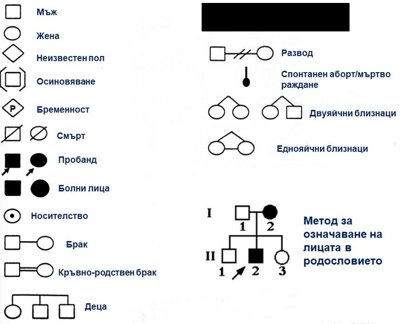
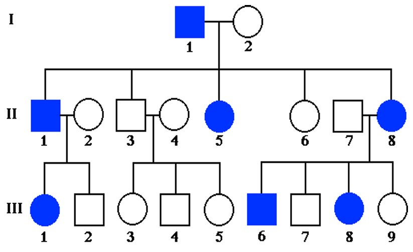
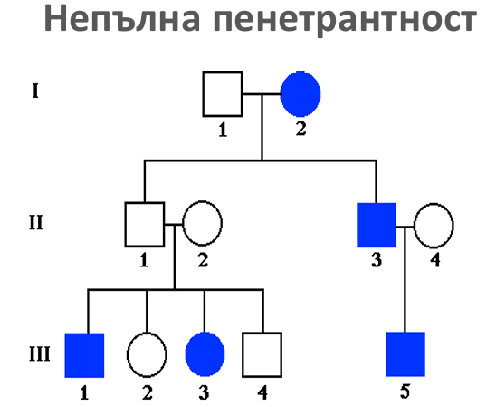
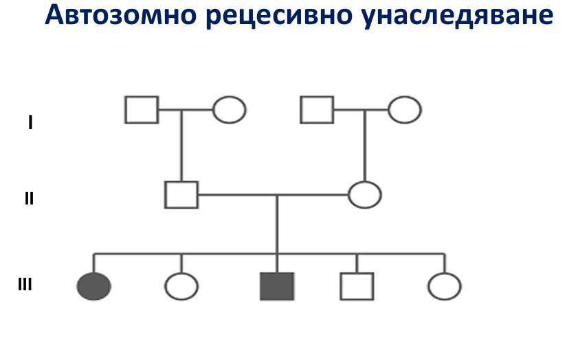
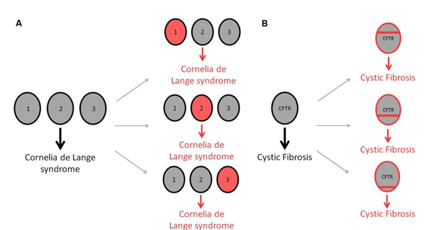
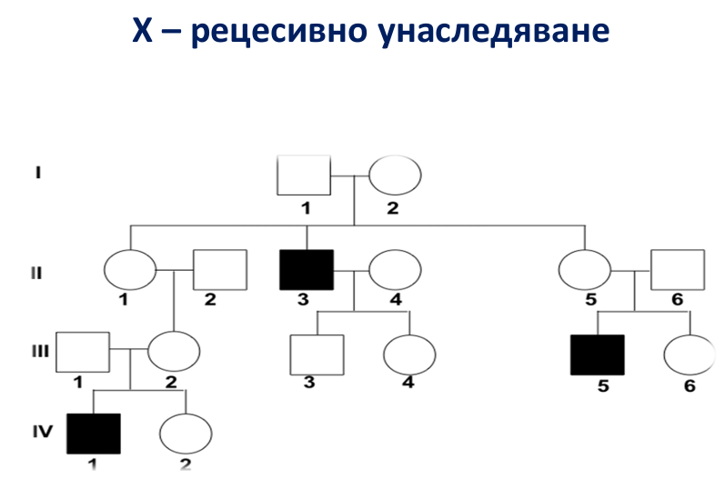

# Наследствени заболявания - класификация. Генеалогичен метод
### Медицинска генетика
**Медицинската генетика** обхваща всяко приложение на генетиката в медицинската практика.
* **Изучава** закономерностите на унаследяване на генетичните заболявания.
* **Разкрива** тяхната генетичната същност.
* **Анализира** молекулярните механизми, водещи до генетични заболявания.
* **Осигурява** диагностика, лечение и профилактика.
Медицинската генетика включва и процеса на **генетично консултиране**, насочен към пациенти и техните родственици, с цел предоставяне на обоснована информация за риска от наследствени заболявания, прогнозата на тяхното протичане и възможностите за профилактика и лечение.
---
### Основни структури и открития
**Брой хромозоми**
С помощта на светлинен микроскоп през 50-те години на миналия век се установява, че нормалната човешка клетка съдържа **46 хромозоми**.
**Нормален кариотип**
* **Автозоми:** Хромозоми 1 до 22.
* **Гонозоми:** XX (female) и XY (male).

**Характеристики на човешкия геном**

* Изграден от около **20 000 гена**.
* **3 X 10⁹ bp** (**3 млрд. нукл.двойки**).

---
### Класификация на генетичните заболявания
Всяка патологична промяна в генетичния материал може да доведе до възникване на генетично заболяване. Генетичните заболявания се подразделят на няколко групи:
1. **Хромозомни болести**
2. **Моногенни (Менделови) болести**
3. **Мултифакторни заболявания**
4. **Митохондриални заболявания**
5. **Соматични (придобити) генетични нарушения**

#### 1. Хромозомни болести
* Дължат се на **хромозомни промени (аберации)**, които са разнообразни по вид нарушения – бройни и структурни.
* Формираният хромозомен дисбаланс води до тежки смущения в соматичното, половото и интелектуалното развитие.

#### 2. Моногенни болести
* Резултат от патологична промяна в **отделен ген** и се унаследяват по законите на Мендел.
* Унаследяват се **автозомно- или полово-свързано**:
    * Автозомно доминантно
    * Автозомно рецесивно
    * Х-свързано доминантно
    * Х-свързано рецесивно

#### 3. Мултифакторни заболявания
* Причиняват се от **множество генетични и негенетични фактори**.
* Включват както **единични вродени аномалии**, така и някои **често срещани заболявания при възрастни**: артериална хипертония, диабет и др..

#### 4. Митохондриални болести
* Резултат от разнообразни и различни по вид **генни мутации, възникнали в митохондриалната ДНК (мтДНК)**.

---
### Генеалогичен (родословен) метод на изследване
* **Определение:** Първи етап на генетичната консултация.
* **Цели:**
    * Да установи типа на унаследяване на патологичния признак (заболяване).
    * Да определи вероятните генотипове на родствениците.
    * Да подпомогне поставянето на генетичната диагноза.
    * Да определи риска за повторение в поколенията.
* **Резултат:** Завършва с начертаването на **родословна схема**, която представлява графичен израз на семейната история на консултиращите се.
* **Характеристики:** Родословията дават възможност да се проследи унаследяването на гените, тъй като предоставят информация за много индивиди с определено заболяване. Индивидите са характеризирани съобразно своя пол, възраст, поколение и биологични връзки помежду си.

#### Основни понятия

* **Пробанд (index case):** Индивид с диагностицирано генетично заболяване, заради когото семейството е насочено за генетично консултиране; от него започва анализът на родословието.
* **Консултиращ се:** Пациент/семейство, посетил генетична консултация по повод генетично заболяване в семейството.
* **Сибси (siblings):** Братя и сестри.
* **Кръвно родство:** Генетична връзка чрез общ предшественик

#### Изграждане на родословия

* Използват се специфични, общоприети символи.
* Започва се от **пробанда**, който се означава със запълване на символа и сочеща го стрелка.
* Лицата от едно поколение се разполагат хоризонтално на една линия, срещу която се намира номера на поколението, означен с **римска цифра**, а с **арабска цифра** се отбелязват самите индивиди.
* Кръвнородствени бракове, спонтанни аборти, мъртвораждане се отбелязват със съответния символ.

.

#### Кръвнородствени бракове
* Имат особено значение при **редки автозомно-рецесивни заболявания**.
* Кръвното родство увеличава многократно вероятността за бракове между **хетерозиготи** по един и същ болестен алел.
* Колкото по-рядко е едно **рецесивно разстройство**, толкова по-голяма е честотата на кръвно родство сред родителите на засегнатите индивиди.
* **Степени на родство:** I, II, III, IV, V степен.

---
### Типове на моногенно унаследяване
#### **1. Автозомно доминантно (АД) унаследяване**
* **Дефиниция:** Локусът на гена е върху автозомна хромозома, като само **един мутантен алел** е достатъчен за експресия на фенотипа.

**Класически критерии**
* Всяко засегнато дете има поне един болен родител.
* В еднаква степен се засяга както женския, така и мъжкия пол.
* Както засегнатите жени, така и засегнатите мъже могат да предадат белега в своето поколение без оглед пола на децата.
* Рискът за болният хетерозигот да предаде патологичния белег в поколението е **50%**.
* Фено- и генотипно здравите индивиди създават здраво потомство.

**Характеристики на доминантните гени, водещи до отклонения от класическия ход на унаследяване**
* **Вариабилна експресивност:** Различна по тежест клинична изява на гена, възможна е т.нар. **„мин. симптоматика“**.
* **Плейотропен ефект:** Явление, при което един абнормен ген определя множество фенотипни изяви в различни органи и системи.
* **Непълна пенетрантност:** Мутантният алел е унаследен, но не се изявява фенотипно в част от хетерозиготите – феномен **„всичко или нищо“**.
* **Късно начало**.
* **Нова мутация:** Нововъзникнала мутация в единична герминативна клетка на здрав родител.
* **Мозаицизъм:** Присъствие в един индивид или в една тъкан на ≥ 2 клетъчни линии, които произлизат от една зигота.
    * **Гонаден мозаицизъм:** В здрав родител се образуват гамети, част от които носят генна мутация.
    * **Соматичен мозаицизъм:** Генна мутация, настъпила рано в ембриогенезата.
    

**Примери за АД заболявания**
* Синдром на Марфан
* Болест на Хънтингтън
* Неврофиброматоза тип I
* Автозомно доминантна бъбречна поликистоза
* Остеогенезис имперферкта
* Ахондроплазия
* Фамилна хиперхолестеролемия и др.
---
### 2. Автозомно рецесивно (АР) унаследяване
* **Дефиниция:** Локусът е върху автозомна хромозома; необходими са **два мутантни алела** за експресия на фенотипа. Болните са **хомозиготи по рецесивен алел „аа“**.
**Критерии**
* Болните с АР заболяване имат **здрави родители**, които са **хетерозиготни носители**.
* Най-често няма други болни в родословието, освен евентуално сибси (заболяването се среща обикновено в **едно поколение**).
* Еднакво се засягат и двата пола.
* Рискът в поколението на двама хетерозиготи да се роди болно дете е **25%**.
* **Висока честота** при кръвнородствени бракове, изолатни групи.

**Допълнителни характеристики**
* **2/3** е вероятността незасегнатите сибси на болен индивид да са **носители** на мутантния алел.
* Родителите и децата на болен от АР заболяване се наричат **облигатни хетерозиготи**.
**Видове хетерогенност**
* **Локусна хетерогенност:** Мутации в различни гени и локуси водят до появата на едно и също заболяване (напр. АР глухота).
    * **Двоен хетерозигот:** Индивид, който е хетерозигот по гени в два различни локуса: **aa**BB x AAbb -> A**a**Bb
* **Алелна хетерогенност:** Различни мутации в даден локус са причина за появата на дадено състояние.
    * **Компаунд хетерозигот:** Индивид, при който са идентифицирани две различни мутации в един и същи локус: A**a1** x Aa2 -> **a1a2**
    

**Примери за АР заболявания**
* Кистична фиброза (муковисцидоза)
* Спинална мускулна атрофия
* Бета таласемия
* Сърповидноклетъчна анемия
* Почти всички вродени метаболитни болести и др.
---
### 3. Полово свързани гени
* **Дефиниция:** Гените, локализирани върху Х или Y хромозомата.
    * Мъжете са **хемизиготи** по отношение на гените върху X – хромозомата.
    * Жените унаследяват по една Х – хромозома от всеки родител.
#### Феномен на лайонизация (Хипотеза на Лайън)
* В ранна ембриогенеза, с еднаква вероятност, едната от Х хромозомите се **инактивира** във всяка от соматичните клетки.
* Жените са **естествена мозайка** – част от клетките им имат активна бащина Х, а останалата част – активна майчина Х хромозома.
* Инактивацията уеднаквява съотношението между Х свързаните гени при мъже и при жени.
---
### 4. X – доминантно унаследяване
#### Критерии
* Всеки болен (мъж или жена) има поне един болен родител.
* Жените предават белега на **50%** от своите деца при всяка бременност. 
* **Никога не се наблюдава предаване от баща на син** (разлика с АД унаследяване).
* Мъжете предават патологичния алел на **всички свои дъщери** и на **нито един от своите синове**.
* Мъжкият пол е **по-тежко засегнат** (някои гени са с летален ефект).

---
### 5. X – рецесивно унаследяване
#### Критерии
* Засегнат е **предимно мъжкия пол**.
* Патологичният алел **винаги се експресира в мъжкия пол** (тъй като мъжете са хемизиготи).
* Родителите на болния са фенотипно здрави, но майката е **хетерозиготен носител** на патологичния ген.
* **Общ риск** за потомството на хетерозиготна майка е **25%**, като:
    * Боледуват **50%** от момчетата.
    * Дъщерите са здрави, но **50% са носителки**.
* **Болен баща** има най-често **здраво потомство**:
    * Дъщерите са здрави, но **облигатни хетерозиготи**.
    * Синовете са фено- и генотипно **здрави**.
    
    
#### Примери за ХР заболявания
* Хемофилия
* Цветна слепота
* Мускулна дистрофия на Дюшен/Бекер
* Някои вродени метаболитни болести (Мукополизахаридоза тип 2 (Болест на Хънтър), болест на Фабри и др.).
---
### 6. Митохондриално (цитоплазмено) унаследяване
* **Причина:** Дължи се на мутации в **митохондриалната ДНК (мтДНК)**.
* **Унаследяване:** Само **от майките**, тъй като мтДНК е локализирана в цитоплазмата на овоцита.
* **Предаване:** Мъжете унаследяват своите мтДНК от майките си, но **не могат да ги предават** на своето потомство.
#### Състояния
* **Хомоплазмия:** Наличие в клетките на идентични митохондрии, само с **нормална** или само с **мутантна** ДНК. Клиничният ефект е най-силен, когато клетките имат само мутантна мтДНК.
* **Хетероплазмия:** Наличие в клетките на два вида митохондрии – с **нормални** и с **мутантни** ДНК-и, но в различно съотношение в отделните органи и тъкани и в отделните засегнати индивиди. По-голяма част от митохондриални заболявания са в резултат на хетероплазмия.