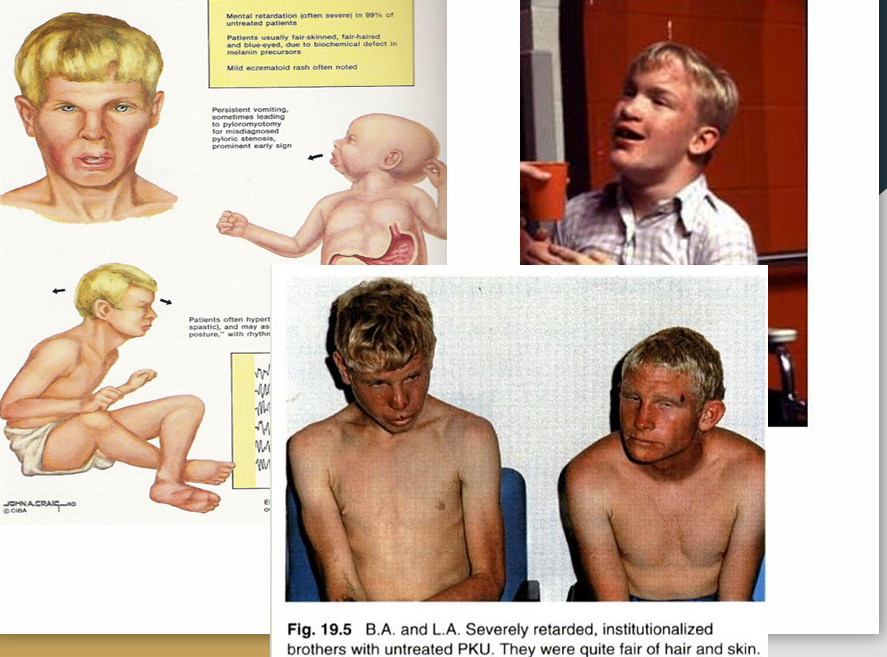
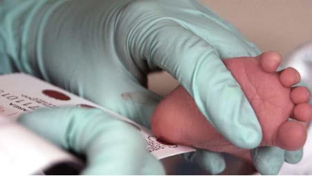
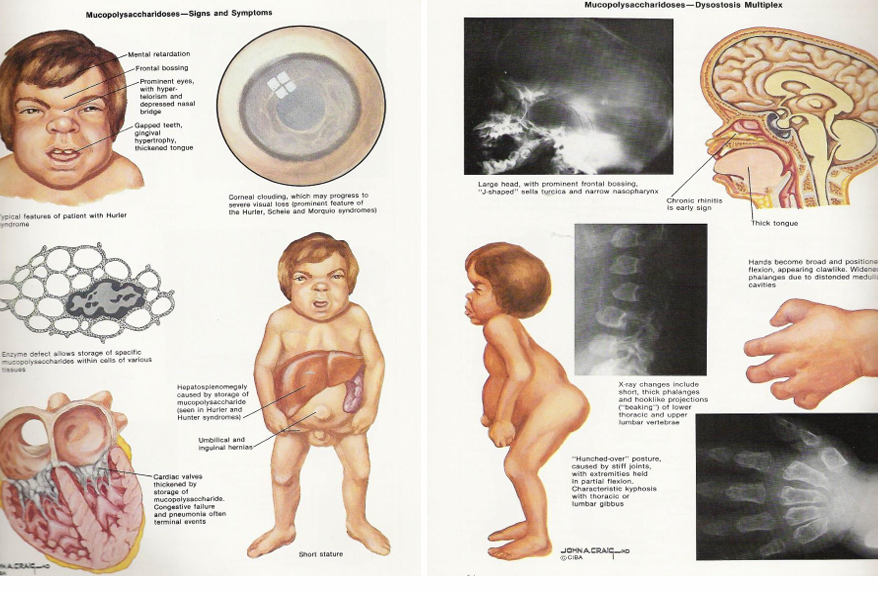
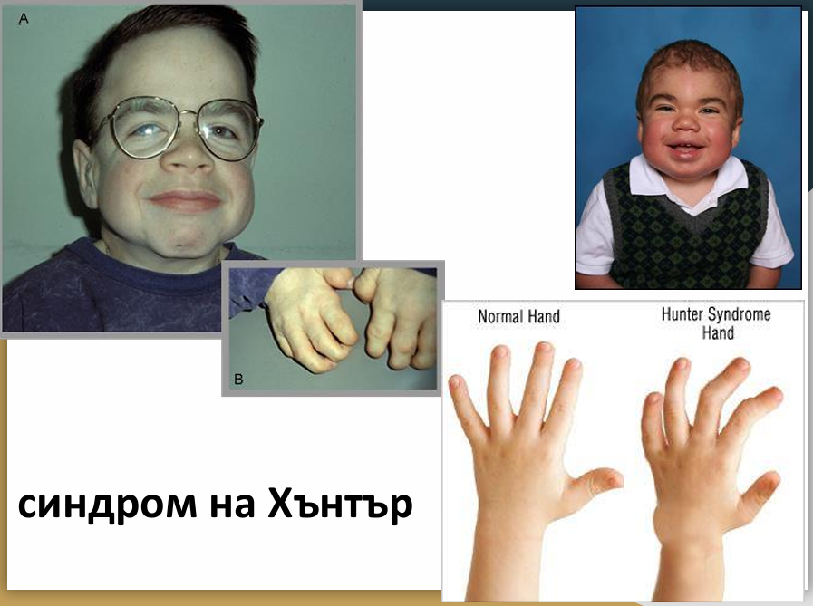
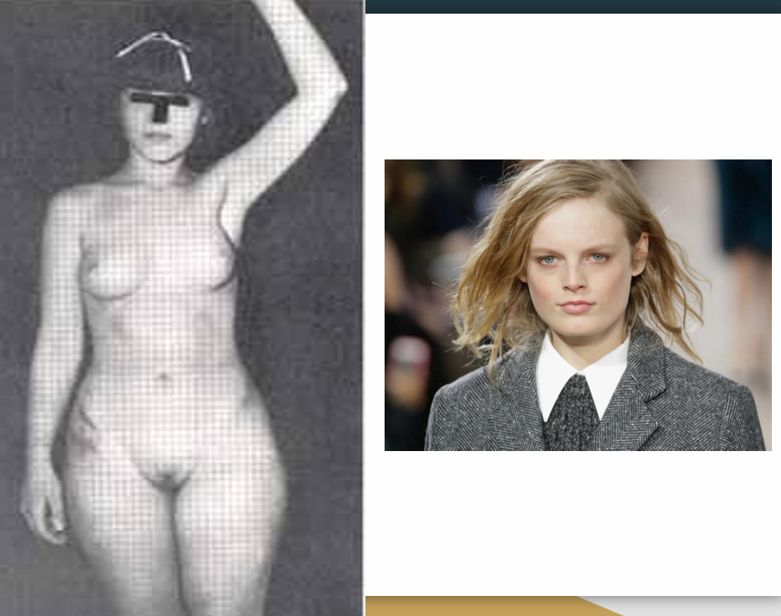

# Наследствени метаболитни болести
• **Определение** – група моногенни заболявания, възникващи в резултат на засягане синтезата или функцията на ензим от даден метаболитен път
• **Тип на унаследяване** – предимно автозомно-рецесивен с малки изключения
• **Честота** – общо около 1/2500 новородени
• Голяма част от тях спадат към групата на т.нар. “редки болести” (честота по - ниска om 1:2000)

## Класификация
| Нарушение | Дефектен ензим | Клиника |
|:---|:---|:---|
| **Аминокиселинна обмяна** | | |
| Фенилкетонурия | Phenylalanin hydroxylase | Умствено изоставане, светла кожа, епилепсия |
| **Стероиден метаболизъм** | | |
| Вродена надбъбречна хиперплазия (ВНХ) | 21-hydroxylase | Вирилизация, загуба на сол |
| Андрогенна нечувствителност | Androgen receptor | Вторични полови белези от женски тип, тестиси, мъжки кариотип |
| **Гликогенов метаболизъм** |  |  |
| Болест на Помпе | Lysosomal α-1,4-glucosidase | Сърдечни проблеми, мускулна слабост |
| **Липиден метаболизъм** | | |
| Фамилна хиперхолестеролемия | Low density lipoprotein receptor | Атеросклероза в млада възраст |
| **Лизозомни болести на натрупването** | | |
| **Мукополизахаридози (MPS)** | | |
| Хърлър с. (MPS I) | a-L-iduronidase | Ум. изост., скелетни аномалии, хепатослпленомегалия |
| Хънтър с. (MPS II) | Iduronate sulfate sulphatase | Ум. изост., скелетни аномалии, хепатослпленомегалия |
| **Sphingolipidoses** | | |
| Gaucher's disease | Glucosylceramide-beta-glucosidase | Тип 1 - болки в стави и кости  Туре II - спастицитет |
| **Copper metabolism** | | |
| Wilson's disease | ATPase membrane copper transport protein | Спастицитет, ригидност, дисфагия, цироза |

---
## Нарушения в обмяната на аминокиселините
### Фенилкетонурия (ФКУ)
- **Честота** - 1: 10 000 новородени (1/2900 в някои популации)
- **Ензим** – фенилаланин хидроксилаза (12q24.1)
- Над 400 различни мутации
- **Масов скрининг на новородени!** (заедно с ВНХ и вроден хипотиреоидизъм). Методът при ФКУ е флуориметричен
- Ензимният блок води до дефицит на **тирозин** с последващо намаление на синтеза на **меланин**, което е причината децата често да са **руси и със сини очи**.
- *Substantia nigra* – редуцирано количество пигмент.
#### **Клинична картина**
- Умствено изоставане
- Епилепсия
- Забавено развитие
- Руса коса, сини очи, бяла кожа
- Екземи
- Повръщане
- Екскреция на фенилкетопродукти с потта и урината – **“миши” аромат**

#### **Майчина ФКУ**
- Неспазваща диета бременна жена с ФКУ може да доведе до:
  - Вродени сърдечни дефекти
  - Микроцефалия
  - Ниско тегло при раждане
  - Умствено изоставане
  - Забавено развитие
  - Затруднение в говора
  - Такива жени са и с висок риск от спонтанни аборти.
#### **Скрининг на новородени**
ФКУ е включена в масовия скрининг на новородени заедно с Вродената надбъбречна хиперплазия и Вродения хипотиреоидизъм.
Изследването се провежда със сухи петна от кръв (от петичката), нанесени върху специална филтърна бланка.
Взимането на кръв от всички новородени се извършва в родилните заведения:
* 2-3 ден след раждането;
* 30-60 мин. след нахранването;
* всички кръгчета на филтърната бланка трябва да бъдат пропити с кръв;
* след изсъхване на стайна температура пробите се изпращат веднага в специализирана лаборатория.

#### **Лечение**
*  Целта на лечението е възстановяване на нормалните нива на фенилаланин в кръвта чрез хранителен режим.
*  Пациентите трябва да сдържат **диета** с храни бедни на фенилаланин.
*  Диетата трябва да започне колкото се може по-скоро.
   *  **KUVAN (sapropterin dihydrochloride)**: Активното вещество е фармацевтичният вариант на BH4 (тетрахидробиоптерин), който подпомага ензима да поддържа ниски нива на фенилаланин в кръвта.
   *  **PALYNZIQ (pegvaliase-pqpz)**: Инжекционен разтвор, който понижава нивото на фенилаланин, действайки като заместител на PAH ензима. При лечение с PALYNZIQ не е необходимо да се спазва диета.
---
### Лизозомни болести на натрупването - мукополизахаридози сфинголипидози
- Лизозомите са органели, съдържащи хидролитични ензими, участващи в  разграждането на разнообразни  макромолекули. Дефектите в хидролазните гени водят до натрупване на субстрати в лизозомите, което нарушава клетъчните функции. 
- Заболяванията от тази група имат прогресивен ход, характеризират се **органомегалия**, а при засягане на ЦНС и с **невродегенеративни промени**. 
- Повечето са **автозомно рецесивни**.

### Мукополизахаридози (MPS)
- Мукополизахаридозите са хетерогенна група заболявания дължащи се на намалена способност за разграждане на глюкозаминогликани. 
- Десет ензимни дефекта причиняват 6 различни заболявания със сходна клинична картина.
- Характеризират се със специфична екскреция в урината на дерматан, хепаран, кератан и хондроитин сулфат.
- **Клинична картина**:
  - Скелетни аномалии
  - Сърдечни проблеми
  - Засягане на ЦНС
  - Загрубяване на чертите на лице - в резултат на прогресивната акумулация на  глукозаминогликани
#### MPS 1 - Синдром на Хърлър:
- **Автозомно рецесивно унаследяване** 
- Честота: 1-2/100 000 
- Начало < 18 месеца;  
- Най-тежката мукополизахаридоза.
- Скринингови тестове – наличие на дерматан и хепаран сулфат в урината
- Ензимна диагностика
- **Клиника**:
  - Груби черти на лицето
  - Помътняване на корнеята
  - Хепатомегалия 
  - Сърдечни клапни дефекти 
  - Затруднение в дишането 
  - Загуба на слуха 
  - Гръбначни деформации 
  - Ставни контрактури  
  - Умствено изоставане
  
- **Лечение:**
  - Ензим заместителна терапия с Iduronidase (Aldurazyme) 
    - подобряване на белодробната функция
    - намаляване количеството карбохидрати  натрупани в органите
  - Оперативна корекция на костните  деформации. 
  - Оперативно коригиране на зрителните  нарушения. 
  - Костно мозъчна трансплантаци
#### MPS II – синдром на Хънтър 
- **Ензимен дефицит**:  L-iduronate sulfatase 
- **Натрупван метаболит**:  дерматан и хепаран сулфат 
- **Унаследяване**:  **Х-свързано рецесивно** 
- Начало на клининична картина – 1 до 3 год.  
- Клиника – подобна на синдрома на Hurler,  но с по-бавна прогресия

- **Лечение**:
  - Ензим заместителна терапия с Elaprase (Idursulfase):
    - Подобрява значително състоянието на децата, особено ако терапията започне в ранни етапи на заболяването
  - Костно-мозъчна трансплантация.
  - Палиативни грижи – респираторни и кардиоваскуларни усложнения, артропатия, нарушения на слуха и зрението.

### Сфинголипидози
#### Болест на Gaucher
* **Унаследяване** – <u>Автозомно рецесивно</u>
* **Дефицит** на глюкоцереброзидаза
* **Tипове Gaucher disease**
  * Tип 1 – Хронична неневронопатична форма
  * Tип 2 – Остра невронопатична форма
  * Tип 3 – Хронична невронопатична форма
  **Tип I – Хронична неневронопатична форма**
- Най-честата форма
- Честота - 1/ 40 000 (1/450 при евреи Ешкенази)
- Начало във всяка възраст
- **Най-чести симптоми:**
  - хепатоспленомегалия
  - анемия
  - тромбоцитопения
  - скелетни аномалии: фрактури, артрит и др.
  - Няма засягане на ЦНС.
- **Лечение на Gaucher**
  - Ензим заместителна терапия с **CEREZYME** при пациенти с болест на Гоше тип I независимо от възрастта. 
  - Подпомага следните симптоми: анемия, тромбоцитопения, костни аномалии, хепато- или спленомегалия.
  **Тип II, остра невронопатична форма**
- Начало в кърмаческа възраст:
  - масивна хепатоспленомегалия
  - прогресивно засягане на ЦНС
  - тежко неврологично засягане,
  - продължителност на живота до около 2 години
  **Тип III, субакутна невронопатична форма**
- Начало в детско-юношеска възраст.
  - бавно прогресиращо неврологично засягане
  - хепатомегалия
  - спленомегалия

---
### Нарушения в гликогенов метаболизъм
#### Болест на Помпе
- **Унаследяване** – Автозомно рецесивно
-  **Дефицит** на кисела алфа-глюкозидаза (GAA)
  - Нарушено разграждане на гликоген в лизозомите
- Натрупването на гликоген води до:  прогресивна мускулна слабост особено засягаща сърцето, скелетните мускули и черния дроб.
- **Честота** - 1:40,000
- **Болестта на Pompe има три клинични форми, съобразно началoто на клиничната картина**:
  - **Инфантилна форма** - начало на симптоматиката няколко месеца след раждане.
    - силно понижен до липсващ мускулен тонус
    - кардиомегалия
    - хепатомегалия
    - макроглосия
    - Запазено нервно-психическо развитие
    - Повечето пациенти загиват до 2 год. възраст.
  - **Ювенилна форма**
    - прогресивна слабост на мускулатурата
    - нарушения в походката
    - сколиоза
    - лордоза
    - дихателна недостатъчност, сънна апнея
    - Запазен интелект
    - Продължителност на живота – 20-30 год.
  - **Адултна форма**
    - по-късно начало
    - бавна прогресия
    - първи симптом: прогресивно намаляване на мускулната сила, започващо от краката и постепенно обхващащо мускулите на ръцете и диафрагмата.
    - чести респираторни инфекции
      **Лечение**: ензим заместителна терапия с **Myozyme**
---
### **ДЕФЕКТНИ ИЛИ ЛИПСВАЩИ ЛИЗОЗОМАЛНИ ЕНЗИМИ, ПРИЧИНЯВАЩИ КОНКРЕТНО ЗАБОЛЯВАНЕ.***
**Дефектни ензими при ганглиозидозите**
#### Болест на Фабри
- **Унаследяване** – X – рецесивно
- **Честота**: 1/40 000
- **Нарушение** – в метаболизма на гликосфинголипидите, в резултат на alpha galactosidase A дефицит
- Първите симптоми се проявяват в детска възраст с епизоди на силни болки в крайниците – **акропарестезия**
- **Ранни симптоми**
  - **Акропарестезии** – парещи болки в крайниците
  - **Ангиокератоми**
  - **Хипохидроза**
  - Промени в лещата и корнеята
  - Бавно прогресиращо заболяване със засягане на:
    - бъбреци, най-честата причина за летален изход е **терминалната бъбречна недостатъчност**
    - сърце
    - нервна система – **инсулт**
- **Лечение: Ензим заместителна терапия с Fabrazyme**

---
### Нарушения в обмяната на металите
#### Болест на Уилсън
- **Унаследяване** – <u>Автозомно рецесивно</u>
- Характеризира се с натрупване на **мед** в:
  - черен дроб
  - мозък
  - очи
  - ЦНС
- **Честота**: 1:30 000.
- **Ген** – възниква в резултат на мутация в **ATP7B** гена
- **Диагноза**
  - Нисък церулоплазмин
  - Куприурия
  - Куприемия
  - Тест с Купренил
  - ДНК анализ
- **Лечение**
  - Целта на лечението е да се премахне акумулиралия мед и превенция на реакумулацията.
  - **Хелираща терапия** с penicillamine (Cuprimine and Depen) и trientine (Syprine and Trientine Dihydrochloride) – действието на хелаторите е да свързват медта и да подпомогнат изхвърлянето ѝ с урината.
  - Диета
  - Трансплантация на черен дроб

---
### Нарушения на стероидната обмяна
#### Вродена надбъбречна хиперплазия (ВНХ)
- **Честота** – 1/12 500
- **Унаследяване** – <u>Автозомно рецесивно</u>
- 95% от случаите са свързани с дефицит на **21- хидроксилаза**
- Мутации на гените за ензими, участващи в синтеза на кортизол от холестерол в надбъбречните жлези
- **Форми**:
  - **Вирилизация със загуба на сол** (75%)
  - **Проста вирилизация** (25%)
  - **Некласическа форма** – хирзутизъм, ранен пубертет, акне, нарушения в менструалния цикъл
- **Масов неонатален скрининг** – определяне на **17-хидроксипрогестерон** върху филтърна бланка - радиоимунологично
- **Клинична картина**
  - **Момичета** – вирилизация на външните гениталии в различна степен:
    - клиторомегалия
    - лабиална фузия
  - **Момчетата с класическа форма на ВНХ** се диагностицират в ранния неонатален период:
    - по повод нарушения в храненето,
    - ненаддаване на тегло,
    - дехидратация (ниски нива на серумния Na, висок К, ацидоза)
    - повишени нива на ОН-прогестерон,
    - понякога хипогликемия
- **Лечение**
  - **Глюкокортикоиди** - намаляват нивата на стероидните хормони
  - Минералкортикоиди,
  - Лечение на дехидратацията
  - Оперативна корекция на гениталите

#### Синдром на пълна андрогенна нечувствителност (синдром на Morris, тестикуларна феминизация)
- **Унаследяване** – <u>Х-рецесивно</u>
- **Честота** – 1/20 000 живородени
- **Молекулярен дефект** – нарушена функция на **андрогенния рецептор** (Хq11)
- **Патогенеза**
  - Първичната диференциация на мъжкия пол зависи от андрогенните хормони тестостерон и дихидротестостерон (DHT), произвеждани от феталните тестиси. Мутациите в андрогенния рецептор възпрепятстват нормалното свързване между лиганд и рецепторна молекула и ембрионът се развива като **женски**.
  - Освен андрогени клетките на тестисите синтезират **анти-Мюлеров хормон**, което води до закърняване на структурите, от които биха се развили маточни тръби, матка и горната част на влагалището.
- **Фенотип**
  - Фенотипно нормални момиченца при раждането, възможно е откриването на **двустранна ингвинална херния**, съдържаща задържаните тестиси
  - **Аменорея** (липса на матка)
  - По време на пубертета се развиват вторични полови белези от женски тип (гърди), но **липсва окосмяване** (аксиларно и пубисно).
- **Диференциална диагноза:**
  - Парциална андрогенна нечувствителност 
  - 46,ХУ жени (SRY mutations)
- **Лечение**
  - Хирургично отстраняване на тестисите поради риск от малигнизация
  - Хормонзаместителна терапия за индуциране на нормално пубертетно развитие и профилактика на ранна остеопороза.
  - Оперативна корекция на влагалището
  