# Упражнение 1

# Наследствени заболявания - класификация. Генеалогичен метод

### Медицинска генетика

**Медицинската генетика** обхваща всяко приложение на генетиката в медицинската практика.

* **Изучава** закономерностите на унаследяване на генетичните заболявания.
* **Разкрива** тяхната генетичната същност.
* **Анализира** молекулярните механизми, водещи до генетични заболявания.
* **Осигурява** диагностика, лечение и профилактика.
  Медицинската генетика включва и процеса на **генетично консултиране**, насочен към пациенти и техните родственици, с цел предоставяне на обоснована информация за риска от наследствени заболявания, прогнозата на тяхното протичане и възможностите за профилактика и лечение.

---

### Основни структури и открития

**Брой хромозоми**
С помощта на светлинен микроскоп през 50-те години на миналия век се установява, че нормалната човешка клетка съдържа **46 хромозоми**.
**Нормален кариотип**

* **Автозоми:** Хромозоми 1 до 22.
* **Гонозоми:** XX (female) и XY (male).

**Характеристики на човешкия геном**

* Изграден от около **20 000 гена**.
* **3 X 10⁹ bp** (**3 млрд. нукл.двойки**).

---

### Класификация на генетичните заболявания

Всяка патологична промяна в генетичния материал може да доведе до възникване на генетично заболяване. Генетичните заболявания се подразделят на няколко групи:

1. **Хромозомни болести**
2. **Моногенни (Менделови) болести**
3. **Мултифакторни заболявания**
4. **Митохондриални заболявания**
5. **Соматични (придобити) генетични нарушения**

#### 1. Хромозомни болести

* Дължат се на **хромозомни промени (аберации)**, които са разнообразни по вид нарушения – бройни и структурни.
* Формираният хромозомен дисбаланс води до тежки смущения в соматичното, половото и интелектуалното развитие.

#### 2. Моногенни болести

* Резултат от патологична промяна в **отделен ген** и се унаследяват по законите на Мендел.
* Унаследяват се **автозомно- или полово-свързано**:
  * Автозомно доминантно
  * Автозомно рецесивно
  * Х-свързано доминантно
  * Х-свързано рецесивно

#### 3. Мултифакторни заболявания

* Причиняват се от **множество генетични и негенетични фактори**.
* Включват както **единични вродени аномалии**, така и някои **често срещани заболявания при възрастни**: артериална хипертония, диабет и др..

#### 4. Митохондриални болести

* Резултат от разнообразни и различни по вид **генни мутации, възникнали в митохондриалната ДНК (мтДНК)**.

---

### Генеалогичен (родословен) метод на изследване

* **Определение:** Първи етап на генетичната консултация.
* **Цели:**
  * Да установи типа на унаследяване на патологичния признак (заболяване).
  * Да определи вероятните генотипове на родствениците.
  * Да подпомогне поставянето на генетичната диагноза.
  * Да определи риска за повторение в поколенията.
* **Резултат:** Завършва с начертаването на **родословна схема**, която представлява графичен израз на семейната история на консултиращите се.
* **Характеристики:** Родословията дават възможност да се проследи унаследяването на гените, тъй като предоставят информация за много индивиди с определено заболяване. Индивидите са характеризирани съобразно своя пол, възраст, поколение и биологични връзки помежду си.

#### Основни понятия

* **Пробанд (index case):** Индивид с диагностицирано генетично заболяване, заради когото семейството е насочено за генетично консултиране; от него започва анализът на родословието.
* **Консултиращ се:** Пациент/семейство, посетил генетична консултация по повод генетично заболяване в семейството.
* **Сибси (siblings):** Братя и сестри.
* **Кръвно родство:** Генетична връзка чрез общ предшественик

#### Изграждане на родословия

* Използват се специфични, общоприети символи.
* Започва се от **пробанда**, който се означава със запълване на символа и сочеща го стрелка.
* Лицата от едно поколение се разполагат хоризонтално на една линия, срещу която се намира номера на поколението, означен с **римска цифра**, а с **арабска цифра** се отбелязват самите индивиди.
* Кръвнородствени бракове, спонтанни аборти, мъртвораждане се отбелязват със съответния символ.

.

#### Кръвнородствени бракове

* Имат особено значение при **редки автозомно-рецесивни заболявания**.
* Кръвното родство увеличава многократно вероятността за бракове между **хетерозиготи** по един и същ болестен алел.
* Колкото по-рядко е едно **рецесивно разстройство**, толкова по-голяма е честотата на кръвно родство сред родителите на засегнатите индивиди.
* **Степени на родство:** I, II, III, IV, V степен.

---

### Типове на моногенно унаследяване

#### **1. Автозомно доминантно (АД) унаследяване**

* **Дефиниция:** Локусът на гена е върху автозомна хромозома, като само **един мутантен алел** е достатъчен за експресия на фенотипа.

**Класически критерии**
* Всяко засегнато дете има поне един болен родител.
* В еднаква степен се засяга както женския, така и мъжкия пол.
* Както засегнатите жени, така и засегнатите мъже могат да предадат белега в своето поколение без оглед пола на децата.
* Рискът за болният хетерозигот да предаде патологичния белег в поколението е **50%**.
* Фено- и генотипно здравите индивиди създават здраво потомство.

**Характеристики на доминантните гени, водещи до отклонения от класическия ход на унаследяване**
* **Вариабилна експресивност:** Различна по тежест клинична изява на гена, възможна е т.нар. **„мин. симптоматика“**.
* **Плейотропен ефект:** Явление, при което един абнормен ген определя множество фенотипни изяви в различни органи и системи.
* **Непълна пенетрантност:** Мутантният алел е унаследен, но не се изявява фенотипно в част от хетерозиготите – феномен **„всичко или нищо“**.
* **Късно начало**.
* **Нова мутация:** Нововъзникнала мутация в единична герминативна клетка на здрав родител.
* **Мозаицизъм:** Присъствие в един индивид или в една тъкан на ≥ 2 клетъчни линии, които произлизат от една зигота.
  * **Гонаден мозаицизъм:** В здрав родител се образуват гамети, част от които носят генна мутация.
  * **Соматичен мозаицизъм:** Генна мутация, настъпила рано в ембриогенезата.
    

**Примери за АД заболявания**
* Синдром на Марфан
* Болест на Хънтингтън
* Неврофиброматоза тип I
* Автозомно доминантна бъбречна поликистоза
* Остеогенезис имперферкта
* Ахондроплазия
* Фамилна хиперхолестеролемия и др.

---

### 2. Автозомно рецесивно (АР) унаследяване
* **Дефиниция:** Локусът е върху автозомна хромозома; необходими са **два мутантни алела** за експресия на фенотипа. Болните са **хомозиготи по рецесивен алел „аа“**.

**Критерии**

* Болните с АР заболяване имат **здрави родители**, които са **хетерозиготни носители**.
* Най-често няма други болни в родословието, освен евентуално сибси (заболяването се среща обикновено в **едно поколение**).
* Еднакво се засягат и двата пола.
* Рискът в поколението на двама хетерозиготи да се роди болно дете е **25%**.
* **Висока честота** при кръвнородствени бракове, изолатни групи.

**Допълнителни характеристики**
* **2/3** е вероятността незасегнатите сибси на болен индивид да са **носители** на мутантния алел.
* Родителите и децата на болен от АР заболяване се наричат **облигатни хетерозиготи**.

**Видове хетерогенност**

* **Локусна хетерогенност:** Мутации в различни гени и локуси водят до появата на едно и също заболяване (напр. АР глухота).
  * **Двоен хетерозигот:** Индивид, който е хетерозигот по гени в два различни локуса: **aa**BB x AAbb -> A**a**Bb
* **Алелна хетерогенност:** Различни мутации в даден локус са причина за появата на дадено състояние.
  * **Компаунд хетерозигот:** Индивид, при който са идентифицирани две различни мутации в един и същи локус: A**a1** x Aa2 -> **a1a2**
    

**Примери за АР заболявания**
* Кистична фиброза (муковисцидоза)
* Спинална мускулна атрофия
* Бета таласемия
* Сърповидноклетъчна анемия
* Почти всички вродени метаболитни болести и др.

---

### 3. Полово свързани гени

* **Дефиниция:** Гените, локализирани върху Х или Y хромозомата.
  * Мъжете са **хемизиготи** по отношение на гените върху X – хромозомата.
  * Жените унаследяват по една Х – хромозома от всеки родител.

#### Феномен на лайонизация (Хипотеза на Лайън)
* В ранна ембриогенеза, с еднаква вероятност, едната от Х хромозомите се **инактивира** във всяка от соматичните клетки.
* Жените са **естествена мозайка** – част от клетките им имат активна бащина Х, а останалата част – активна майчина Х хромозома.
* Инактивацията уеднаквява съотношението между Х свързаните гени при мъже и при жени.

---

### 4. X – доминантно унаследяване
#### Критерии
* Всеки болен (мъж или жена) има поне един болен родител.
* Жените предават белега на **50%** от своите деца при всяка бременност. 
* **Никога не се наблюдава предаване от баща на син** (разлика с АД унаследяване).
* Мъжете предават патологичния алел на **всички свои дъщери** и на **нито един от своите синове**.
* Мъжкият пол е **по-тежко засегнат** (някои гени са с летален ефект).

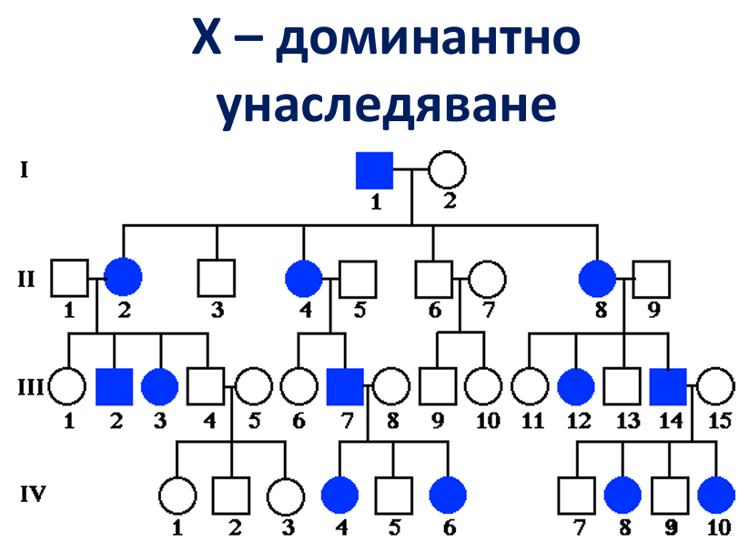

---

### 5. X – рецесивно унаследяване
#### Критерии
* Засегнат е **предимно мъжкия пол**.
* Патологичният алел **винаги се експресира в мъжкия пол** (тъй като мъжете са хемизиготи).
* Родителите на болния са фенотипно здрави, но майката е **хетерозиготен носител** на патологичния ген.
* **Общ риск** за потомството на хетерозиготна майка е **25%**, като:
  * Боледуват **50%** от момчетата.
  * Дъщерите са здрави, но **50% са носителки**.
* **Болен баща** има най-често **здраво потомство**:
  * Дъщерите са здрави, но **облигатни хетерозиготи**.
  * Синовете са фено- и генотипно **здрави**.

  

#### Примери за ХР заболявания
* Хемофилия
* Цветна слепота
* Мускулна дистрофия на Дюшен/Бекер
* Някои вродени метаболитни болести (Мукополизахаридоза тип 2 (Болест на Хънтър), болест на Фабри и др.).

---

### 6. Митохондриално (цитоплазмено) унаследяване
* **Причина:** Дължи се на мутации в **митохондриалната ДНК (мтДНК)**.
* **Унаследяване:** Само **от майките**, тъй като мтДНК е локализирана в цитоплазмата на овоцита.
* **Предаване:** Мъжете унаследяват своите мтДНК от майките си, но **не могат да ги предават** на своето потомство.

#### Състояния
* **Хомоплазмия:** Наличие в клетките на идентични митохондрии, само с **нормална** или само с **мутантна** ДНК. Клиничният ефект е най-силен, когато клетките имат само мутантна мтДНК.
* **Хетероплазмия:** Наличие в клетките на два вида митохондрии – с **нормални** и с **мутантни** ДНК-и, но в различно съотношение в отделните органи и тъкани и в отделните засегнати индивиди. По-голяма част от митохондриални заболявания са в резултат на хетероплазмия.

---

# Упражнение 2

# Заболявания, свързани със засягане на съединителната тъкан. Кардиогенетика. Таргетни и геномни методи за лабораторен анализ.

### Заболявания, свързани със засягане на съединителната тъкан
* Синдром на Марфан
* Синдром на Елерс-Данлос
* Ахондроплазия
* Остеогенезис имперфекта

### Синдром на Марфан (Marfan)
* Честота – 1/5 000 - 1/10 000
* Системно заболяване, засягащо **съединителната тъкан**, с прояви от страна на три системи:
  * Сърдечно-съдова система
  * Костна система
  * Зрителен анализатор
* **Характеризира се:**
  * с **вариабилна експресивност**
  * с **алелна хетерогенност**
  * **АД тип на унаследяване**
  * **плейотропен ефект** на мутантния ген.
  * Тези ефекти могат да обяснят вариращата клинична изява при отделните индивиди.
* Заболяването е резултат от мутации във **фибрилин-1 гена (FBN1)**, като при 25-35% от пациентите мутацията е <u>de novo</u> възникнала
* FBNI генът е голям ген с 65 екзона, открити са над 200 мутации
* Фибрилин 1 е екстрацелуларен матриксен протеин, включен при формирането на микрофибрилите. От своя страна те участват:
  * при формирането и хомеостазата на еластичния матрикс
  * във връзката матрикс-клетка
  * вероятно в регулацията на определени растежни фактор

#### Клинични белези
* **Скелетна система:**
  * Непропорционално <u>висок ръст с астеничен хабитус</u>.
  * <u>Арахнодактилия</u>.
  * <u>Wrist and thumb signs</u>.
  * Сколиоза.
  * Pectus carinatum, pectus excavatum.
  * <u>Ставна хипермобилност</u>.
  * Високо небце с лошо подредени зъби
  * Характерен лицев израз (долихоцефалия, енофталм, ретрогнатия, насочени надолу външни очни ъгли
* **Зрителен анализатор**
  * Ектопия (<u>дислокация на лещата</u>).
  * Плоска корнея.
  * Катаракта.
  * Глаукома.
   * При пациенти под 50 годишна възраст → късогледство, отлепяне на ретината.
* **Сърдечно-съдова система**
  * <u>Дилатация на аортния корен</u> (синуси на Valsalva) – 70-80% от случаите
  * <u>Дисекация на aorta ascendens</u>.
  * Дилатация на aorta abdominalis
  * <u>Митрален пролапс</u> (честота 55-69%)± митрална регургитация.
* **Други органи и системи**
  * Бял дроб → спонтанен пневмоторакс.
  * Кожа → атрофични стрии предимно по предната част на раменете, кръста и гърба.
  * Хернии, особено ингвинални.
    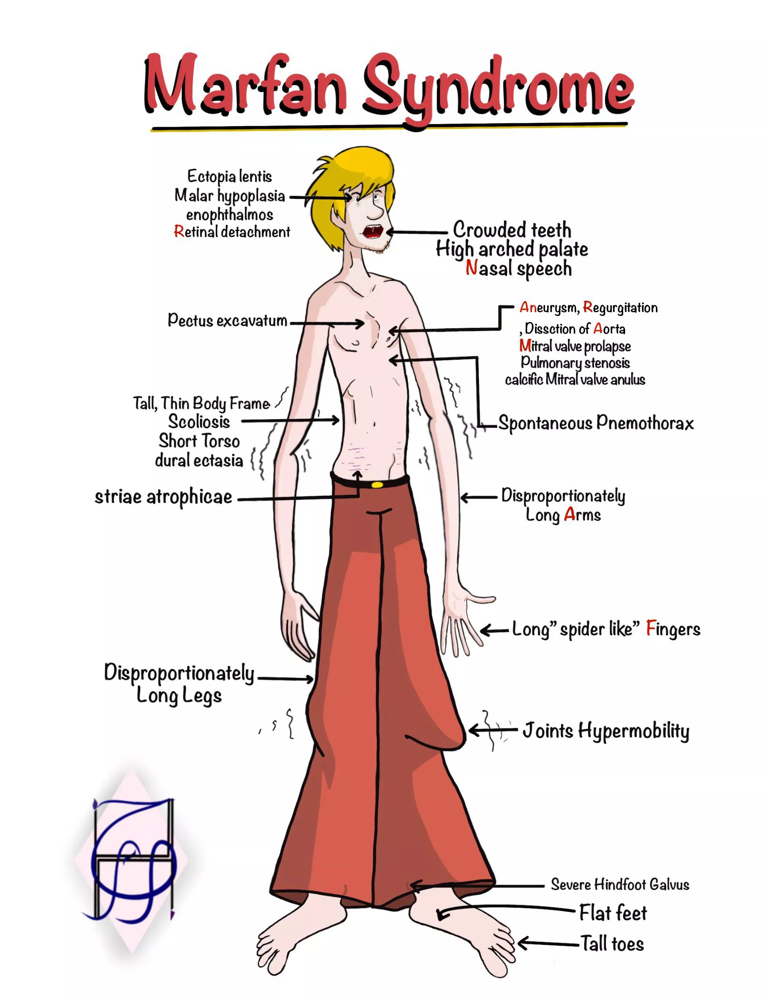

#### Диагноза
* Диагнозата синдром на Marfan се поставя с помощта на диагностични критерии, базирани на клиничните данни, фамилната история и молекулярните изследвания.
* За да бъде диагностицирането улеснено са създадени международни диагностични критерии (критерии на Гент), базирани на основни и/или второстепенни клинични признаци.
* За целта може да се използват онлайн калкулатори.
* **ДНК анализ**
  * **Секвениране на гена**
  * Делеционен анализ
  * Ограничения: Съществува възможност за припокриване на клиничните белези на синдрома с други състояния, които не се дължат на мутации в FBN1
* **Фамилна анамнеза**
  * Родител, дете или сибс, при когото се откриват диагностичните критерии
  * Доказана мутация във FBN1 гена, причиняваща синдром на Марфан

#### Генетично консултиране
* Рискът за повторение е 50%, ако е засегнат единият родител.
* При здрави родители рискът за повторение е нисък, но по-висок от популационния, заради възможността (макар и изключително рядка при синдрома на Марфан) за гонаден мозаицизъм.
* В процеса на консултиране трябва да се оцени вариабилността на болестната изява, като детето може да е по-тежко или по-леко засегнато от болния родител.

## СИНДРОМ НА ЕЛЕРС ДАНЛОС
* Група от наследствени болести с нарушения в **съединителната тъкан**, предизвикващи дефекти в синтезата на колагена
* Характерна е увеличената еластичност и крехкост на тъканите - кожа, мускули, лигаменти, кръвоносни съдове и вътрешни органи
* Описани са 13 клинични типа, като от тях хипермобилният е най-чест, а с най-тежка клинична картина е васкуларният тип
* Честота 1/5000
* Предимно **автозомно-доминантно унаследяване**, но някои форми са автозомно-рецесивни
* Мутациите засягат гени за колаген (COL5A1, COL5A2, COL3A1, COL1A1, COL1A2) или ензими, свързани с неговата обработка.

#### Клинична картина
- **Кожа:**
  - <u>Хипереластичност</u> (разтеглива, кадифена кожа)
  - <u>Лесно образуване на синини</u>, забавено заздравяване на рани, атрофични белези
- **Стави:**
  - <u>Генерализирана хипермобилност</u> 
  - Чести луксации и сублуксации
  - Ранно начало на остеоартрoза
- **Чупливост на тъканите:**
  - <u>Хернии, руптури на органи или съдове</u> (особено при васкуларен EDS)
    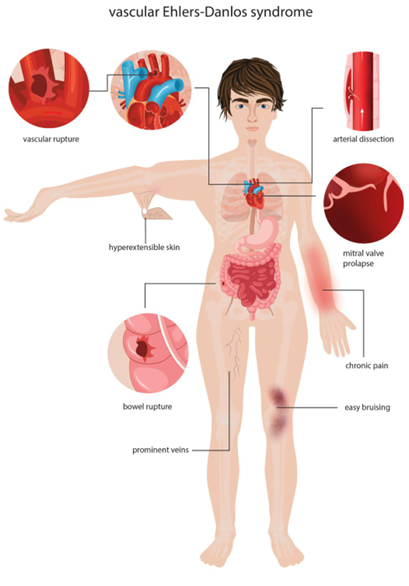

## Диференциална диагноза

| Характеристика       | Марфан                                                       | Лоис–Дийтс                                                   | Елерс–Данлос                                                 |
| :------------------- | :----------------------------------------------------------- | :----------------------------------------------------------- | :----------------------------------------------------------- |
| **Основни симптоми** | Аортна дилатация, луксации на лещата, арахнодактилия, сколиоза, дълги крайници | Аортни аневризми, хипертелоризъм, разцепено небце/увула, хипермобилност, стрии | Хипереластична кожа, хипермобилност, лесно образуване на синини, атрофични белези, съдови руптури |
| **Унаследяване**     | Автозомно-доминантно                                         | Автозомно-доминантно                                         | Предимно автозомно доминантно, някои – автозомно-рецесивни   |
| **Засегнати гени**   | FBN1 (фибрилин-1)                                            | TGFBR1, TGFBR2, SMAD3, TGFB2, TGFB3                          | COL5A1, COL5A2, COL3A1, COL1A1, COL1A2                       |

## АХОНДРОПЛАЗИЯ
* Автозомно-доминантно заболяване
* 1/15 000 живородени
* 85%-**нова мутация**, характерни изключително за **бащините полови клетки**, като рискът корелира с **напреднала бащина възраст**
* Заболяването се дължи на мутация във FGFR 3 гена.
* Той кодира фибробластен рецептор за растежен фактор 3 и мутации в него водят до нарушение в хондроцитите.
* FGFR 3 е трансмембранен тирозин киназен рецептор, който свързва фибробластни растежни фактори.
* Нормалната активация на рецептора инхибира пролиферацията на хондроцитите и дава възможност за координиране на растежа и диференциацията

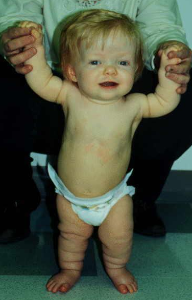

#### Клинична картина
* <u>Ризомелично скъсяване на горните и долните крайници</u>
* <u>Релативно дълъг и тесен гръден кош</u>
* <u>Макроцефалия</u>, депресия на корена на носа, проминиращо чело
* Абнормният растеж на черепа води до малка основа на черепа, стеснени черепни отвори (компресия на мозъчния ствол, централна или сънна апнея)
* Нормален интелект, изоставане в моторното развитие

#### Лечение
* Симтоматично лечение на придружаващите усложнения.
* Противоречиви резултати от оперативни корекции за удължаване на долните крайници и лечение със соматотропен хормон.
* Хомозиготната Achondroplasia е летална!
* Това трябва да се има предвид при желание за брак между двама засегнати – опасност не само от засегнати деца, но и от спонтанни аборти.

## OSTEOGENESIS IMPERFECTA
* Osteogenesis imperfecta (OI) е състояние, което възниква в резултат от нарушения в синтезата на **колаген тип 1** като най – често се манифестира с патологична костна чупливост.
* Съществуват разични типове, характеризиращи се с различна тежест.
* **Тип I е най разпространената, сравнително лека форма**.

#### Патофизиология
* Колаген тип 1 се открива в костите, органните капсули, фасциите, сухожилията, роговиците, склерите, менингите и дермата.
* Структурно колаген тип 1 се състои от две pro-α1 и една pro-α2 вериги.
* COL1A1 17q21 COL1A2 7q22.1

#### Клинична картина
* Физикалната находка може да варира в зависимост от типа на OI
* <u>Костна чупливост и деформации</u>
* <u>Нисък ръст</u>
* <u>Сини склери</u> - в резултат на прозиращата membrana choroidea под абнормно прозрачните склери
* <u>Загуба на слуха</u>
* <u>Нарушена дентиногенеза</u>

#### Генетично консултиране
* Характерен е **автозомно-доминантен тип** на унаследяване
* Заболяването се характеризира с **алелна и локусна хетерогенност**
* В родословното дърво може да се наблюдава пръсната симптоматика, т.е. отделни родственици на пробанда проявяват различни симптоми на синдрома. Това е израз на **плейотропния ефект** на гена.
* Доказва се чрез ДНК анализ.

## Кардиогенетика
* Фамилна хиперхолестеролемия
* Кардиомиопатии
* Ритъмно-проводни нарушения
* Синдроми със засягане на ССС

### Фамилна хиперхолестеролемия
* Унаследяване – **автозомно доминантно**
* Честота на хетерозиготите – 1/500
* Хромозомна локализация – 19р13.1-13.2
* Протеин – LDL - R
* Мутации – missense/nonsense субституции или делеции и инсерции, водещи най-често до нарушено функциониране на LDL рецептора и **повишени нива на LDL холестерола**.

#### Клинична картина
* Клинични белези (хетерозиготи)
* Chol ≥7.5 mmol/l или LDL chol ≥ 4.9 mmol/l
* **Ксантоми** (холестеролови отлагания по сухожилията)
* **Ксантелазми** – холестеролови отлагания по кожата
* **Миокарден инфаркт до 60г.** (75% от мъжете и 45% от жените

### Наследствени кардиомиопатии
* Хетерогенна група заболявания на сърдечния мускул, водещи до структурни и/или функционални нарушения, често с генетична основа.
* Водят до **сърдечна недостатъчност, аритмии и внезапна сърдечна смърт**.
* Най-често са с **автозомно доминантно унаследяване**

### Наследствени ритъмно-проводни нарушения
* Наследствените ритъмно-проводни нарушения са група заболявания, които засягат **йонните канали, проводната система или структурните белтъци на сърцето**, водещи до **аритмии**, **синкопи** или **внезапна сърдечна смърт**, често при млади и иначе здрави индивиди
* Унаследяват се предимно **автозомно доминантно**
* Примери: Синдром на удължен QT (LQTS), Синдром на Бругада, Синдром на болния синусов възел и други

### Синдроми със засягане на ССС
| Синдром                 | Сърдечно-съдови промени                                      |
| :---------------------- | :----------------------------------------------------------- |
| Синдром на Марфан       | Аортна дилатация, аневризми и дисекации; пролапс на митрална клапа; аортна регургитация |
| Синдром на Лоис-Дитц    | Агресивни аневризми и дисекации на аортата и други съдове; бикуспидна аортна клапа; |
| Синдром на Елерс-Данлос | Артериални дисекации и руптури (особено при васкуларен тип); пролапс на митрална клапа |
| Синдром на Даун         | А-В септални дефекти; дефекти на предсърдна/камерна преграда; персистиращ дуктус артериозус; тетралогия на Фало |
| Синдром на Търнър       | Бикуспидна аортна клапа; коарктация на аортата; аортна дилатация и дисекация |
| Синдром на Ди Джордж    | тетралогия на Фало                                           |
| Синдром на Нунан        | Пулмонална клапна стеноза; хипертрофична кардиомиопатия; предсърдни дефекти |

### АДУЛТОРНА БЪБРЕЧНА ПОЛИКИСТОЗА (ADPKD)
- Унаследяване – **автозомно доминантно**
- Честота – 1:1000
- Ген – PKD1 и PKD2, кодиращи полицистин
- Смята се, че тези гени регулират апоптозата, диференциацията на епителните клетки и комуникацията между клетките на матрикса.
- При мутации в тях това може да доведе до ексцесивна секреция на течност, деозорганизация на клетките и образуване на кисти.
- Характеризира се с: **късно начало**, **вариабилна експресивност,** **плейотропен ефект**, **локусна и алелна хетерогенност**.

#### Патогенеза
- Билатерална прогресивна кистична дилатация на реналните тубули
- Вазопресин медиираното повишение на цАМФ в епитела има главна роля за образуването на кистите.
- С натрупването на течност кистите се разширяват, притискат околния паренхим, прогресивно увреждат бъбречната функция и водят до ХБН.

#### **Клинична картина**
- **Бъбречни симптоми:**
  - Абдоминален дискомфорт, болка
  - Хематурия
  - чести инфекции на ПП
  - нарушена концентрационна способност на бъбреците
  - никтурия
  - полиурия
  - палпаторно наличие на абдоминални маси
  - Инфекциите най-често се дължат на Gram (-) бактерии и протичат с болка, фебрилитет и треска. Кръвните посявки често са положителни за разлика от уринните, тъй като кистите нямат пряка комуникация с каналчетата.
- **Извънбъбречни прояви**
  - Субарахноидални и мозъчни кръвоизливи;
  - Дилатация на аортния корен;
  - Сърдечни клапни аномалии;
  - Хепатални кисти и чернодробна недостатъчност;
  - Кисти в панкреаса;

## Таргетни и геномни методи за лабораторен анализ.
| **Цитогенетични методи**                   | **Молекулярно цитогенетични методи**      | **Молекулярно генетични методи**                             |
| :----------------------------------------- | :---------------------------------------- | :----------------------------------------------------------- |
| Цитогенетичен метод (G-бендинг оцветяване) | FISH (Флуоресцентна in situ хибридизация) | Array CGH (Сравнителна геномна хибридизация с микрочипове)   |
|                                            | Сравнителна геномна хибридизация (CGH)    | Полимеразно верижна реакция (PCR)                            |
|                                            |                                           | Секвениране по Сангер Секвениране от следващо поколение (NGS) |

### Източници на човешка геномна ДНК
* Човешка геномна ДНК може да се изолира от всички видове ядрени клетки.
* Най- чести източници са:
  * Цялостна кръв с антикоагулант EDTA
  * Култивирани амниоцити
  * Хорион биопсия
  * Епителни букални клетки
  * Свежа или замразена проба тъкан и др.
  * Малко количество ДНК може да се получи от смив на букална лигавица и фиксирани тъкани.
* Геномната ДНК остава стабилна много години.
* ДНК екстрахирана от парафинови блокчета може да се използва за семейни случаи на рак на млечната жлеза.

### Основни етапи на ДНК анализа
* Изолиране на ДНК
* Амплификация на ДНК – чрез PCR - реакция
* Анализ на амплифицираната ДНК

### In vitro (неклетъчно) ДНК клониране - PCR. Метод за получаване на голямо количество специфичен сегмент ДНК (амплифицирани копия)
* **Етапи :**
  1. Топлинна денатурация на изходната двуверижна ДНК
  2. Свързване на 2 олигонуклеотидни праймера комплементарни на 3`краищата на единичните ДНК вериги
  3. Удължаване на праймерите върху матриците от едноверижна ДНК с помощта на термоустойчив ензим ДНК полимераза до получаване на двойноверижни копия на изходния ДНК фрагмент
  4. ДНК копията се визуализират след електрофореза и оцветяване с етидиев бромид, флуорисциращ на UV
* Реакцията е **експоненциална** – получава се голямо количество от избрания ДНК фрагмент
* **Предимства на PCR**
  1. Получаване на голямо количество от избрания ДНК фрагмент, който се намножава до 10^9 копия
  2. Голяма скорост на процеса, ДНК се амплифицира за няколко часа
  3. Висока чувствителност и специфичност
  4. Технически лесно за изпълнение – автоматизирано
  5. Не е необходимо голямо количество изходна матрична ДНК, за източник може да служи всякакъв биологичен материал – кръв, кръвни петна, изсушени на филтърна бланка, малки парчета тъкани
* **Ограничения на PCR**
  * Използва се за търсене на конкретни мутации, но не може да изключи всички възможни
  * Трябва да е известна молекулярната етиология на заболяването, за да могат да бъдат синтезирани праймерите

### Секвениране
* Секвенирането е метод за определяне на нуклеотидната последователност на ДНК – четене на гена база по база.
* Служи основно за детекция на точкови мутации.

#### Секвениране по Сангер
* Секвенцията на едноверижна ДНК се определя чрез ензимен синтез на комплементарна верига, чиято синтеза се спира на определено място.
* **Същност на метода**
  * Ако към системата се добави ензима ДНК полимераза и четирите дезоксирибонуклеотидтрифосфата (АТФ, ГТФ, ЦТФ и ТТФ), ще започне синтеза на втора верига, която обикновено продължава до прибавяне на няколко хиляди нуклеотида.
  * Това обаче не става, ако към реакционната смес се добави малко количество дидеоксинуклеотид (например ддАТФ).
  * Ензимът не различава нормалните дНТФ от ддНТФ, така че ддНТФ може да бъде добавен към растящата верига и тогава той блокира по-нататъшното нарастване на веригата, защото няма 3 ́-ОН група.
  * Едноверижни ДНК молекули, които се различават по дължина само с един нуклеотид могат да се разграничат чрез разделянето им с електрофореза в полиакриламиден гел.

#### Секвениране от следващо поколение (NGS)
* Нарича се още масово паралелно секвениране, тъй като протича в една реакция и позволява целият човешки геном да бъде секвениран за едно денонощие.
  * **Таргетно екзомно секвениране** - секвениране на определен брой гени (генни панели)
  * **Цялоекзомно секвениране (WES)** - при този тип анализ се секвенират всички региони от генома, които кодират протеини (екзома - 1-2% от целия геном)
  * **Цялогеномно секвениране (WGS)** – определя се пълната нуклеотидна последователност на генома на дадения пациент
* **Показания за провеждане на цялоекзомно/цялогеномно секвениране**
  * За диагностициране на състояния с голяма генетична хетерогенност
  * Предишни генетични изследвания не са идентифицирали генетичната причина
  * Неизяснено умствено изоставане
  * Неуточнен дисморфичен синдром
  * Фамилни форми на ракови заболявания и др.
* **Предимства и недостатъци на NGS**
  * Едновременно изследване на цели геноми и на панели от голям брой гени при няколко пациента
  * Идентифицира нови кандидат гени
  * Бързина на изследване, недостижима със стандартното секвениране.

---

# Упражнение 3
# Наследствени метаболитни болести
• **Определение** – група моногенни заболявания, възникващи в резултат на засягане синтезата или функцията на ензим от даден метаболитен път
• **Тип на унаследяване** – предимно автозомно-рецесивен с малки изключения
• **Честота** – общо около 1/2500 новородени
• Голяма част от тях спадат към групата на т.нар. “редки болести” (честота по - ниска om 1:2000)

## Класификация

| Нарушение                             | Дефектен ензим                           | Клиника                                                      |
| :------------------------------------ | :--------------------------------------- | :----------------------------------------------------------- |
| **Аминокиселинна обмяна**             | <                                        | <                                                            |
| Фенилкетонурия                        | Phenylalanin hydroxylase                 | Умствено изоставане, светла кожа, епилепсия                  |
| **Стероиден метаболизъм**             | <                                        | <                                                            |
| Вродена надбъбречна хиперплазия (ВНХ) | 21-hydroxylase                           | Вирилизация, загуба на сол                                   |
| Андрогенна нечувствителност           | Androgen receptor                        | Вторични полови белези от женски тип, тестиси, мъжки кариотип |
| **Гликогенов метаболизъм**            | <                                        | <                                                            |
| Болест на Помпе                       | Lysosomal α-1,4-glucosidase              | Сърдечни проблеми, мускулна слабост                          |
| **Липиден метаболизъм**               | <                                        | <                                                            |
| Фамилна хиперхолестеролемия           | Low density lipoprotein receptor         | Атеросклероза в млада възраст                                |
| **Лизозомни болести на натрупването** | <                                        | <                                                            |
| **Мукополизахаридози (MPS)**          | <                                        | <                                                            |
| Хърлър с. (MPS I)                     | a-L-iduronidase                          | Ум. изост., скелетни аномалии, хепатослпленомегалия          |
| Хънтър с. (MPS II)                    | Iduronate sulfate sulphatase             | Ум. изост., скелетни аномалии, хепатослпленомегалия          |
| **Sphingolipidoses**                  | <                                        | <                                                            |
| Gaucher's disease                     | Glucosylceramide-beta-glucosidase        | Тип 1 - болки в стави и кости  Туре II - спастицитет      |
| **Copper metabolism**                 | <                                        | <                                                            |
| Wilson's disease                      | ATPase membrane copper transport protein | Спастицитет, ригидност, дисфагия, цироза                     |

---

## Нарушения в обмяната на аминокиселините

### Фенилкетонурия (ФКУ)
- **Честота** - 1: 10 000 новородени (1/2900 в някои популации)
- **Ензим** – фенилаланин хидроксилаза (12q24.1)
- Над 400 различни мутации
- **Масов скрининг на новородени!** (заедно с ВНХ и вроден хипотиреоидизъм). Методът при ФКУ е флуориметричен
- Ензимният блок води до дефицит на **тирозин** с последващо намаление на синтеза на **меланин**, което е причината децата често да са **руси и със сини очи**.
- *Substantia nigra* – редуцирано количество пигмент.

#### **Клинична картина**
- Умствено изоставане
- Епилепсия
- Забавено развитие
- Руса коса, сини очи, бяла кожа
- Екземи
- Повръщане
- Екскреция на фенилкетопродукти с потта и урината – **“миши” аромат**
  

#### **Майчина ФКУ**
- Неспазваща диета бременна жена с ФКУ може да доведе до:
  - Вродени сърдечни дефекти
  - Микроцефалия
  - Ниско тегло при раждане
  - Умствено изоставане
  - Забавено развитие
  - Затруднение в говора
  - Такива жени са и с висок риск от спонтанни аборти.

#### **Скрининг на новородени**
ФКУ е включена в масовия скрининг на новородени заедно с Вродената надбъбречна хиперплазия и Вродения хипотиреоидизъм.
Изследването се провежда със сухи петна от кръв (от петичката), нанесени върху специална филтърна бланка.
Взимането на кръв от всички новородени се извършва в родилните заведения:
* 2-3 ден след раждането;
* 30-60 мин. след нахранването;
* всички кръгчета на филтърната бланка трябва да бъдат пропити с кръв;
* след изсъхване на стайна температура пробите се изпращат веднага в специализирана лаборатория.
  

#### **Лечение**
*  Целта на лечението е възстановяване на нормалните нива на фенилаланин в кръвта чрез хранителен режим.
*  Пациентите трябва да сдържат **диета** с храни бедни на фенилаланин.
*  Диетата трябва да започне колкото се може по-скоро.
   *  **KUVAN (sapropterin dihydrochloride)**: Активното вещество е фармацевтичният вариант на BH4 (тетрахидробиоптерин), който подпомага ензима да поддържа ниски нива на фенилаланин в кръвта.
   *  **PALYNZIQ (pegvaliase-pqpz)**: Инжекционен разтвор, който понижава нивото на фенилаланин, действайки като заместител на PAH ензима. При лечение с PALYNZIQ не е необходимо да се спазва диета.

---

### Лизозомни болести на натрупването - мукополизахаридози сфинголипидози
- Лизозомите са органели, съдържащи хидролитични ензими, участващи в  разграждането на разнообразни  макромолекули. Дефектите в хидролазните гени водят до натрупване на субстрати в лизозомите, което нарушава клетъчните функции. 
- Заболяванията от тази група имат прогресивен ход, характеризират се **органомегалия**, а при засягане на ЦНС и с **невродегенеративни промени**. 
- Повечето са **автозомно рецесивни**.

### Мукополизахаридози (MPS)
- Мукополизахаридозите са хетерогенна група заболявания дължащи се на намалена способност за разграждане на глюкозаминогликани. 
- Десет ензимни дефекта причиняват 6 различни заболявания със сходна клинична картина.
- Характеризират се със специфична екскреция в урината на дерматан, хепаран, кератан и хондроитин сулфат.
- **Клинична картина**:
  - Скелетни аномалии
  - Сърдечни проблеми
  - Засягане на ЦНС
  - Загрубяване на чертите на лице - в резултат на прогресивната акумулация на  глукозаминогликани

#### MPS 1 - Синдром на Хърлър:
- **Автозомно рецесивно унаследяване** 
- Честота: 1-2/100 000 
- Начало < 18 месеца;  
- Най-тежката мукополизахаридоза.
- Скринингови тестове – наличие на дерматан и хепаран сулфат в урината
- Ензимна диагностика
- **Клиника**:
  - Груби черти на лицето
  - Помътняване на корнеята
  - Хепатомегалия 
  - Сърдечни клапни дефекти 
  - Затруднение в дишането 
  - Загуба на слуха 
  - Гръбначни деформации 
  - Ставни контрактури  
  - Умствено изоставане
    
- **Лечение:**
  - Ензим заместителна терапия с Iduronidase (Aldurazyme) 
    - подобряване на белодробната функция
    - намаляване количеството карбохидрати  натрупани в органите
  - Оперативна корекция на костните  деформации. 
  - Оперативно коригиране на зрителните  нарушения. 
  - Костно мозъчна трансплантаци

#### MPS II – синдром на Хънтър 
- **Ензимен дефицит**:  L-iduronate sulfatase 
- **Натрупван метаболит**:  дерматан и хепаран сулфат 
- **Унаследяване**:  **Х-свързано рецесивно** 
- Начало на клининична картина – 1 до 3 год.  
- Клиника – подобна на синдрома на Hurler,  но с по-бавна прогресия
  
- **Лечение**:
  - Ензим заместителна терапия с Elaprase (Idursulfase):
    - Подобрява значително състоянието на децата, особено ако терапията започне в ранни етапи на заболяването
  - Костно-мозъчна трансплантация.
  - Палиативни грижи – респираторни и кардиоваскуларни усложнения, артропатия, нарушения на слуха и зрението.

### Сфинголипидози
#### Болест на Gaucher
* **Унаследяване** – <u>Автозомно рецесивно</u>
* **Дефицит** на глюкоцереброзидаза
* **Tипове Gaucher disease**
  * Tип 1 – Хронична неневронопатична форма
  * Tип 2 – Остра невронопатична форма
  * Tип 3 – Хронична невронопатична форма

**Tип I – Хронична неневронопатична форма**
* Най-честата форма
* Честота - 1/ 40 000 (1/450 при евреи Ешкенази)
* Начало във всяка възраст
* **Най-чести симптоми:**
  * хепатоспленомегалия
  * анемия
  * тромбоцитопения
  * скелетни аномалии: фрактури, артрит и др.
  * Няма засягане на ЦНС.
* **Лечение на Gaucher**
  * Ензим заместителна терапия с **CEREZYME** при пациенти с болест на Гоше тип I независимо от възрастта. 
  * Подпомага следните симптоми: анемия, тромбоцитопения, костни аномалии, хепато- или спленомегалия.

**Тип II, остра невронопатична форма**
* Начало в кърмаческа възраст
* масивна хепатоспленомегалия
* прогресивно засягане на ЦНС
* тежко неврологично засягане,
* продължителност на живота до около 2 години

**Тип III, субакутна невронопатична форма**

* Начало в детско-юношеска възраст
* бавно прогресиращо неврологично засягане
* хепатомегалия
* спленомегалия

---

### Нарушения в гликогенов метаболизъм
#### Болест на Помпе
- **Унаследяване** – Автозомно рецесивно
- **Дефицит** на кисела алфа-глюкозидаза (GAA)
  - Нарушено разграждане на гликоген в лизозомите
- Натрупването на гликоген води до:  прогресивна мускулна слабост особено засягаща сърцето, скелетните мускули и черния дроб.
- **Честота** - 1:40,000
- **Болестта на Pompe има три клинични форми, съобразно началoто на клиничната картина**:
  - **Инфантилна форма** - начало на симптоматиката няколко месеца след раждане.
    - силно понижен до липсващ мускулен тонус
    - кардиомегалия
    - хепатомегалия
    - макроглосия
    - Запазено нервно-психическо развитие
    - Повечето пациенти загиват до 2 год. възраст.
  - **Ювенилна форма**
    - прогресивна слабост на мускулатурата
    - нарушения в походката
    - сколиоза
    - лордоза
    - дихателна недостатъчност, сънна апнея
    - Запазен интелект
    - Продължителност на живота – 20-30 год.
  - **Адултна форма**
    - по-късно начало
    - бавна прогресия
    - първи симптом: прогресивно намаляване на мускулната сила, започващо от краката и постепенно обхващащо мускулите на ръцете и диафрагмата.
    - чести респираторни инфекции
      **Лечение**: ензим заместителна терапия с **Myozyme**

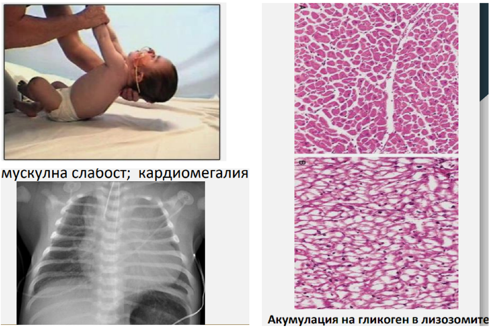

---

### **ДЕФЕКТНИ ИЛИ ЛИПСВАЩИ ЛИЗОЗОМАЛНИ ЕНЗИМИ, ПРИЧИНЯВАЩИ КОНКРЕТНО ЗАБОЛЯВАНЕ.**

**Дефектни ензими при ганглиозидозите**
#### Болест на Фабри
- **Унаследяване** – X – рецесивно
- **Честота**: 1/40 000
- **Нарушение** – в метаболизма на гликосфинголипидите, в резултат на alpha galactosidase A дефицит
- Първите симптоми се проявяват в детска възраст с епизоди на силни болки в крайниците – **акропарестезия**
- **Ранни симптоми**
  - **Акропарестезии** – парещи болки в крайниците
  - **Ангиокератоми**
  - **Хипохидроза**
  - Промени в лещата и корнеята
  - Бавно прогресиращо заболяване със засягане на:
    - бъбреци, най-честата причина за летален изход е **терминалната бъбречна недостатъчност**
    - сърце
    - нервна система – **инсулт**
- **Лечение: Ензим заместителна терапия с Fabrazyme**

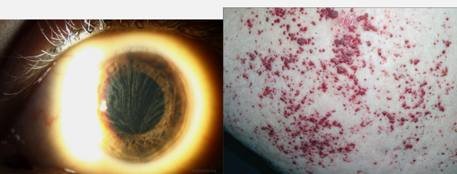

---

### Нарушения в обмяната на металите
#### Болест на Уилсън
- **Унаследяване** – <u>Автозомно рецесивно</u>
- Характеризира се с натрупване на **мед** в:
  - черен дроб
  - мозък
  - очи
  - ЦНС
- **Честота**: 1:30 000.
- **Ген** – възниква в резултат на мутация в **ATP7B** гена
- **Диагноза**
  - Нисък церулоплазмин
  - Куприурия
  - Куприемия
  - Тест с Купренил
  - ДНК анализ
- **Лечение**
  - Целта на лечението е да се премахне акумулиралия мед и превенция на реакумулацията.
  - **Хелираща терапия** с penicillamine (Cuprimine and Depen) и trientine (Syprine and Trientine Dihydrochloride) – действието на хелаторите е да свързват медта и да подпомогнат изхвърлянето ѝ с урината.
  - Диета
  - Трансплантация на черен дроб

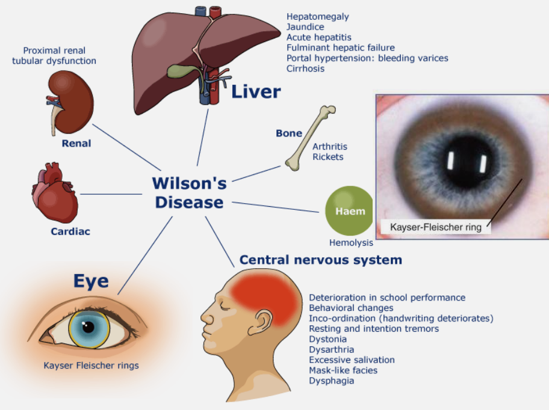

---

### Нарушения на стероидната обмяна

#### Вродена надбъбречна хиперплазия (ВНХ)
- **Честота** – 1/12 500
- **Унаследяване** – <u>Автозомно рецесивно</u>
- 95% от случаите са свързани с дефицит на **21- хидроксилаза**
- Мутации на гените за ензими, участващи в синтеза на кортизол от холестерол в надбъбречните жлези
- **Форми**:
  - **Вирилизация със загуба на сол** (75%)
  - **Проста вирилизация** (25%)
  - **Некласическа форма** – хирзутизъм, ранен пубертет, акне, нарушения в менструалния цикъл
- **Масов неонатален скрининг** – определяне на **17-хидроксипрогестерон** върху филтърна бланка - радиоимунологично
- **Клинична картина**
  - **Момичета** – вирилизация на външните гениталии в различна степен:
    - клиторомегалия
    - лабиална фузия
  - **Момчетата с класическа форма на ВНХ** се диагностицират в ранния неонатален период:
    - по повод нарушения в храненето,
    - ненаддаване на тегло,
    - дехидратация (ниски нива на серумния Na, висок К, ацидоза)
    - повишени нива на ОН-прогестерон,
    - понякога хипогликемия
- **Лечение**
  - **Глюкокортикоиди** - намаляват нивата на стероидните хормони
  - Минералкортикоиди,
  - Лечение на дехидратацията
  - Оперативна корекция на гениталите
  
  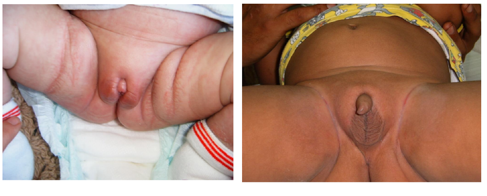

#### Синдром на пълна андрогенна нечувствителност (синдром на Morris, тестикуларна феминизация)

- **Унаследяване** – <u>Х-рецесивно</u>
- **Честота** – 1/20 000 живородени
- **Молекулярен дефект** – нарушена функция на **андрогенния рецептор** (Хq11)
- **Патогенеза**
  - Първичната диференциация на мъжкия пол зависи от андрогенните хормони тестостерон и дихидротестостерон (DHT), произвеждани от феталните тестиси. Мутациите в андрогенния рецептор възпрепятстват нормалното свързване между лиганд и рецепторна молекула и ембрионът се развива като **женски**.
  - Освен андрогени клетките на тестисите синтезират **анти-Мюлеров хормон**, което води до закърняване на структурите, от които биха се развили маточни тръби, матка и горната част на влагалището.
- **Фенотип**
  - Фенотипно нормални момиченца при раждането, възможно е откриването на **двустранна ингвинална херния**, съдържаща задържаните тестиси
  - **Аменорея** (липса на матка)
  - По време на пубертета се развиват вторични полови белези от женски тип (гърди), но **липсва окосмяване** (аксиларно и пубисно).
- **Диференциална диагноза:**
  - Парциална андрогенна нечувствителност 
  - 46,ХУ жени (SRY mutations)
- **Лечение**
  - Хирургично отстраняване на тестисите поради риск от малигнизация
  - Хормонзаместителна терапия за индуциране на нормално пубертетно развитие и профилактика на ранна остеопороза.
  - Оперативна корекция на влагалището
    

---

# Упражнение 4

# Наследствени и вродени неврогенетични и невромускулни заболявания. Митохондриални заболявания.

### Терминология
• **Неврогенетичните и невромускулните заболявания** обхващат голяма група нозологични единици, при които има нарушение от страна на нервната система и/или инервацията на мускулите.
• Симптомите може да включват **мускулна слабост**, **ригидност** на мускулатурата, **загуба на контрол** на движенията, **загуба на равновесие**, **спазми**, мускулни болки, **умствено изоставане** и други.

---

#### Динамични мутации. Антиципация

- **Динамични мутации** (нестабилни) – представляват увеличаване на повтарящи се тринуклеотидни ДНК последователности, които увеличават броя на копията си при преминаване в следващите поколения.
- **Антиципация** – феномен, при който наследственото заболяване се проявява с **по-тежка клинична картина** и с **по-ранно начало** от поколение на поколение. Тя се дължи на прогресивно увеличаващия се брой тринуклеотидни повтори. Тези повтори са:
  - **Разпръснати в генома** в близост до или вътре в някои гени
  - Силно полиморфни - различни по брой за всеки индивид, нормално представени в малък брой (20-30)
  - **Стабилни под определен брой** (праг) предават се в потомството без промяна в броя, не водят до болест.
  - **Могат да станат нестабилни** и да достигнат стотици дори хиляди по време на <u>мейоза или ранно фетално развитие.</u>
  - Причина за десетки моногенни болести, при които е установено явлението антиципация.

---

### Болест на Хънтингтън

• Характеризира се с **късно начало** - началото на клиничната картина е между **35-45 години**, като варира от юношеските до 60-те години.
• Близо **100%** от индивидите, носители на патологичния алел, развиват заболяването до 70 годишна възраст.
• Заболяването е с **прогресивен ход** и завършва летално в период от **четири до 25 години**.
• **Автозомно доминантен** ход на унаследяване.
• **Честота** - 4-10/100 000.
• Болестта се характеризира с **бавна и прогресивна загуба на неврони в ЦНС**.

#### Клинична картина
*  **Начални симптоми**:
   * **деменция**
   * **нарушена когниция**
   * **загуба на сръчност**
   * **личностови промени**
   * **неволеви движения (хорея)** и загуба на моторен контрол
*  Характерни са и **поведенчески отклонения** (депресия, биполярно разстройство).
*  В рамките на 10-20 години болният загубва умствен и физически контрол, стигайки до летален изход.

#### Генетика
- **Автозомно доминантно** унаследяване
- **Хромозомен локус** – **4р16.3**.
- **Мутация** – **Тринуклеотидно повторение (амплификация) - CAG** в 5' региона на гена **HTT** (екзон 1), **динамична мутация**.

| Брой повторения       | Състояние |
| :-------------------- | :-------- |
| Норма                 | ≤ 26      |
| Нестабилна мутация    | 27-35     |
| Непълна пенетрантност | 36-39     |
| Пълна пенетрантност   | ≥ 40      |

#### Патогенеза
- Протеин - **Huntingtin**
- Експанзията на полиглутаминови аминокиселинни остатъци уврежда структурните и биохимични характеристики на белтъка.
- Експресията на мутантния протеин причинява невронална дисфункция, генерализирана мозъчна атрофия, промени в нивата на невротрансмитерите и акумулиране на ядрени и цитоплазмени агрегати.
- Специфичен белег е **тежка атрофия на неостриатума** (putamen и nucleus caudatus).

#### Генетично консултиране
- Генетични феномени, които са от значение при оценката  на риска:
  - **Късно начало** на клинична изява.
  - **Премутация** и **непълна пенетрантност**.
  - **Родителски произход на мутацията** – по-тежка клиника в поколението, ако мутацията е унаследена от бащата.
  - **Антиципация** – болните в следващите поколения са с по-ранно начало и по-тежка клиника.

#### Диагностика и Лечение
- **Методи за ДНК диагностика**: <u>**PCR**</u> 
- **Лечение чрез РНК „заглушаване“**: Терапия, целяща намаляване производството на дефектния протеин чрез разграждане на мРНК молекулите, отговорни за синтезирането му, което намалява количеството на HTT протеина.
- Сегашният подход е да се достави мРНК с помощта на аденоасоциирани вирусни вектори (AAV).

---

### Синдром на чуплива Х хромозома
- **Синоними**: FRAX, Синдром на Martin Bell.

#### Честота
- **Популационна честота**:
  - 1 / 4000 мъже
  - **1 / 8 000 жени**
- По-ниската степен на **пенетрантност в женския пол**, **вариабилната експресивност** и **Х-инактивацията** повлияват ефекта на нормалната Х-хромозома.
- **Унаследяване** – **Х – свързано** (не може да се отнесе към класическото доминантно и рецесивно унаследяване).
- Това е **най-честата известна моногенна причина за аутизъм** и **най-честата унаследяема причина за умствено изоставане**.

#### Клинични белези
- **<u>Умствено изоставане</u>** - средно към тежко.
- **Лек лицев дисморфизъм**: широко чело, дълго лице, големи щръкнали ушни миди, проминираща брадичка.
- **<u>Голям тестикуларен обем</u>** в постпубертетния период.
- **Епилепсия**.
- **Аутизъм** в над 20% от случаите.
- **Съединителнотъканни аномалии** (плоскостъпие, хиперподвижни стави).
- **Поведенчески проблеми** (хиперактивност, агресия).

#### Генетика и лабораторна диагностика
- Заболяването се дължи на **динамична мутация** експанзия (амплификация) на нестабилния тринуклеотиден повтор **CGG,** който е локализиран в 5` нетранслиращата се област на гена **FMR1**(Xq27.3)
- Мутацията води до липса на синтез на функционално активен FMR протеин (необходим за нормално невронално развитие).
- **Брой на триплетните повторения**:
  - **Нормален алел**: ≤ 54  повторения.
  - **Премутация** (55-200 повторения) – здрави носители.
  - **Пълна мутация** (над 200 повторения) – настъпва **метилация** на гена.
- Премутацията нараства до пълна мутация само при **предаване от жена** (майка) и е зависима от **размера** (броя на повторите).
- Това е първото заболяване, при което се установява динамична мутация.

#### Генотип – Фенотип корелация (CGG повторения)
| Пол      | Брой повторения            | Микроскопски визуализираща се фражилност | Интелигентност                             |
| :------- | :------------------------- | :--------------------------------------- | :----------------------------------------- |
| **Мъже** | 55 - 200 (премутация)      | Не                                       | Нормална (нормални трансмитиращи мъже)     |
|          | 200 - 2000 (пълна мутация) | Да (в над 50% от клетките)               | Умствено изоставане                        |
| **Жени** | 55 - 200 (премутация)      | Не                                       | Нормална                                   |
|          | 200 - 2000 (пълна мутация) | Да (в под 10% от клетките)               | 50% нормална, 50% леко Умствено изоставане |

- **Премутациите** се свързват с повишен риск от развитие на:
  - **Преждевременна яйчникова недостатъчност** при жени (менопауза преди 40г.).
  - **Х-свързан тремор/атаксия** при двата пола.

#### Генетично консултиране
- **Премутациите не променят дължината си при предаване от баща на дъщеря**. Затова дъщерите на трансмитиращите мъже са носителки на премутация.
- При жени, носителки на премутация, има **по-голяма вероятност за експанзия** и предаване на пълна мутация в следващото поколение.

#### Диагноза:

- Само с **ДНК анализът!**

---

### Синдром на Rett
- **Честота** – 1:10 000.
  - Засяга преди всичко **женския пол**
- **Унаследяване** – **Х-доминантно**.
- **Мутация** – **MECP2** ген (Methyl-CpG-binding protein 2).
- **Мутациите са почти винаги de novo** (при момчета са летални в ранна детска възраст).
- Rett е нервнопсихическо нарушение в детска възраст, характеризиращо се **с нормално развитие след раждането**, последвано от загуба на целенасочени движения на ръцете, стереотипни движения на ръцете, забавено нарастване на мозъка и главата, променена походка, припадъци и умствено затруднение.

#### Синдром на Rett: Клинични критерии
| Задължителни критерии                                        | Допълнителни критерии                                        |
| :----------------------------------------------------------- | :----------------------------------------------------------- |
| **Начало:** между 6-18 месеца възраст. Нормално пре- и перинатално развитие. Загуба на вече придобити умения (моторни и комуникативни). Нормална обиколка на главичката след раждането и забавяне в нарастването в последствие. Значително изоставане в развитието. Стереотипни движения на ръцете. Загуба на умението за използване на ръцете. Нарушения в походката. | Гърчове. Абнормна ЕЕГ. Дихателна дисфункция и хипервентилация. Сколиоза/ кифосколиоза. Изоставане в растежа. Промяна в мускулния тонус. Аутистично поведение. Нарушения в ритъма на сън и бодърстване. Спонтани изблици на смях и плач. Намален отговор на болка. |

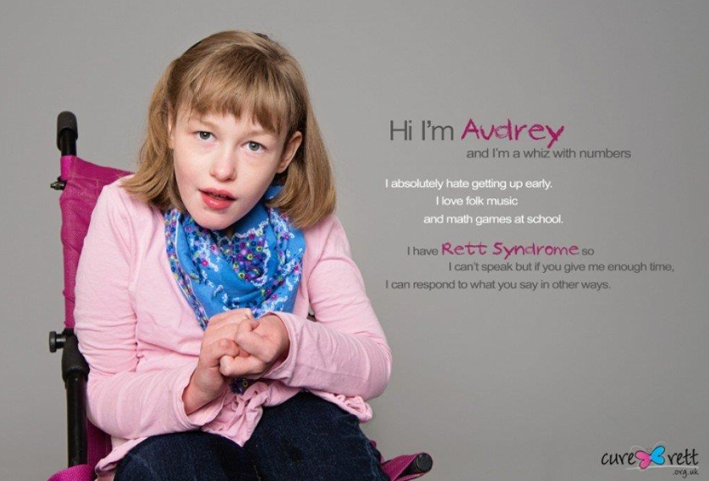

---

### Мускулна дистрофия Дюшен/Бекер
- **Абривиатура**: DMD.
- **Ген**: DYS.
- **Генен продукт**: **dystrophin**.
- **Локус**: **Xp21.2.**
- **Честота**: **най-честата мускулна дистрофия** в детската възраст, **1/3500 момчета**.
- **Унаследяване** – **X-рецесивно**.
- В около 20% от новопоявилитесе случаи се касае за  гонаден мозаицизъм

#### Клинична картина
-  **Мускулна слабост**    
   - **Начало:** 3-5 години (забавено прохождане, ходене на пръсти, ‘патешка’ походка, затруднено изкачване на стълби).    
   - **Разпространение:** От проксимално към дистално.    
   - **Симетрично** 
   - Засегнати са горни и долни крайници. 
-  **Клиничен ход**    
   - Намаляване на моторната функция в първите 2-3 години от началото на заболяването. 
   - Постоянен регрес на мускулната сила. 
-  **Мускулна псевдохипертрофия**    
   * Предимно засягане на **подбедриците**.    
   * Може да бъде генерализирана.    
   * Прогресиращ характер.    
   * Най-често в резултат на мускулна фиброза. 
-  **Други скелетно-мускулни прояви**    
   - Контрактури.    
   - Сколиоза. 
   - Поясна лордоза. 
   - **Инвалидизиране:** Настъпва към **11-12 г. възраст**. 
-  Други клинични белези и летален изход 
   - **Кардиомиопатия:** Настъпва след 15-годишна възраст.
   - **Засягане на дихателната мускулатура.** 
-  **Летален изход:** Между **15 – 25 години** възраст, поради слабост на дихателната и сърдечната мускулатура.
   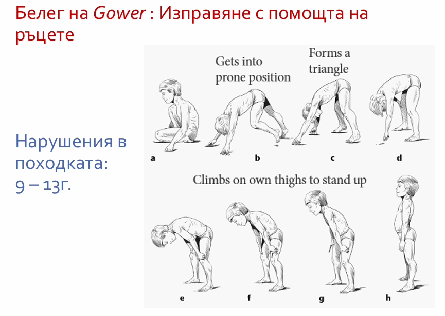
   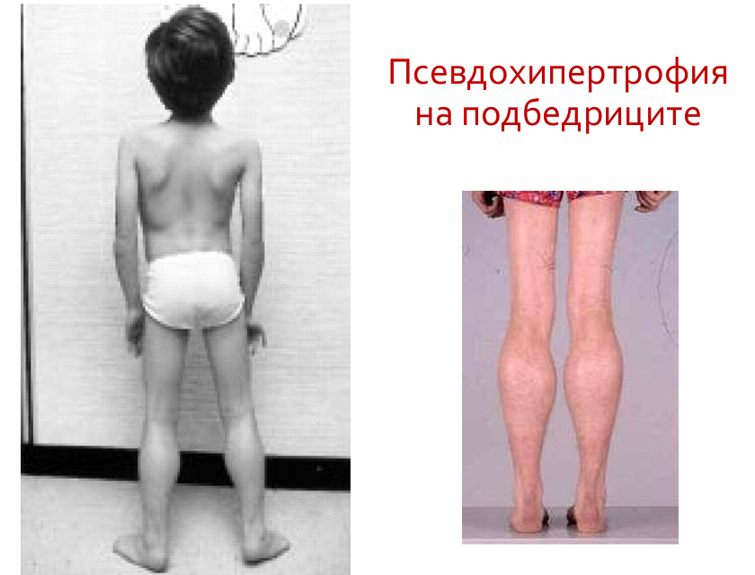

#### Генетика
  - Над 3000 различни мутации.
  - Най-често **делеции/дупликации** на един или няколко екзона.
  - 96% - frameshift мутации.
  - 30% от случаите са резултатот нова мутация - 10% до 20% oт случаите на “нови мутации” са резултат от гонаден  мозаицизъм
  - Мутациите или делециите, които значимо намаляват дължината или увреждат критични сегменти от дистрофиновия ген, водят до фенотипната поява на DMD. Най-значимите мутации засягат големи интрони, както и актин свързващиякрайнадистрофиноватамолекула.
  - Мускулната дистрофия **Becker** корелира с **точкови** **мутации**, които запазват рамката на четене или **делеции**, причиняващи **малки структурни промени**.

#### Диагностика
- **Серумни проби**: <u>CK (креатин киназа)  ↑↑↑</u>, Troponin I ↑, Чернодробни ензими - ↑ AST & ALT.
- **Мускулна биопсия**: Фиброза, Дегенерация на мускулните фибрили
- **Dystrophin – липсва оцветяване** (нормално се оцветява в кафяво в нормалния мускул).
- **Електромиография (ЕМГ)** - показва, че слабостта се дължи на разрушаване на мускулна тъкан, а ненауврежданенанерви
- **Молекулярно-генетична диагностика**.

#### Лечение
- **Eteplirsen (Exondys 51)**
- **Deflazacort (Emflaza)** - кортикостероид
- **Ataluren (Translarna)**

---

### Спинална мускулна атрофия (SMA)
- **Определение** – Невромускулно заболяване, характеризиращо се с прогресивна мускулна слабост, резултат от дегенерацията и загубата на клетки в предните рога на гръбначния мозък и ядрата на мозъчния ствол.
- **Честота**: **1:10 000**.
- **Унаследяване** – **Автозомно-рецесивно**.
- **Гени**: **SMN1** и **SMN2** – 5q12.
- Класификация - базира се на началото на клиничната картина и степента на засягане:
  * **SMA тип I (Werdnig – Hoffman)**
  * **SMA тип II (Dubowitz)**
  * **SMA тип III (Kugelberg –Welander)**
  * **SMA тип IV**

| Тип         | Начало        | Клинична симптоматика                                        | Продължителност на живот                                     |
| :---------- | :------------ | :----------------------------------------------------------- | :----------------------------------------------------------- |
| **SMA I**   | 0 – 6 мес.    | **Тежка мускулна слабост** (проксимално и симетрично  засягане) **Липса на моторно развитие** (невъзможност за поддържане на седнала позиция, затруднения при храненето) **Симптом на парцалената кукла** | Летален изход в рамките на **2 години**                      |
| **SMA II**  | 6 - 18 мес.   | Не могат да ходят, но могат да се задържат в седнала позиция. | Някои пациенти са с нормална продължителност на живот        |
| **SMA III** | >12 - 18 мес. | Долните крайници са по-тежко засегнати от горните.           | Прогнозата корелира с достигнатите нива на моторно развитие,като  някой индивиди могат да запазят способността си да вървят до 30-40  годишна възраст. |
| **SMA IV**  | ( >18-20 г.)  |                                                              |                                                              |

**Усложнения в протичането на заболяването:**
- Затруднено наддаване на тегло; 
- Нарушения на съня; 
- Чести инфекции на дихателните пътища; 
- Сколиоза; 
- Ставни контрактури
  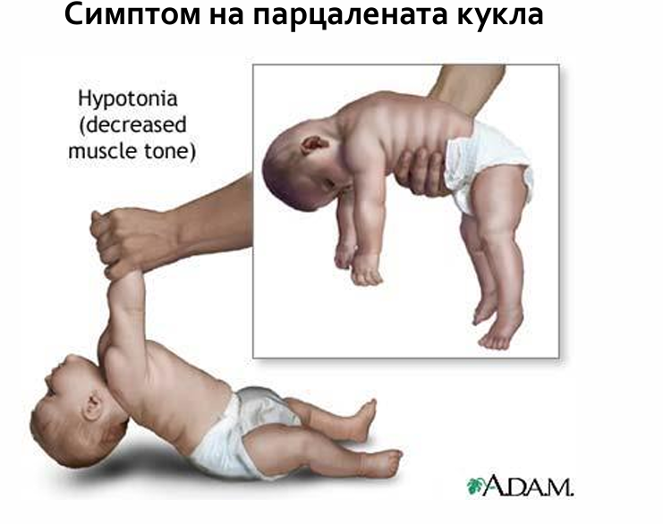

#### Генетика и Лечение
- **SMN1** (survival motor neuron) е основният ген, ангажиран със заболяването.
- **SMN2** – наличието на три или повече копия на гена корелира с **по-лека фенотипна изява**.
- При 95-98% от пациентите със SMA се открива хомозиготна делеция на екзон 7 на SMN1 гена.
- **Spinraza (Nusinersen)** - Allele-specific oligonucleotide (ASO) therapy. Води до алтернативен сплайсинг на SMN2 гена, като функционално го превръща в SMN1 гена и така увеличава нивата на SMN протеина в ЦНС.
- **Zolgensma (Ona-semenogene abeparvovec)** - Генна терапия. Рекомбинантно копие на човешки SMN1 (див тип) се въвежда в организма чрез вирусен вектор.

---

### Болест на Шарко – Мари – Тут (CMT)
- Представлява **наследствена моторносетивна невропатия (HMSNs)**.
- **Честота** – 1 на 2500 индивида.
- **Генетична етиология** – Идентифицирани са над **60 гена** (локусна хетерогенност).
- **Генетична хетерогенност - показва АД, Х-доминантен и АР ход на унаследяване.**
- Най-честата мутация е **дупликация в късото рамо на 17та хромозома на локус PMP22**. Това води до свръхпродукция и  демиелинизация.

#### Класификация (по начин на унаследяване)
| Тип НМСН                         | Начин на унаследяване                                   |
| :------------------------------- | :------------------------------------------------------ |
| НМСН 1 (CMT1)                    | Автозомно доминантно                                    |
| НМСН X (CMT X)                   | Х – свързано рецесивно                                  |
| НМСН 2 (CMT2)                    | Автозомно доминантно                                    |
| НМСН 3 (CMT3), Конгенитална НМСН | Автозомно доминантно (Висок процент на de novo мутации) |
| НМСН 4 (CMT4)                    | Автозомно рецесивно                                     |

#### Клинична картина (НМСН 1 и НМСН 2)
- **Проявява се** между **5 и 25-годишна възраст**.
- **Дистална слабост** с начало в перонеалната мускулатура и евентуално в други дистални мускули на краката и ръцете.
- Сетивните нарушения са дискретни.
- Сухожилните рефлекси са отслабени.
- Наблюдава се **pes cavus** (висок свод на стъпалото).
- Заболяването протича **сравнително леко** и пациентите остават подвижни дори и в късна възраст.
- **Диагноза** – Основава се на клиничните и **ЕМГ данни** (наблюдава  се забавяне на скоростта на провеждане).
  - Поради генетичната хетерогенност на заболяването е уместно да се препоръча цялоекзомно или цялогеномно секвениране.'
- **Лечение:**
  - Симптоматично
  - Нивалин по схема, прием на витамини
  - Физиотерапия
  - Носене не ортези при деформация в ходилото
  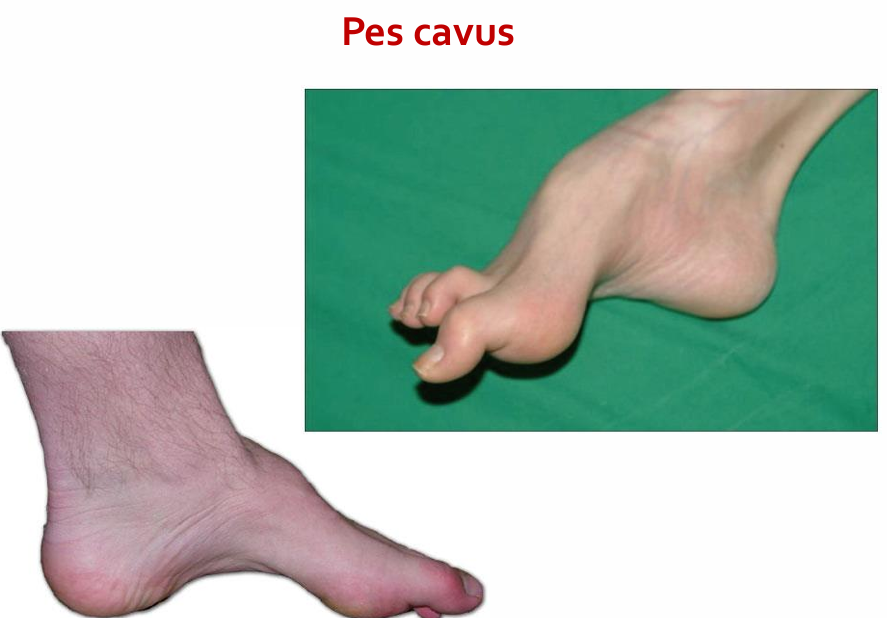

---

## Митохондриални заболявания
- Хетерогенна група заболявания, дължащи се на структурни и функционални дефекти,засягащи митохондриалнатапродукция на АТФ.
- Мултисистемно засягане най-често на (ппц органи и тъкани с големи енергийни нужди):
  - Черен дроб
  - Бъбреци
  - Панкреас
  - Мозък
  - ГИТ
  - Мускули
- **Унаследяване:**
  - В родословното дърво се наблюдава **неменделиращ ход на унаследяване**.
  - **Предаване само от майките**, като предава заболяването на **всичките си деца**.
  - Мъжете унаследяват своите мтДНК от майките си, но **не могат да ги предават на своето потомство**.
  - **Голямата клинична вариабилност** се обяснява с различното разпределение на мутантната мтДНК (хомоплазмия и хетероплазмия).
    - **Хомоплазмия** – наличие в цитоплазмата на клетките на **идентични митохондрии**, само с нормална или само с мутантна ДНК. Клиничният ефект е най-силен, когато клетките имат само мутантна мтДНК.
    - **Хетероплазмия** – наличие в клетките на **два вида митохондрии** (с нормални и с мутантни ДНК-и), но в различно съотношение в отделните органи и тъкани.
    - По-голяма част от митохондриалните заболявания са в резултат на **хетероплазмия**.

#### Примери за митохондриални болести
| Заболяване                                                   | Клиника                                                      |
| :----------------------------------------------------------- | :----------------------------------------------------------- |
| **MERRF** (Myoclonic Epilepsy and Ragged Red Fiber Disease)  | Прогресивна миоклонус епилепсия, миопатия, деменция, оптична атрофия |
| **MELAS** (Mitochondrial Encephalomyopathy, Lactic Acidosis and Stroke-Like Episodes) | Нисък ръст, инсулт-подобни епизоди: повръщане, главоболие, нарушение в зрението, транзиторна хемиплегия; диабет тип 2, загуба на слуха |
| **NARP** (Neurodegenaration, Ataxia and Retinitis Pigmentosa) | Невропатия, атаксия, ретинитис пигментоза, деменция, забавяне в развитието |
| **Kearns-Sayre Syndrome**                                    | Офталмоплегия, пигментна ретинопатия, кардиомиопатия         |
| **Leber Hereditary Optic Neuropathy (LHON)**                 | Внезапна загуба на зрението                                  |

#### **Лечение:**
- Симптоматично, с цел забавяне на прогресията.
- Витамини - Coenzyme Q10 и от групата на B.
- Alpha lipoid acid.
- L-carnitive; Creatine и L-Arginine.
- Физиотерапия

---

# Упражнение 5

# Заболявания, свързани с нарушения в геномния импринтинг. Нетрадиционно унаследяване. Микроделеционни синдроми.

### НЕТРАДИЦИОННО УНАСЛЕДЯВАНЕ
* Редица моногенни заболявания не следват закономерностите на класическите Менделови типове на унаследяване.
* Генетични феномени, свързани с нетрадиционното унаследяване:
  * Мозаицизъм
  * Геномен импринтинг
  * Унипарентална дизомия
  * Динамични мутации
  * Цитоплазмено (митохондриално) унаследяване

---

### МОЗАИЦИЗЪМ
* **Определение:** Присъствие в един индивид на ≥ 2 клетъчни линии, различни по своя генотип, но произлезли от една зигота.
* **Физиологиен мозаицизъм** (X хромозомна инактивация): В нормалните женски соматични клетки, има 2X хромозоми, но повечето от гените върху едната X хромозома са неактивни.
* **Гонаден мозаицизъм:** Генната мутация възниква в стволова клетка, предшественик на гаметите. Образуват се абнормни гамети (с два клетъчни клона - с нормален и мутантен алел) във фенотипно нормални индивиди (ХР и АД болести) с ограничени репродуктивни възможности. <u>Унаследява се в потомството</u>.
  * Примери: остеогенезис имперфекта, ахондроплазия, мускулна дистрофия на Дюшен, хемофилия А.
* **Соматичен мозаицизъм:** когато генната мутация настъпи рано в **ранната ембриогенеза преди диференциацията**, индивидът може да има в различните части на тялото клетки, съдържащи нормални и мутантни алели. <u>Не се унаследява в потомството</u>.
  * Примери: синдром на Марфан, неврофиброматоза 1.
* **Химера (генетичен химеризъм):** Организъм, съставен от клетки, произлезли от **различни зиготи**.
  * Примери: наличие едновременно на женски и мъжки полови органи, кръвни клетки от две различни кръвни групи.
    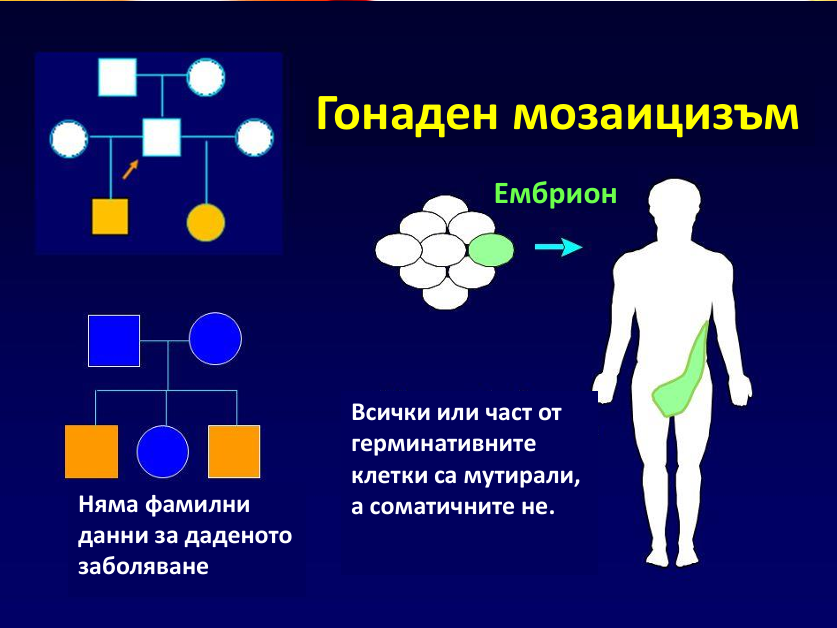
    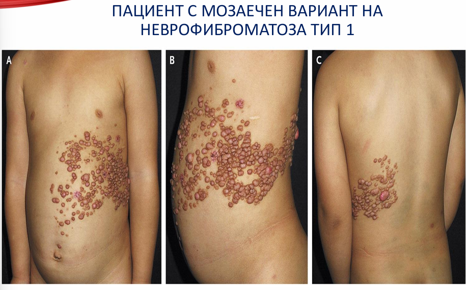

---

### МИТОХОНДРИАЛНО (ЦИТОПЛАЗМЕНО) УНАСЛЕДЯВАНЕ

* Дължи се на мутации в **митохондриалната ДНК (мтДНК)**.
* **Модел на унаследяване:** **Само от майките** (неменделиращ ход).
* Мъжете унаследяват мтДНК от майките си, но **не могат да я предават** на своето потомство.
* **Разновидности**
  * **Хомоплазмия:** Наличие на **идентични митохондрии** (само с нормална или само с мутантна ДНК).
  * **Хетероплазмия:** Наличие на **два вида митохондрии** (нормални и мутантни ДНК) в различно съотношение.
  * По-голяма част от митохондриалните заболявания са в резултат на **хетероплазмия**.
* **Симптоми**:
  * Нарушаване във физическо развитие
  * Загуба на мускулна координация
  * Мускулна слабост
  * Засягане на зрителния апарат
  * Засягане на слуха
  * Проблеми в обучението
  * Засягане на ССС, бъбреци, черен дроб, ГИТ
  * Респираторни прояви
  * Неврологични прояви
  * Автономна дисфункция, деменция

---

## Микроделеционни синдроми. 
* Заболявания, дължащи се на  хромозомна делеция,  с **размер под 5Mb** (5 млн. базови двойки),  обхващаща няколко или множество съседни гена  (contiguous gene syndromes).
* Тези нарушения са под разрешителната способност на конвенционалните цитогенетични методи
* Разкриват се чрез молекулярно-цитогенетични методи (**FISH**) и молекулярно-генетични методи (**array CGH** и др.)

### 1. Синдром на DiGeorgi:
- **Честота:** 1 / 4000
- **Етиология** - микроделеция **22q11**
- **Клинични прояви:**
  - **Тимусна аплазия и Т-клетъчен имунен дефицит  (77%)** 
  - **Сърдечно съдови аномалии** (75% от индивидите) - най-често тетралогия на Фало 
  - **Аномалии на небцето** - 70% 
  - **Лицев дисморфизъм** – хипертелоризъм, ниско разположени ушни миди, микрогнатия (80%) 
  - **Умствено изоставане**, изоставане в развитието (60 70%) 
  - **Хипoпаратиреодизъм**, хипокалциемия (50%) 
  - Нисък ръст 
  - Психични разстройства,автоимунни заболявания и др.
    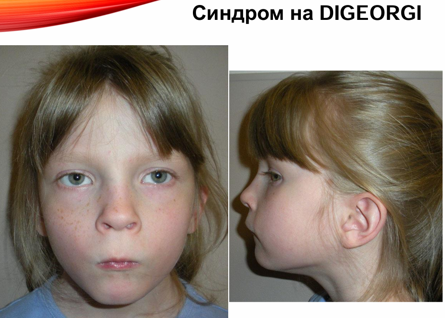

### 2. WAGR - СИНДРОМ
* **Етиология:** Микроделеция **11p13**.
* **Фенотип:**
  * **Аниридия** (липса на ирис).
  * **Тумор на Wilms**.
  * **Двусмислени гениталии**.
  * Хипоспадия.
  * Крипторхизъм.
  * **Умствено изоставане**.
  * Нисък ръст със затлъстяване.
    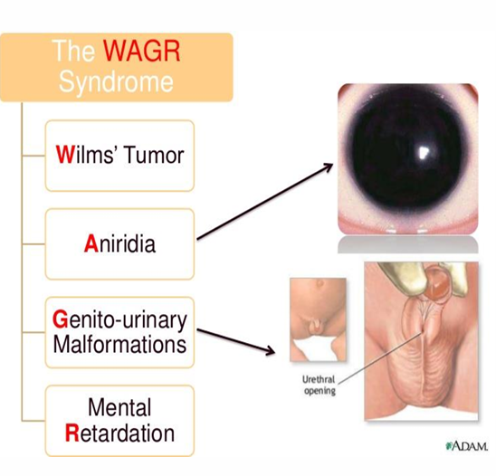

### 3. Други микроделеционни синдроми

| Синдром               | Клинични белези                                              | Хромозомна делеция |
| :-------------------- | :----------------------------------------------------------- | :----------------- |
| **Williams syndrome** | Лицев дисморфизъм, пулмонална стеноза, леко УИ, хиперкалциемия | **7q11**           |
| **Miller-Dieker**     | Лисенцефалия, лицев дисморфизъм                              | **17p13.3**        |
| **Smith-Magenis**     | УИ, хиперактивност, дисморфични белези, автоагресия          | **17p11.2**        |

---

### Заболявания, свързани с геномен импринтинг
- **Епигенетично явление**, при което експресията на някои гени се определя от това дали са унаследени от майката или от бащата, т.нар. <u>родителски произход на гена</u>.
- Хората унаследяват две копия (алели) на гените си - едно от майка си и едно от баща си. 
- В повечето случаи двете копия са транскрипционно  активни. 
- **!** За 100-200 гена е известно, че само единият алел е транскрипционно активен, а другият е импринтиран (неактивен) чрез метилиране. 
- Нормалният индивид има **<u>само едно транскрипционно активно копие на тези гени</u>**. 
- Импринтингът е функционална промяна (епигенетична модификация) на гена и се осъществява в гаметогенезата чрез метилиране:  **хиперметилираните** гени са **неактивни** (**импринтирани**), а хипометилираните – **активни**. 
- Този процес се контролира от определени гени –" "<u>импринтинг контролни центрове</u>’’. 
- Правилният импринтинг е изключително важен за нормалното развитие на детето.
- При грешка в импринтинга детето може да получи 2 активни или 2 неактивни копия на опреден ген, което води до заболяване.
- **Унипарентална дизомия (UPD)**:
  - Състояние, при което един индивид унаследява и двете хромозоми на една **хомоложна двойка** само от **единия родител**. 
  - <u>Кариотипът е с нормален брой и структура на хромозомите</u>.
  - Само ДНК анализът (маркери) открива еднородителския произход на конкретна двойка хромозоми или цял хромозомен набор.
  - 3 възможни механизма за възникване на UPD:
    1. Първоначално сформиране на **тризомична** **зигота** и впоследствие загуба на свръхбройната хромозома, т.нар. „тризомично спасение“. (най-чест механизъм)
    2. Първоначално сформиране на **монозомична** **зигота** и впоследствие дупликация на хромозомата и възстановяване на нормалния брой – “монозомично спасение“.
    3. Оплождане между гамети, едната от които е с **нулизомия** за някоя хромозома, а другата е **дизомична** за същата хромозома– т.нар „гаметно допълване“
  - **Унипарентална изодизомия** - детето получава от единия си родител две идентични копия на единия хомолог от хромозомната двойка.
  - **Унипарентална хетеродизомия** - детето получава от единия си родител двете хомоложни хромозоми от хромозомната двойка.
  - **Примери за UPD при човека:**
    - Муковисцидоза.
    - Russel-Silver синдром.
    - Prader-Willi синдром.
    - Angelman синдром.
    - Beckwith-Wiedeman синдром.

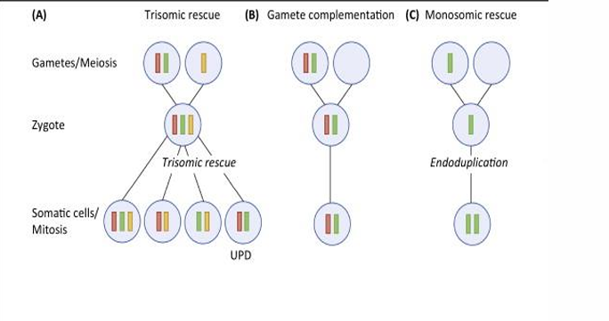

### 1. Синдром на Prader-Willi (PWS)
* **Етиология** - повечето случаи на PWS са <u>спорадични</u>
  * **75%** - **делеция 15q11-13 на бащината хромозома 15** (**46,XX(XY),del(15)(q11q13)pat**).
  * 25% - **Майчина унипарентална дизомия (UPD 15mat)**.
  * 1% - мутация в импринтинг контролния ген.
* **Фенотип:**
  * **Хипотония**, трудности с храненето, ненаддаване на тегло (в ранна детска възраст- 1-3 години)
  * **Лицев дисморфизъм** (бадемовидни очи, страбизъм, битемпорално стеснение, тънка горна устна) 
  * **Умствено изоставане** (леко до умерено)
  * **След 3-4 г.:** **Хиперфагия, затлъстяване** (след 3-4годишна възраст).
  * **Нисък ръст, малки ръце и крака**
  * **Хипогонадизъм/хипогенитализъм**
  * Сколиоза/остеопороза
  * Нормална продължителност на живота
* Диагностични методи:
  * **FISH** - за микроделеции
  * ДНК методи - за анализ на метилиционния статус и търсене на мутации в импринтинг центъра
    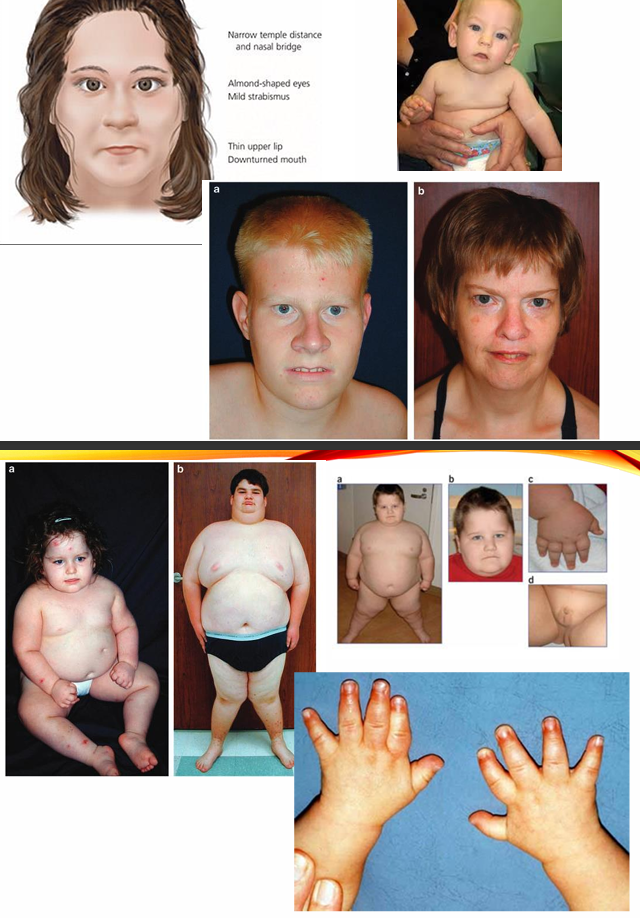

### 2. Синдром на Angelman (AS)
* **Синоним:** Синдром на “щастливата кукла”.
* Честота - 1/15 000
* **Етиология** - повечето случаи на AS са <u>спорадични</u>
  * **70%** - **делеция 15q11-13 на майчината хромозома 15** (**46,XX(XY),del(15)(q11q13)mat**)
  * 2% **Бащина унипарентална дизомия (UPD 15pat)**.
  * 1-2% - мутация в импринтинг контролния ген 
  * 25% - мутации в UBE3A гена 
* **Фенотип:**
  * **Тежко умствено изоставане** (100%).
  * Микроцефалия.
  * **Атаксия (лошка координация)**
  * Пристъпи на **немотивиран смях** ("щастлива кукла").
  * **Епилепсия**.
  * Хиперактивно поведения.
  * Хипопигментация, светла кожа и руска коса (65%).
  * Прогнатия, редки зъби, голяма уста с протрузия на езика
  * Нормална продължителност на живота.
    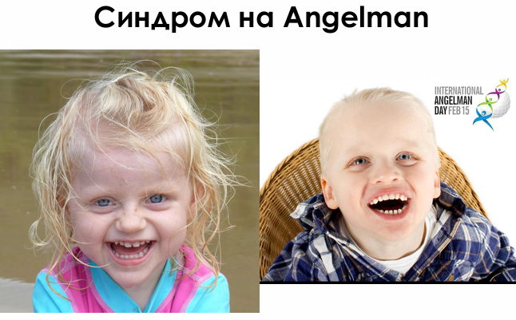

### 3. Синдром на Beckwith – Wiedemann (BWS)
* **UPD11pat**
* При заболяването свръх-експресия на генен продукт (обратно на PWS и AS, които се дължат на загуба на генен продукт!) поради двойна доза за гена IGF2 в критичната област 11р15.5. Активен е само алелът от бащината хромозома (майчиният алел нормално е неактивен, импринтиран).
* **Диагностични критерии (често разпознаваеми при раждането):**
  * **Макросомия** (рождено тегло и дължина >97  персентил)
  * **Макроглосия**.
  * **Срединен дефект на предната коремна стена** (омфалоцеле, умбиликална херния, диастаза на правите коремни мускули).
  * **Неонатална хипогликемия**.
  * **Характерни ушни резки (гънки) и ямки**.
* **Повишен риск (7-10%) от ембрионални тумори** (тумор на Вилмс, хепатобластом).
* При  някои деца със синдрома на Бекуит-Видеман се наблюдава **хемихипертрофия** (някои части на тялото са по-големи, което води до асиметричен вид).
  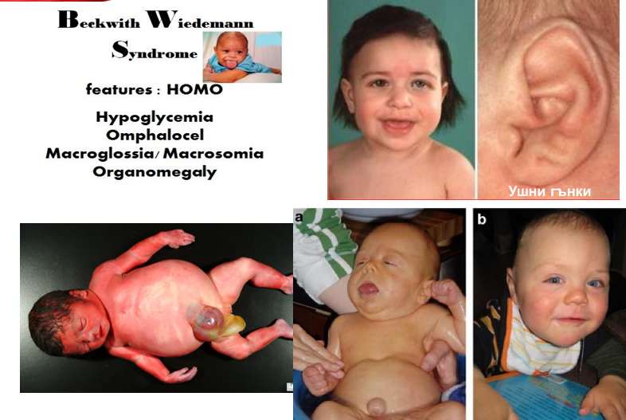

### 4. Синдром на Silver-Russel  (SRS)
* **UPD 7 mat**
* **Клинични прояви:**
  * **малки за гестационната възраст** (тегло и ръст на раждане  <3 персентил) 
  * **забавен растеж след раждането** 
  * значителни затруднения в храненето в малката възраст 
  * **относително голям размер на главата спрямо тялото** 
  * **триъгълна форма на лицето** 
  * **изпъкнало чело** (при оглед в профил) 
  * асиметрия на тялото (хемихипотрофия)  
  * забавяне в развитието на речта
  * **Скелетна асиметрия.**
  * Малки изкривени 5ти пръсти (**клинодактилия**).
* <u>Прилага се с успех заместително лечение с растежен хормон</u>
  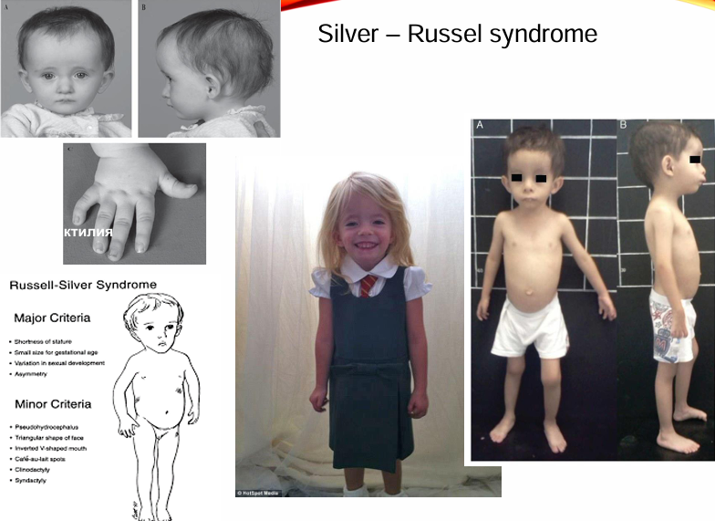

---

# Упражнение 6

# Хромозомни болести

Заболявания, дължащи се на бройни и структурни нарушения в хромозомите: Хромозомни аберации по автозомите; микроделеционни синдроми.
Методи за анализ – конвенционално и молекулярно кариотипиране.
Катедра по Медицинска генетика

## Класификация на методите за анализ

| Цитогенетични методи                           | Молекулярно-цитогенетични методи       | Молекулярно-генетични методи                                 |
| ---------------------------------------------- | -------------------------------------- | ------------------------------------------------------------ |
| Цитогенетичен метод - **G-бендинг оцветяване** | **FISH**                               | **Array CGH**                                                |
| Сравнителна геномна хибридизация (CGH)         | Сравнителна геномна хибридизация (CGH) | **Полимеразно-верижна реакция (PCR)**                        |
|                                                |                                        | **Секвениране по Сангер Секвениране от следващо поколение (NGS)** |

### Цитогенетични методи
Позволяват рутинно хромозомно изследване за клинични цели с цел откриване на **бройни и структурни хромозомни аберации**.
Извършват се на клетки, които позволяват отглеждане, растеж и деление в клетъчна култура.

#### Изследване на кариотип
Материал за изследване - от тъкани и клетъчни суспензии, съдържащи спонтанно или стимулирано делящи се клетки:

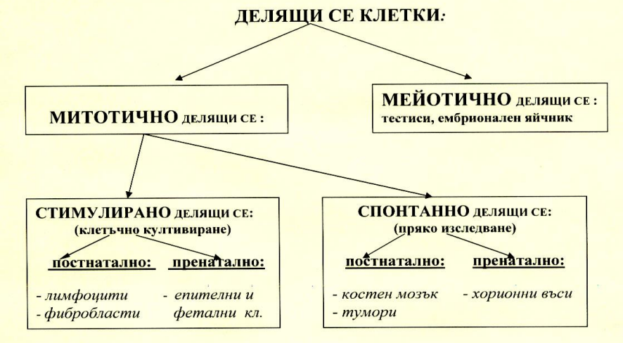

**Краткосрочна лимфоцитна култура – основни етапи**
I. **Култивиране** в стерилни условия в присъствие на хранителна среда, серум, ФХА (фитохемаглутинин като стимулатор на митотичното деление), антибиотик, кръв/плазма.
II. **Обработка**
а)  третиране с колхицин 
б) **Хипотонична обработка** 
в) фиксиране
III. **Изготвяне на препарати и "зреене"**
IV. **Оцветяване**
V. **Анализиране** (Prophase, Metaphase, Anaphase, Telophase)

**Лентови (бендинг) техники за диференциално оцветяване на хромозомите**
* Чрез оцветяването на хромозомите се визуализира структурата на хромозомите и се дава възможност за идентификация на всяка от тях или на техен сегмент.
* **G - бендинг (Gimsa):** Препаратите предварително се обработват с **трипсинов разтвор** за денатуриране на хромозомните протеини и след това се оцветяват с **Gimsa**.
* **Резултат:** Получават се напречни редуващи се **хиперхромни**, **хипохромни** и **ахроматични ленти**.
* Образът на всяка хромозома е специфичен и дава възможност за нейната идентификация.

**Показания за провеждане на цитогенетично изследване**
* Множествени вродени аномалии
* Умствено изоставане/изоставен в НПР при деца със или без дисморфизъм
* Двусмислен пол
* Отклонение в половото и/или физическо развитие
* Инфертилитет и повтарящи се аборти
* Необяснимо мъртвораждане
* Фамилно изследване за структурни хромозомни аномалии
* Някои онкохематологични заболявания; синдроми с хромозомна чупливост

**Предимства и недостатъци на цитогенетичния метод**
* **Предимства:**
  * Визуализира едновременно всичките 23 двойки хромозоми.
  * Може да се използва за диагностика на **балансирани хромозомни преустройства**.
* **Недостатъци:**
  * Времето за получаване на резултат обикновено е около **3 седмици**.
  * Не могат да се визуализират малки по размер хромозомни дефекти – например микроделеции, микродупликации, поради ниската резолюция на метода - **5 Mb**.
  **Примери за хромозомни аберации (Цитогенетични методи)**
* **Тризомия 13 (Patau S.)**
* **Wolf – Hirschhorn syndrome** (делеция 4р синдром)

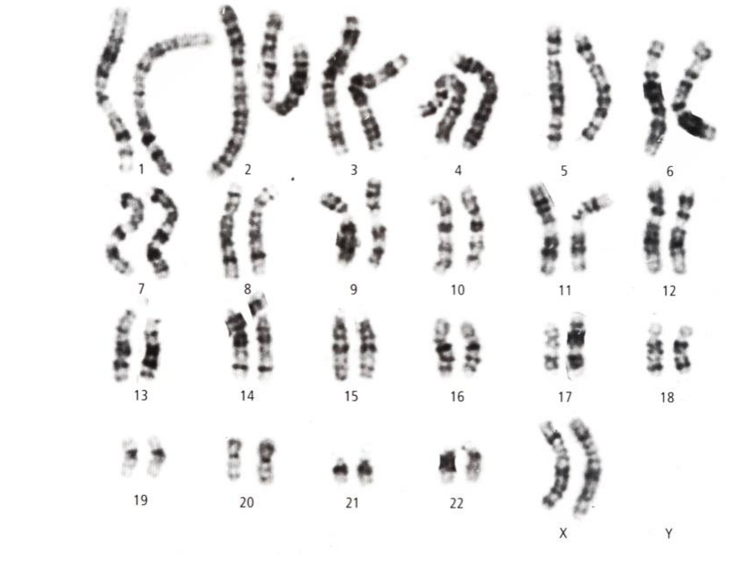

### Молекулярно – цитогенетични методи

#### FISH - Флуорисцентна ин ситу хибридизация

Базира се на уникалната възможност на част от едноверижна **ДНК (сонда)** да хибридизира със своята комплементарна прицелна последователност, където и да е локализирана тя върху **метафазна пластинка** или имобилизирани **интерфазни ядра** на неделящи се клетки.

* **Етапи на FISH:**
  * Фиксация на клетките
  * Приготвяне на препарата
  * Хибридизация на сондата
  * Отмиване на несвързаната сонда
  * Визуализиране под **флуоресцентен микроскоп**
* **Интерпретиране:**
  * Основава се на **броя на сигналите**, наблюдаващи се по време на микроскопирането (Нормален резултат, Дупликация, Делеция).
* **Примери:** монозомия 17, del (17) (p13), два интактни гена p53, Miller-Dieker синдром del 17р13; Williams синдром - del 7q11; Prader-Willi синдром -del 15q12; diGeorge синдром - del 22q11
* **Multicolor FISH, Spectral karyotyping**

**Показания за провеждане на FISH**

* При съмнение за хромозомни болести (бройни и структурни вкл. микроделеционни синдроми (contiguous gene syndromes))
* Малигнена неоплазия (левкемии, лимфоми и солидни тумори)

**Предимства и недостатъци на FISH метода**

* **Предимства:**
  * Кратко време за получаване за резултата, сравнено с цитогенетичния метод
  * Може да се използва за диагностика на микроделеционни и микродупликационни синдроми
* **Недостатъци:**
  * Тъй като сондите са комплементарни на определени участъци от ДНК, чрез тях могат да се визуализират само тези конкретни участъци.

#### Сравнителна геномна хибридизация (CGH)

* Този метод спада към молекулярно цитогенетичните методи.
* Позволява цялостно сканиране на генома за наличие на **допълнителен** или **липсващ** генетичен материал в единичен експеримент (не е възможно да бъдат отчитани транслокации или други размествания в генома).
* Основава се на конкурентната in situ хибридизация на изследвана (тест) ДНК върху метафазни хромозоми.
* CGH еволюира в **array CGH**, който е молекулярно генетичен метод.

### Молекулярно-генетични методи

#### Array CGH

* Позволява цялостно сканиране на генома за наличие на допълнителен или липсващ генетичен материал в единичен експеримент.
* Провежда се с използване на **ДНК микрочипове**.
* **ДНК микрочип** представлява твърда повърхност, върху която се намират ДНК фрагменти.
* Всеки чип съдържа нуклеотидна секвенция, представителна за последователността на специфичен ген или хромозомен участък.

**Показания за провеждане на array CGH**

* Разкриване на хромозомни мутации – например микроделеционни, микродупликационни синдроми
* Предимплантационна диагностика
* Анализ на генна експресия в тъканна проба (тумор)

**Предимства и недостатъци на array CHG метода**

* **Предимства:**
  * Позволява едновременно да се тестват множество локуси в генома.
  * По-добра разделителна способност на метода, сравнено с цитогенетичния например.
* **Недостатъци:**
  * **Балансирани хромозомни преустройства** като например балансирани транслокации или инверсии не могат да бъдат идентифицирани чрез този метод, тъй като няма допълнителен или липсващ генетичен материал.
  * Не може да се използва при съмнение за полиплоидия, например **триплоидия**.
  * Не може да се използва за диагностика на **моногенни заболявания**.

---

### Хромозомни болести - Класификация

* Патологични състояния, възникващи в резултат на микроскопски **бройни и структурни хромозомни мутации**, протичащи с тежки смущения в соматичното, половото и интелектуалното развитие.
* **Класификация:** гонозомни, автозомни, бройни, структурни, унаследени, спорадични, системни, мозаични.

#### Сравнителна характеристика на автозомните и гонозомни хромозомни болести

| Характеристика   | **Автозомни**                                                | **Гонозомни**                                                |
| ---------------- | ------------------------------------------------------------ | ------------------------------------------------------------ |
| Честота          | По - редки                                                   | По-чести                                                     |
| Тежест           | По - тежки                                                   | По-леки, съвместими с живота                                 |
| Клинична картина | Множествени малформации с ↓ в умственото и физическо развитие (пре- и постнатално); 1/3 от гените участват в развитието на ЦНС; Фенотипна вариабилност в рамките на синдрома | Нарушение в растеж, полово развитие и съзряване; Могат да се открият случайно при амниоцентеза или изследване за инфертилитет |

### Синдром на Down (Тризомия 21)

* **Синоними:** Тризомия 21
* **Описание:** Най-често срещаната и най-добре познатата хромозомна болест, както и най-честата генетична причина за умствено изоставане.
* **Честота:** 1 / 700 новородени
* **Пол:** съотношението мъжки / женски пол е повишено (около 1,15:1) при новородените (отнася се за цитогенетичен вариант **тризомия 21**)
* **Клиничен фенотип:**
  * **Лицев дисморфизъм:** 
    * Брахицефален череп с плосък лицев профил; 
    * Косо разположени очни цепки, двустранен епикант; 
    * Малък нос на широка основа; 
    * Отворена уста с тенденция за протрузия на езика; 
    * Малки, ниско разположени ушни миди с прегънат хеликс
  * **Други:** 
    * Късо и широко вратле; 
    * Понижен мускулен тонус; 
    * Брахидактилия/клинодактилия на пети пръст (50%); 
    * Четирипръстна бразда (50%); 
    * Сърдечни аномалии (40%); 
    * Дуоденална атрезия; 
    * Трахеоезофагеална фистула; 
    * Чести инфекции; 
    * IQ ~ 50.
* **Продължителност на живота:** Средна преживяемост 49г. Преживяемост до 60г. - 44,4%.
* **Други заболявания с по-висока честота:** 
  * Целиакия; 
  * Болест на Хиршпрунг; 
  * Проблеми със зрението; 
  * Хипотиреоидизъм; 
  * Левкемия – 15 пъти по-често; 
  * Болест на Алцхаймер – няколко десетилетия по-рано.
* **Цитогенетични варианти:**
  * **Свободна тризомия – пълна форма:** 95%, Кариотип: **47, ХХ/ХУ, + 21**
  * **Мозаичен вариант:** 1-2%, Кариотип: 47, ХХ/ХУ, + 21[ ? ] / 46, ХХ/ХУ [ ? ]
  * **Транслокационна форма:** 4%, Кариотип: 46, ХХ/ХУ,der(14;21)(q10;q10), +21 или 46, ХХ/ХУ,der(21;21)(q10;q10), +21
* **Етиология:**
  * В 95% от случаите се установява регулярна **тризомия 21**, в резултат на хромозомно неразделяне по време на първото (80%) и по-рядко по време на второто мейотично делене.
  * В 85% от случаите допълнителната 21 хромозома е с майчин произход (зависимост с напреднала възраст на майката).
  * **Мозаицизъм:** 
    * Около 1% от пациентите. 
    * Етиология – случайно възникнал митотичен nondisjunction в тризомична или нормална зигота.
    * Тежестта на клиничната картина при тези пациенти варира в зависимост от съотношението между аберантната и нормалната клетъчна линия. 
  * **Транслокационна форма:** 
    * В 4% от случаите. 
    * Децата получават допълнителната 21 хромозома от родител, носител на **балансирана** транслокация, включваща хромозома 21 или транслокацията е нововъзникнала.
    * **Робертсонова транслокация** – центрично сливане между големи и малки акроцентрични хромозоми (13,14,15,21 или 22)
* **Риск за повторение (Фамилни транслокации):**
  * **13/21, 14/21, 15/21:** Майка (10 - 15%), Баща (1 - 2%)
  * **21/22:** Майка (10 %), Баща (2 - 5 %)
  * **21/21:** Майка (100 %), Баща (100 %)
* **Потомство:** Мъжете със синдром на Down са стерилни, но жените могат да оставят потомство (с нормален кариотип и синдром на Down).
* **Други методи за диагностика:** FISH, ДНК - анализ.

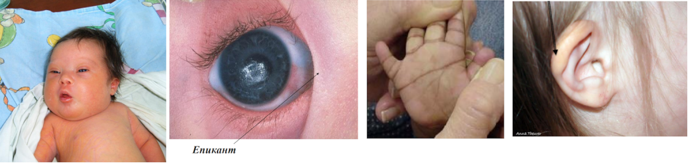

### Синдром на Edwards (Тризомия 18)

* **Синоними:** Тризомия 18
* **Кариотип:** **47,ХХ/ХУ,+18**
* **Описание:** Втората най-често срещана автозомна тризомия след синдрома на Down.
* **Честота:** 1 / 6000-8000 живородени
* **Пол:** предилекционно се засяга женският пол (в 80% от случаите).
* **Преживяемост:** 95% от тризомичните плодове загиват през ембрионалния и феталния период; 5-10% от засегнатите деца преживяват след 1г. възраст.
* **Характеристика:** Тежко психомоторно и физическо изоставане.
* **Клиничен фенотип:**
  * **Краниум:** микроцефалия, **<u>долихоцефалия</u>**, проминиращ тил, широко отворени фонтанели.
  * **Лицев дисморфизъм:** микрофталмия, **<u>хипертелоризъм</u>**, епикант, тесни очни цепки, малко носле, **<u>микрогнатия</u>**, ниско разположени малформативни ушни миди, къс врат с кожна гънка.
  * **Други:** Бъбречни, сърдечни аномалии, къс стернум, **<u>припокриващи се пръсти</u>**, крипторхизъм, **<u>‘rocker bottom’ ходила</u>**, хипопластични нокти.
* **Етиология:**
  * 95% от случаите възникват в резултат на неправилно разделяне по време на първото мейотично делене на яйцеклетката.
  * Установена е зависимост с напреднала възраст на майката.
  * Транслокационни варианти се срещат рядко.

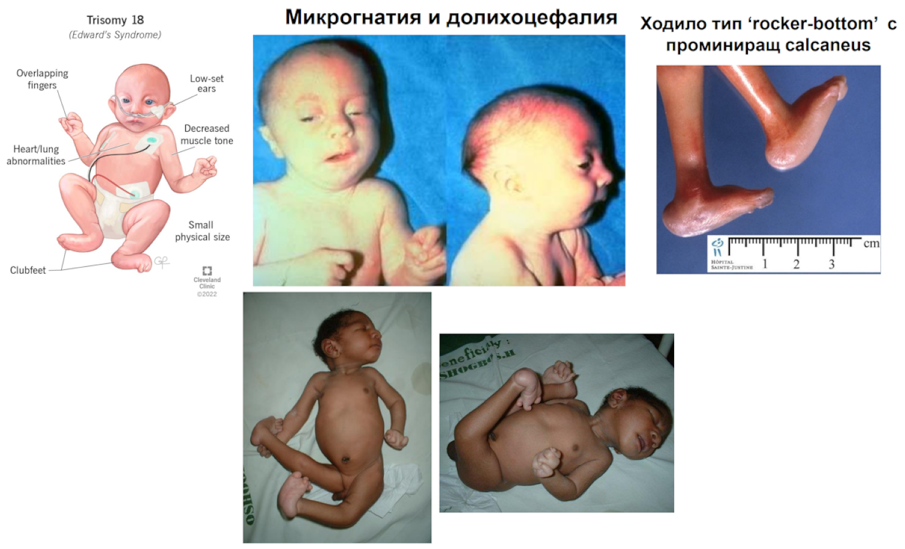

### Синдром на Patau (Тризомия 13)

* **Синоними:** Тризомия 13
* **Кариотип:** **47,XX/ХУ,+13** (свободна тризомия) или **46, ХУ,der(13;14)(q10;q10), +13** (транслокационна форма).
* **Честота:** 1 / 8 000-12 000 живородени
* **Преживяемост:** Средната преживяемост е 2.5 дни.
* **Пол:** Засегнат е предимно женския пол.
* **Клиничен фенотип:** 
  * <u>**Микроцефалия**</u>; 
  * Хипотелоризъм;
  * <u>**Микрофталмия или анофталмия(60-70%)**</u>; 
  * Липсващ или малформативен нос; 
  * **<u>Хейлогнатопалатосхиза</u>**; 
  * **Полидактилия**; 
  * Cutis aplasia; 
  * Omphalocele; 
  * Бъбречни малформации; 
  * <u>**Холопрозенцефалия**</u> - непълно разделяне на мозъка на две половини, често в съчетание с лицеви цепки; 
  * <u>**Сърдечни аномалии**</u> (в 80% от случаите); 
  * <u>Хемангиоми</u>, кожни дефекти по скалпа; 
  * <u>Урогенитални дефекти</u>.

* **Етиология:**
  * 65% от случаите възникват в резултат на неправилно разделяне по време на първото мейотично делене на яйцеклетката, 10% - в сперматозоидите.
  * Установена е зависимост с напреднала възраст на майката.
  * 20% са транслокационните варианти.
  * 5% от случаите са мозаични.

  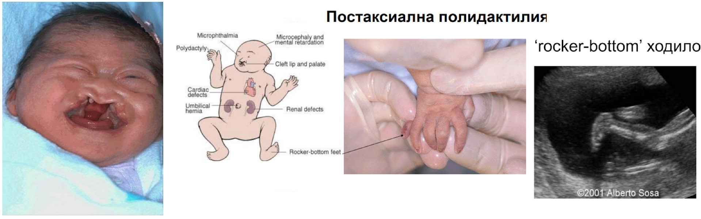

### Cri-du-chat синдром (Монозомия 5p синдром)
* **Синоними:** Сat cry синдром, Монозомия 5p синдром
* **Кариотип**: **46,XX/XY,del(5)(p15.3p15.2)**
* **Честота:** 1 на 50,000 живородени
* **Смъртност:** 75% умират през първите месеци след раждането, 90% умират до навършването на 1 година (възможна е преживяемост до зряла възраст).
* **Пол:** Засeгнат е предимно женският пол.
* **Диагностика:** При раждането поради специфичните дисморфични белези и характерен плач (поради аномалии на ларинкса и мозъчна дисфункция).
* **Клиничен фенотип:**
  * **Лицев дисморфизъм:** 
    * Микроцефалия, кръгло лице; 
    * Епикант, антимонголоиден наклон на очните цепки, хипертелоризъм; 
    * Ретрогнатия; 
    * Загрубяване на лицевите черти.
  * **Други:** 
    * Умствено изоставане; 
    * Хипертонус; 
    * Гръбначни деформации; 
    * Поведенчески отклонения като хиперактивност, агресия, повтарящи се движения.
* **Етиология:**
  * 80-85% от случаите са резултат от de novo възникнала **делеция на 5p** (15.3-15.2) – терминална делеция.
  * Загубата на малък регион от късото рамо на хромозомата 5p15.2 (cri-du-chat критичен регион) корелира с всички клинични белези с изключение на котешкото мяукане, за който е отговорен участъкът 5p15.3.
  * В 80% от случаите делецията е с бащин произход.
  * 10-15% от всички случаи възникват в резултат на неравна сегрегация в гаметите на родител, носител на **балансирана транслокация** (напр. 46,XY,t(5;17)(p13.3;p13)).
* **Диагностика:** Цитогенетичен анализ, FISH.

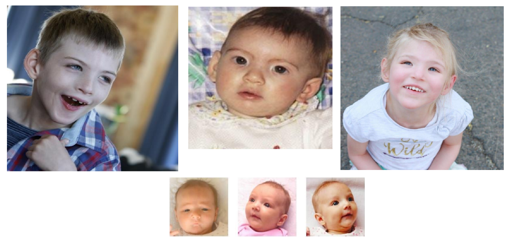

---

# Упражнение 7

# Генетични причини за инфертилитет

Хромозомни аберации. Моногенни нарушения. Наследствени предразположения

### Инфертилитет

* Определение: невъзможност да се постигне зачеване в продължение на 1 година, като двойката води редовен полов живот и не употребява контрацептивни средства.
* Честота: 10-15% сред двойките в репродуктивна възраст, като тенденцията е към нарастване през последните десетилетия.
* Процентът на инфертилитет нараства с напредване на възрастта на партньорите.
* **Първичен**: невъзможност за постигане на бременност при двойка, която никога не е имала живо раждане.
* **Вторичен инфертилитет**: невъзможност за постигане на нова бременност след поне едно предходно живо раждане.

### Репродуктивни проблеми

* Обхваща всички медицински състояния, които водят до затруднения при зачеване или износване на бременност.
* Терминът включва широк клиничен спектър: семейства с два и повече повтарящи се спонтанни аборти, мъртвораждания, първичен и вторичен инфертилитет.
* 15-20% от всички установени бременности завършват със спонтанен аборт.
* 50-60% от спонтанните аборти се дължат на хромозомна аберация.

### Причини за женски инфертилитет

Съществуват различни етиологични причини за женски инфертилитет: анатомични отклонения, гинекологични заболявания, ендокринни нарушения, хромозомни аберации, антифосфолипидни антитела, полово предавани инфекциозни заболявания и други.
В около 50% от случаите причината остава неизяснена.

### Причини за мъжки инфертилитет

* **Ендокринни (пре-тестикуларни) причини**: нарушения в хипоталамо-хипофизарната регулация.
* **Генетични фактори**: включват хромозомни аномалии, микроделеции на Y-хромозомата, мутации в гена за CFTR (свързани с вродена двустранна липса на vas deferens), както и моногенни дефекти, които засягат сперматогенезата.
* **Пост-тестикуларни причини**.
* **Възпалителни и инфекциозни фактори**.
* **Влияние на околната среда и начин на живот**.
* **Идиопатичен инфертилитет**: при значителна част от мъжете (до 40-75%).

### Поведение при двойка с инфертилитет

Предполага се, че при около 15% от мъжете и 10% от жените с репродуктивни проблеми могат да бъдат открити **генетични аномалии, включващи хромозомни или моногенни дефекти**.
*В около 50% от случаите причината може да остане неизяснена.*

| Женски инфертилитет                                          | Мъжки инфертилитет                                        |
| ------------------------------------------------------------ | --------------------------------------------------------- |
| Гинекологичен статус                                         | Спермограма                                               |
| Хормонален статус: прогестерон, FSH, LH, TSH, T3, T4, пролактин и др. | Хормонален статус: FSH, LH, тестостерон, пролактин и др.  |
| Инфекциозни заболявания                                      | Инфекциозни заболявания                                   |
| Цитогенетичен анализ: за търсене на бройни и балансирани хром. аберации | Цитогенетичен анализ: 47, ХХY; балансирани хром. аберации |
| Имунологични маркери: антифосфолипидни антитела, антиспермални антитела | ДНК анализ за Y микроделеции, за CFTR мутации             |
| Тромбофилия                                                  | Тестикуларна биопсия                                      |
|                                                              | Урологични заболявания (варикоцеле)                       |

### Хромозомни причини за мъжки и женски инфертилитет и повтарящи спонтанни аборти.  Гонозомни хромозомни болести

#### Синдром на Klinefelter (XXY)

* **Честота:** между 1/500 и 1/1000 мъже.
* Повечето мъже остават недиагностицирани до пубертета.
* **Индикация за цитогенетично изследване:** **хипогонадизъм** или **инфертилитет** (азооспермия).
* Нормална продължителност на живота: 
* **Клиничен фенотип:** 
  * Висок ръст.
  * Дълги крайници
  * Тесни рамене и широк таз
  * **Гинекомастия** - 30-50%
    * Повишен риск (х20) за развитие на карцином на млечните жлези
  * Хипогонадизъм/хипогенитализъм - **тестикуларна** **дисгенезия** с малки твърди тестиси (обем <10 mL)
  * **Азооспермия**
  * **Вторични полови белези – намалена продукция на андрогени**:
    * Рядка брада/липса на окосмяване на тялото от мъжки тип 
    * Висок глас
    * Натрупване на мазнини от женски тип
    * Окосмяване от женски тип в областта на гениталиите
  * **Нервно-психично развитие:** 
    * Повечето мъже имат леко снижен интелект – фамилността го повлиява
    * Субнормални стойности(IQ 85-90) или УИ могат да се дължат на по-голям брой Х-хромозоми
    * 70% имат леки нарушения в обучението и развитието ± поведенчески отклонения, несигурност
* **Кариотип:** **47, ХХY**
* **Етиология:** 
  * 56% от случаите допълнителната хромозома е с майчин произход
  * 44% се дължат на нарушен ХУ-кросинговър по време на мейозата и формиране на ХУ-сперматозоид
  * Мозаицизъм се установява в около **15**% от случаите
* **Цитогенетични варианти:**
  * **Бройни:** 
    * 48, ХХХY (по-тежко умствено изоставане), 
    * 49, ХХХХY (Синдром на Fraccaro - значително изоставане в интелектуалнот оразвитие, нисък ръст, хипогонадизъм, скелетни аномалии (радиоулнарна синостоза, ограничена пронация в лакетната става, genu valgum)).
  * **Мозаични:** 
    * 46, ХY/47, ХХY; 
    * 46, ХY/47, ХХY/48, ХХХY.
* **Структурни:** 
  * 47, Хi(Xq)Y (i-изохромозома)
  * 47, Хr(X)Y (r-ринг хромозома)

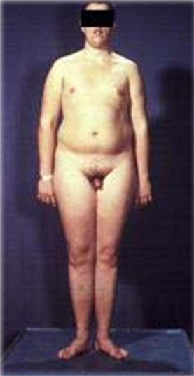

#### 47, ХYY синдром

* **Честота:** 1/1000 мъже.
* **Фенотипни белези:** нормални.
* **Характеристики:** Висок ръст, нормален интелект (обикновено по-нисък от този на сибсите), нарушения във фината моторика, лек интенционен тремор, хиперактивност, нарушено внимание, **запазена фертилност**.
* **Етиология:** неразделяне по време на второто мейотично делене при мъжа, без установена зависимост от бащината възраст.

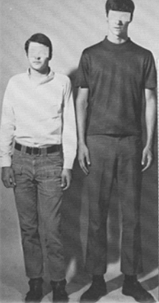

#### Синдром на Turner (Монозомия Х)

* **Честота:** около 1/2500 живородени момиченца.
* 99% от случаите на монозомия в плода завършват със спонтанен аборт.
* **Най-честата хромозомна причина за женски репродуктивни проблеми:** води до преждевременна яйчникова недостатъчност, инфертилитет, нисък ръст и характерен фенотип.
* **Пренатални белези:** Фетален хидропс, Кистична хигрома.
* **Клиничен фенотип:**
  * **Генерилизиран лимфедем:**
    * Свободните кожни гънки формират по – късно специфичното вратле при синдрома на Turner
    * Диагнозата може да се постави клинично веднага след раждането заради наличието на локализиран по длани и ходила лимфедем
  * **Лицев дисморфизъм:** 
    * антимонголоидни очни цепки
    * хипертелоризъм
    * ниско разположени уши
    * микрогнатия.
  * **Други:**
    *  **Нисък ръст** (средно 147см)
    *  Тесен таз
    *  Късо/широко вратле с ниска линия на окосмяване
    *  Раздалечени мамили
    *  Гръден кош с **щитовидна форма**
    *  **Пигментни невуси**
  * **Репродуктивни:** **Гонадна агенезия**, **Инфертилитет**, No menstruation.
  * **Системни:** Сърдечни дефекти, Бъбречни аномалии.

* <u>**Умствено развитие:** Нормално</u>.
* **Рентгенологично изследване:** Скъсяване на 4-та метакарпална кост.
* **Генетика:** Синдромът не се унаследява и рискът за повторение е нисък.
* **Цитогенетични варианти:**
  * **Бройно нарушение:** 45, Х.
  * **Мозаицизъм:** 
    * 45, Х/46, ХХ
    * 45, Х/46, ХХ/47, ХХХ.
  * **Структурни нарушения:** 
    * 46, Хdel(Хр)
    * 46, Хdel(Хq)
    * 46, Хi(Хq)
    * 46, Хr(X)

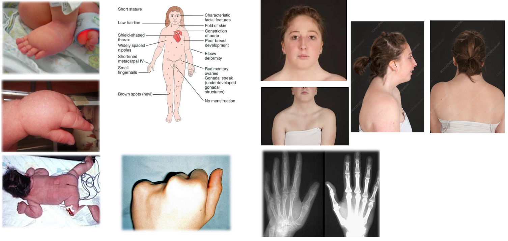

#### Полизомия Х

* **47, ХХХ (Тризомия Х):**
  * **Честота:** 1/1000 жени.
  * **Фенотип:** Нормален фенотип, среден ръст около 172 cm, ¾ от жените са фертилни.
  * **Възможни проблеми:** Епикант, късен пубертет, ранна менопауза, забавено развитие на моторни умения и речеви нарушения; 
  * IQ 85-90.
* **48, ХХХХ**
* **49, ХХХХХ**

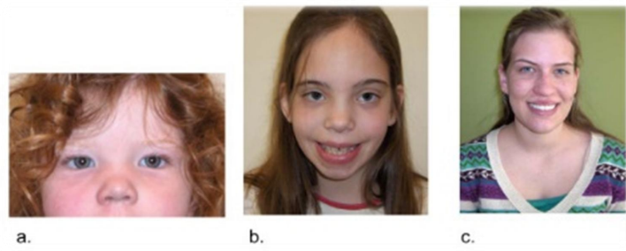

---

### Балансирани хромозомни аберации като причина за инфертилитет

* **Примери:** транслокации (вкл. Робетсонови транслокации), инверсии.
* **Честота в популацията:** 1 на 500 индивиди.
* **Честота сред двойки с репродуктивни проблеми:** По-висок процент на носителите сред пациентите, страдащи от инфертилитет и спонтанни аборти (2.2% при 1 СА, 4.8% при 2 СА, 5.7% при 3 СА).
* **Генетично консултиране:** Генетичен риск за носителите на балансирани хромозомни преустройства за раждане на жив плод с небалансиран кариотип.
  * Реципрочна транслокация: Риск < 30% - 40%.
  * Инверсия: Риск < 5% - 10%.
  * *Рискът при реципрочните транслокации и инверсиите зависи от характера на аномалиите. Тези, които водят до значителен хромозомен дисбаланс в гаметите са с летален ефект за ембриона и завършват със спонтанен аборт.
* Носителите имат шанс за репродукция чрез ин витро оплождане и преимплантационна диагностика.

---

### Моногенни причини за инфертилитет

#### Кистична фиброза (CF) (Муковисцидоза)
* **Наследяване:** **<u>Автозомно рецесивно</u>** заболяване, най-често срещаното сред бялата раса.
* **Честота**: 1:2500
* **Честота в България:** 1:3600 (Хетерозиготи 1:33).
* **Генетика:** CFTR генът (Cystic Fibrosis Transmembrane Conductance Regulator) се състои от 27 екзона на **хромозома 7**; Над 2500 различни мутации.
* **Най-честа мутация:** **delF508** (делеция на 3 нуклеотидни двойки в 10 екзон, водеща до загуба на фенилаланин на 508 място).
* **Патогенеза:** 
  * Дефект в CFTR протеина, който функционира като канал на хлорните йони. 
  * Мутациите в CTFR гена водят до нарушения в транспорта на хлорните йони и водата през мембраната на епителните клетки, което формира гъст, жилав секрет (мукус) в бронхиалното дърво, панкреаса, ГИТ, потните жлези и други тъкани с екзокринна функция.
* **Клинична картина:** 
  * Заболяване на жлезите с външна секреция, засягащо множество органи:
  * **Бял дроб:**
    * Хронични инфекции, водещи до бронхиектазии, кисти, абсцеси, фиброза;
    * Засягане на белия дроб се среща при 90% от пациентите, преживели неонаталния период. 
    * Главна причина за летален изход.
  * **Панкреас:** 
    * 90-95% панкреасна ензимна недостатъчност с храносмилателни проблеми и хипотрофия в ранна детска възраст;
    * Чести изхождания – лошо миришещи, с мастни капки; флатуленция и колики след хранене;
    * Лоша абсорбция на мастно-разтворими вит. A,D,E,K.
    * Панкреатит.
  * **Интестинален тракт:** 
    * Meconium ileus при новородени.
    * Синдром на интестинална обструкция в дисталните отдели в по-късна възраст. 
    * Обструкция на билиарните пътища, цироза, варици на хранопровода, спленомегалия, хиперспленизъм; 
    * Чернодробна стеатоза; 
    * Жлъчно-каменна болест – при 15% от пациентите с CF
  * **Други:** усложнения са забавяне на пубертета и проблеми фертилитета; повечето мъже са с азооспермия поради **агенеза на vas deferens**.
* **Диагноза:**
  * **Потен тест:** Стойности на хлоридите над 60 mmol/l при поне 2 потни теста извеждат клинична диагноза CF.
  * **Клинична:** Наличие на поне два от следните критерии: Положителен потен тест, Хронична белодробна болест, Хронична диария – стеаторея, Фамилност.
  * **Генетична:** Доказване на мутации в CTFR гена чрез ДНК анализ.
* **Прогноза:** Средната преживяемост е 36.9 години.
* **Лечение:** 
  * **Симптоматично** (муколитици, бронходилататори, антибиотици, противовъзпалителни средства, белодробна физиотерапия, панкреасни ензимни препарати, мастно-разтворими витамини, висококалорийна диета) 
  * **Прицелна терапия** (CFTR-модулатори: **KALYDECO**, **ORCAMBI**, **SYMDEKO**, **TRIKAFTA**).
* **Масов неонатален скрининг:** 
  * Провежда се в първите дни след раждането чрез измерване на **имунореактивен трипсиноген (IRT)** в кръв, взета от убождане на петичката.
  * Патологичните резултати от IRT се потвърждават с молекулярен (ДНК) тест. 
  * Ранната диагностика позволява навременно започване на лечение и помага да се забавят или предотвратят сериозни дългосрочни усложнения.
* **CFTR мутации и инфертилитет:** 
  * Около **98% от засегнатите мъже са инфертилни** (азооспермия поради агенеза на vas deferens); 
  * При жени се наблюдава намалена фертилност поради абнормен, гъст и вискозен цервикален мукус.

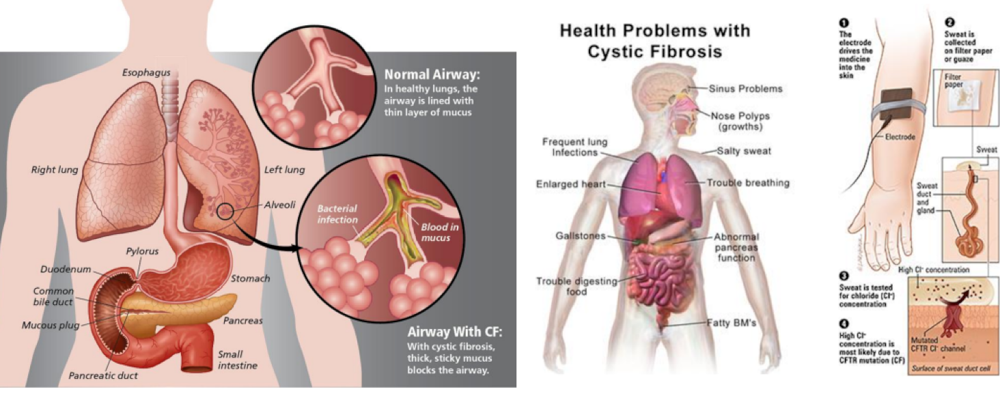

#### Y микроделеции

* Микроделециите в дългото рамо на Y хромозомата са честа причина за инфертилитет при мъжете.
* Обхващат няколко съседни гена, но са твърде малки за конвенционален хромозомен анализ.
* Диагностика само с **ДНК-анализ** чрез търсене на специфични маркери върху Y-хромозомата.
* Откриват се много по-често при мъжете с **азооспермия** **или тежка олигозооспермия**.
* Чрез in vitro оплождането обаче тези микроделеции могат да се предадат на следващото поколение.

#### Носителство на премутация за Чуплива Х
* Ако броят на CGG сегментите е между 55 и 200, състоянието е известно като премутация. 
* **При жени, носителки на премутация:** Може да се наблюдават симптоми на **преждевременна овариална дисфункция** (нередовен месечен цикъл, ранна менопауза, инфертилитет и повишени нива на FSH).
* Тежестта на първичната овариална недостатъчност варира. Някои от носителките имат нередовен цикъл и ранна менопауза преди 40 годишна възраст. Това може да е причина за репродуктивни проблеми.
* При други носителки на премутацията няма засягане на фертилитета и те имат собствено потомство. 

---

### Други причини за репродуктивни проблеми: наследствена и придобита тромбофилия

#### Тромбофилия
* **Определение:** Наследствено или придобито състояние, при което се наблюдава повишена склонност към кръвосъсирване и образуване на тромби.
* **Вродена тромбофилия:** Най-често срещани генетични мутации са **Factor V Leiden (FVL)** и **Factor II (prothrombin) G20210A** (засягат 3-11% от населението). По-рядко се срещат дефицити на протеините C, S и антитромбин III.
* **Наследствената тромбофилия се асоциира с повишен риск за венозни тромбози и може да има роля в етиологията на повтарящите се спонтанни аборти**.
* **FVL:** 
  * Вариантна форма на нормалния човешки фактор V, която води до хиперкоагулация. 
  * Поради наличната промяна, протеин C, който нормално инхибира прокоагулантната активност на фактор V, не може да се свърже с фактор V и това води до тромбофилия.
* **Рискови варианти:** Хомозиготното носителство на FVL и комбинираните хетерозиготи за FVL и prothrombin G20210A са рискови за загуба на ранна бременност (поради увреждане на плацентата). Хетерозиготите са силно асоциирани със загуба на бременност и през втория триместър.

#### Антифосфолипиден синдром
* **Определение:** Автоимунно нарушение, което клинично се проявява с повтарящи се венозни или артериални тромбози, както и може да доведе до спонтанни аборти.

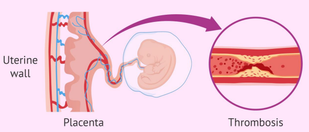

### Заключение:

| Генетична диагностика при женски инфертилитет | Генетична диагностика при мъжки инфертилитет                 |
| --------------------------------------------- | ------------------------------------------------------------ |
| Кариотип                                      | Кариотип                                                     |
| ДНК анализ за премутация във FMR1 гена        | Y микроделеции при тежка олигозооспермия и необструктивна азооспермия |
| Тромбофилия, антифосфолипидни антитела        | ДНК анализ за мутации в CFTR гена при обструктивна азооспермия |